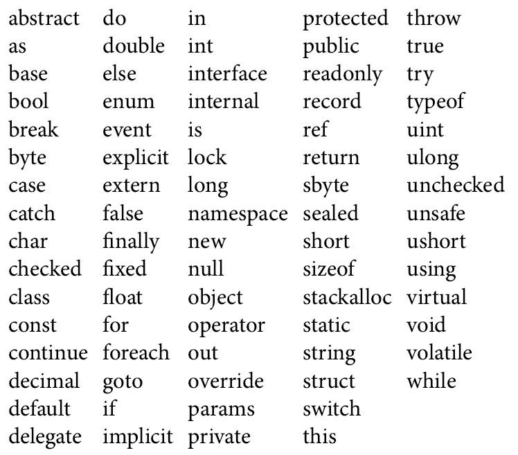
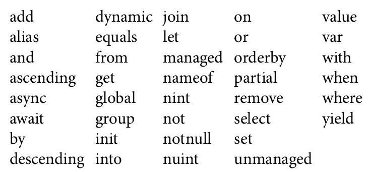
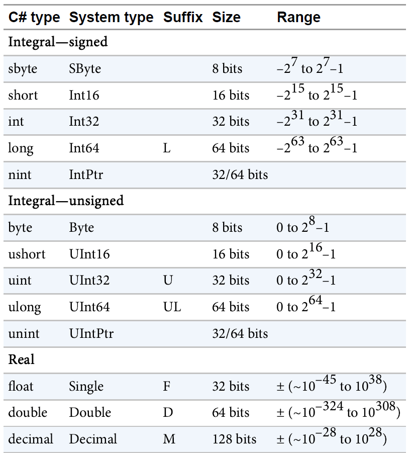
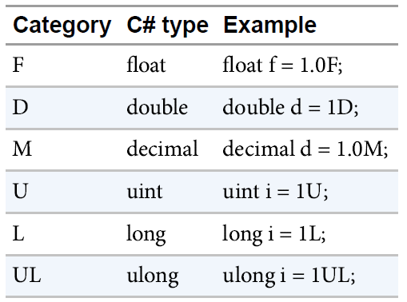

# C#

* **.NET Core** is open source, is available on Linux, and uses modern patterns.

* **C#** and **ASP.NET Core**: create web applications and services that run on Windows, Linux, and Mac.

* **Windows Runtime**: create native Windows apps (Universal Windows Platform, UWP) using C# and XAML, as well as .NET Core.

* **Xamarin**, C# and XAML: create apps that run on Android and iOS devices.

* ASP.NET Core works great in combination with JavaScript technologies like Angular and React/Redux.

* C# started not only as an object-oriented general-purpose programming language but was a component-based programming     language that supported _properties_, _events_, _attributes_ (annotations), and building assemblies (binaries including metadata).

* C# was enhanced with **Generics**, **Language Integrated Query (LINQ)**, **lambda expressions**, **dynamic features**, and easier **asynchronous** programming.

* C# is not an easy programming language because of the many features it offers, but it’s continuously evolving with features that are practical to use.

* C# is more than an object-oriented or component-based language; it also includes ideas of functional programming.

## C# 1.0 Features

* .NET Framework consisted of about 3,000 classes and the CLR. C# offered component-based programming enhancements such as delegates and events.

    * Classes
    * Structs
    * Interfaces
    * Events
    * Properties
    * Delegates
    * Expressions
    * Statements
    * Attributes
    * Literals

## C# 2.0 Features

* Released in 2005, along with Visual Studio 2005, Class count: 8,000 types.

    * Generics
    * Partial types
    * Anonymous methods
    * Nullable types
    * Iterators
    * Covariance and contravariance

## C# 3.0 Features

* Released in late 2007, along with Visual Studio 2008, Class count: 12,000 types.

    * Auto-implemented properties
    * Anonymous types
    * Query expressions
    * Lambda expressions
    * Expression trees
    * Extension methods
    * Implicitly typed local variables
    * Partial methods
    * Object and collection initializers

## C# 4.0 Features

* C# version 4.0, released with Visual Studio 2010.

    * Dynamic binding
    * Named/optional arguments
    * Generic covariant and contravariant
    * Embedded interop types

## C# 5.0 Features

* C# version 5.0, released with Visual Studio 2012.

    * Asynchronous members
    * Caller info attributes

## C# 6 Features

* C# version 6.0, released with Visual Studio 2015.

    * static using,
    * expression-bodied methods and properties,
    * auto-implemented property initializers,
    * readonly auto properties,
    * the nameof operator,
    * the null conditional operator,
    * string interpolation,
    * dictionary initializers,
    * exception filters, and
    * await in catch.

## C# 7.0 Features

* C# version 7.0 was released with Visual Studio 2017.

    * Digit Separators,
    * Binary Literals,
    * Expression-Bodied Members,
    * Out Var
    * Non-Trailing Named Arguments,
    * Readonly Struct,
    * In Parameters
    * Private Protected,
    * Target-Typed Default
    * Local Functions,
    * Tuples,
    * Inferred Tuple Names,
    * Deconstructors,
    * Pattern Matching,
    * Throw Expressions,
    * Async Main,
    * Reference Semantics,

## C# 8.0 Features

* C# 8.0 is the first major C# release that specifically targets .NET Core.

   * Readonly members
   * Default interface methods
   * Pattern matching enhancements:
   *    * Switch expressions
   *    * Property patterns
   *    * Tuple patterns
   *    * Positional patterns
   * Using declarations
   * Static local functions
   * Disposable ref structs
   * Nullable reference types
   * Asynchronous streams
   * Indices and ranges
   * Null-coalescing assignment
   * Unmanaged constructed types
   * Stackalloc in nested expressions
   * Enhancement of interpolated verbatim strings

## C# 9.0 Features

* C# 9 was released with .NET 5.

  *  Records
  *  Init only setters
  *  Top-level statements
  *  Pattern matching enhancements
  *  Performance and interop
  *   *   Native sized integers
  *   *   Function pointers
  *   *   Suppress emitting localsinit flag
  *  Fit and finish features
  *   *   Target-typed new expressions
  *   *   static anonymous functions
  *   *   Target-typed conditional expressions
  *   *   Covariant return types
  *   *   Extension GetEnumerator support for foreach loops
  *   *   Lambda discard parameters
  *   *   Attributes on local functions
  *  Support for code generators
  *   *   Module initializers
  *   *   New features for partial methods

## C# 10.0 Features

* C# 10 adds the following features and enhancements to the C# language:

  *  Record structs
  *  Improvements of structure types
  *  Interpolated string handlers
  *  global using directives
  *  File-scoped namespace declaration
  *  Extended property patterns
  *  Improvements on lambda expressions
  *  Allow const interpolated strings
  *  Record types can seal ToString()
  *  Improved definite assignment
  *  Allow both assignment and declaration in the same deconstruction
  *  Allow AsyncMethodBuilder attribute on methods
  *  CallerArgumentExpression attribute
  *  Enhanced #line pragma

## .NET History

| .NET Framework | CLR | C#  | Visual Studio |
|----------------|-----|-----|---------------|
| 1.0            | 1.0 | 1.0 | 2002  |
| 1.1            | 1.1 | 1.2 | 2003  |
| 2.0            | 2.0 | 2.0 | 2005  |
| 3.0            | 2.0 | 3.0 | 2005+ |
| 3.5            | 2.0 | 3.0 | 2008  |
| 4.0            | 4.0 | 4.0 | 2010  |
| 4.5            | 4.0 | 5.0 | 2012  |
| 4.5.1          | 4.0 | 5.0 | 2013  |
| 4.6            | 4.0 | 6   | 2015  |
| 4.7            | 4.0 | 7   | 2017  |


* **Intermediate Language (IL)** code can be checked by using the tool **ildasm.exe** to open DLL or EXE files that contain .NET code.

* Other parts of the CLR are:
    * a garbage collector (GC)
    * a security mechanism
    * an extension for the debugger
    * a threading facility

* .NET 3.0: **Windows Presentation Foundation (WPF)** was probably the biggest part of the new Framework for creating Windows desktop applications. Windows Forms wrapped the native Windows controls and was based on pixels, whereas WPF was based on DirectX to draw every control on its own. The vector graphics in WPF allow seamless resizing of every form.

* With WPF the user interface can be designed using an XML syntax: XML for Applications Markup Language (XAML).

* For communicating between applications different technologies where used like _ASP.NET Web Services_, _.NET Remoting_, _Message Queuing_ etc. With .NET 3.0, **Windows Communication Foundation (WCF)** combined all the options of the other APIs into the one API.

* .NET 5.0: A new version of platform-independent communication is offered by the ASP.NET Web API. Unlike WCF, which offers stateful and stateless services as well as many different network protocols, the ASP.NET Web API is a lot simpler and based on the **Representational State Transfer (REST)** software architecture style.

* .NET Core is smaller with modular NuGet packages, has a runtime that’s distributed with every application, is open source, and is available not only for the desktop version of Windows but also for many different Windows devices, as well as for Linux and OS X.

* More than 20,000 APIs have been added to .NET Core 2.0.

* Another feature that helps bring legacy applications to .NET Core is the Windows Compatibility Pack (Microsoft.Windows.Compatibility). This NuGet package defines APIs for WCF, registry access, cryptography, directory services, drawing, and more.

* The .NET Standard is a spec that defines which APIs should be available on any platform that supports the standard.

* .NET Core is designed in a modular approach. The framework splits up into a large list of NuGet packages.

* The .NET Standard is not an implementation; it’s a contract. This contract specifies what APIs need to be implemented. .NET Framework, .NET Core, and Xamarin implement this standard.

* A NuGet package is a zip file that contains the assembly (or multiple assemblies) as well as configuration information and PowerShell scripts.

* The new CLR and the CoreCLR include the JIT compiler named RyuJIT. It support the Edit and Continue feature while debugging with Visual Studio.

* Creating a managed thread from C# is not necessarily a thread from the underlying operating system. Threads are virtualized and managed by the runtime.

* Starting with Windows 8, the Windows operating system offers another framework: the Windows Runtime. This runtime is used by the Windows Universal Platform (WUP) and was version 1 with Windows 8, version 2 with Windows 8.1, and version 3 with Windows 10.

* The assembly generated for .NET Core has a dependency to the `System.Console` assembly, whereas the .NET 4.6 assembly finds the Console class in the mscorlib assembly.

* One great productivity feature from the code editor is _code snippets_. Just by typing _cw_ and pressing Tab twice in the editor, the editor creates Console.WriteLine.

* **Microsoft Azure** offers Software as a Service (SaaS), Infrastructure as a Service (IaaS), Platform as a Service (PaaS), and Functions as a Service (FaaS).

## Core C#

* All C# code must be contained within a class.

* Constants are always implicitly static.

* Value type stores its value directly, whereas a reference type stores a reference to the value.

* Value types are stored in an area known as the stack, and reference types are stored in an area known as the managed heap.

* If you want to define your own type as a value type, you should declare it as a **struct**.

* C# has 15 predefined types, 13 value types, and 2 (string and object) reference types.

* In C#, all data types have been defined in a platform-independent manner to allow for the possible future porting of C# and .NET to other platforms.

* strings are immutable. Making changes to one of these strings creates an entirely new string object, leaving the other string unchanged.

* With C# 7, the switch statement has been enhanced with pattern matching. Using pattern matching, the ordering of the cases becomes important.

* Namespace Aliases

```c#
    using alias = NamespaceName;
    :: is namespace alias qualifier
```

* Aprart from keywords, C# also includes a number of commands that are known as **preprocessor directives**. These commands are never actually translated to any commands in your executable code, but they affect aspects of the compilation process.

* C# doesn’t actually have a separate preprocessor. The so-called preprocessor directives are actually handled by the compiler.

* Class members can be one of the following:

    * Fields
    * Constants
    * Methods
    * Properties: Properties are sets of functions that can be accessed from the client in a similar way to the public fields of the class.
    * Constructors
    * Indexers: Indexers allow object to be accessed the same way as arrays.
    * Operators
    * Events: Events are class members that allow an object to notify a subscriber whenever something noteworthy happens, such as a field or property of the class changing, or some form of user interaction occurring.
    * Destructors or finalizers: It is impossible to predict precisely when a finalizer will be called.
    * Types: Classes can contain inner classes.


* Fields with the `readonly` modifier can be assigned values only from constructors.

* `property` is a method or a pair of methods dressed to look like a field.

* In C# 7, property accessors can be written as **expression-bodied members**.

```c#
    public string FirstName
    {
        get => _firstName;
        set => _firstName = value;
    }
```

* Auto-implemented properties

```c#
    public int Age { get; set; }
    public int Age { get; set; } = 42;
```

* expression-bodied properties/methods don’t need curly brackets and return statements.

* Use `var` with the new keyword, for creating **anonymous types**.

```c#
    var captain = new
    {
        FirstName = "James",
        MiddleName = "T",
        LastName = "Kirk"
    };
```

* **Named Arguments**

```c#
    r.MoveAndResize(x: 30, y: 40, width: 20, height: 40);
```

* **Variable Number of Arguments**

```c#
    public void AnyNumberOfArguments(params int[] data);
```

* **coalescing operator**

```c#
    // If the left side of this operator is null, the right side of this operator is processed.
    x =  instance ?? (instance = new Singleton(42));
```

* Special syntax known as a **constructor initializer** for calling one constructor from other.

```c#
    public Car(string description, uint nWheels)
    public Car(string description): this(description, 4)
```

* A C# constructor initializer may contain either one call to another constructor in the same class (using keyword **base**) or one call to a constructor in the immediate base class (using keyword **base**). It is not possible to put more than one call in the initializer.

* With a **struct**, you can specify how the fields are to be laid out in memory.

* It is an error to define a default (parameterless) constructor for a struct.

* A struct is considered fully initialized either when the new operator has been called against it or when values have been individually assigned to all its fields.

* When using the **in** modifier with reference types, you can change the content of the variable, but not the variable itself.

* **Nullable Types**: Variables of reference types (classes) can be null while variables of value types (structs) cannot. This can be a problem with some scenarios, such as mapping C# types to database or XML types. A database or XML number can be null, whereas an int or double cannot be null.

* A **nullable type** is a value type that can be null. The only overhead a value type has compared to the underlying struct is a Boolean member that tells whether it is null.

* Use the **HasValue** and **Value** properties of nullable types.

* enum type can be used to assign multiple options to a variable and not just one of the enum constants. To do this, the values assigned to the constants must be different bits, and the Flags attribute needs to be set with the enum.

* The **partial** keyword allows the _class_, _struct_, _method_, or _interface_ to span multiple files.

* Attributes, XML comments, interfaces, generic-type parameter attributes, and members are combined when the partial types are compiled into the type.

* Partial classes can contain partial methods. This is extremely useful if generated code should invoke methods that might not exist at all. If there’s no implementation of partial method, the compiler removes the invocation of the method.

* A partial method needs to be of type void. Otherwise the compiler cannot remove the invocation in case no implementation exists.

* **Extension Methods**: adds additional functionality to classes. Extension methods are static methods that can look like part of a class without actually being in the source code for the class. This keyword defines the type that is extended.

* In case the type also defines an instance method with the same name, the extension method is never used. Any instance method already in the class takes precedence.

* Every class is actually derived from `System.Object` and struct is always derived from `System.ValueType`, which in turn derives from `System.Object`.

* For more sophisticated string representation, for example, one that takes into account your formatting preferences or the culture (the locale), then you should implement the **IFormattable** interface.

* System.Object class members

    * ToString
    * GetHashCode
    * Equals
    * Finalize
    * GetType
    * MemberwiseClone

* `System.Type` also provides the entry point into .NET’s reflection technology.

* C# does not support multiple inheritance with classes, but it allows multiple inheritance with interfaces.

* By declaring a base class method as `virtual`, you allow the method to be overridden in any derived classes.

* It is also permitted to declare a property as `virtual`.

* In C#, functions are not `virtual` by default but (aside from constructors) can be explicitly declared as `virtual`. This follows the C++ methodology: For performance reasons, functions are not virtual unless indicated. In Java, by contrast, all functions are virtual.

* With polymorphism, the method that is invoked is defined dynamically and not during compile time. The compiler creates a virtual method table (vtable) that lists the methods that can be invoked during runtime, and it invokes the method based on the type at runtime.

* If a method with the same signature is declared in both base and derived classes but the methods are not declared with the modifiers virtual and override, respectively, then the derived class version is said to hide the base class version.

* `new public void Move(Position newPosition)`

* Instead of using the new keyword, you can also rename the method or override the method of the base class if it is declared virtual and serves the same purpose. However, in case other methods already invoke this method, a simple rename can lead to breaking other code.

* C# has a special syntax for calling base versions of a method from a derived class:

```c#
    base.<MethodName>
```

* C# allows both classes and methods to be declared as abstract. An abstract class cannot be instantiated, whereas an abstract method does not have an implementation and must be overridden in any nonabstract derived class.

* An abstract method is automatically virtual. If any class contains any abstract methods, that class is also abstract and must be declared as such.

* Adding the `sealed` modifier to a class doesn’t allow you to create a subclass of it. Sealing a method means it’s not possible to override this method.

* With a sealed class, the compiler knows that derived classes are not possible, and thus the virtual table used for virtual methods can be reduced or eliminated, which can increase performance. The string class is sealed.

* Compiler supplies default zeroing out constructors for all the classes.

* **Modifiers** are keywords that can be applied to a type or a member. Modifiers can indicate the visibility of a method, such as public or private, or the nature of an item, such as whether a method is virtual or abstract.
    * public
    * protected
    * internal
    * private
    * protected internal
    * private protected (new with C\# 7.2)

* Type definitions can be internal or public, depending on whether you want the type to be visible outside its containing assembly. Types can not be protected, private, or protected internal because these visibility levels would be meaningless for a type contained in a namespace.

* Following other modifiers can be applied to members of Types.
    * new - hides an inherited member with the same signature.
    * static - does not operate on a specific instance of the class.
    * virtual - member can be overridden by a derived class.
    * abstract - A virtual member that defines signature but doesn’t provide an implementation.
    * override - overrides an inherited virtual or abstract member.
    * sealed - class cannot be inherited, properties and methods cannot be overridden.
    * extern - member is implemented externally, in a different language.

* **Interfaces**: By deriving from an interface, a class is declaring that it implements certain functions.

* **System.IDisposable**: IDisposable contains one method, `Dispose`, which is intended to be implemented by classes to clean up resources.

* An interface can contain only _declarations_ of methods, properties, indexers, and events.

* Interface members are always implicitly public, and they cannot be declared as virtual.

* Two important operators related to inheritance: the `is` and `as` operators.

* The `as` operator returns a reference to the object. However, it never throws an `InvalidCastException`. Instead, it returns null in case the object is not of the type asked for.

* The `is` operator returns true or false, depending on whether the condition is fulfilled and the object is of the specified type.

## Generics

* Generics are more than a part of the C# programming language; they are deeply integrated with the IL (Intermediate Language) code in the assemblies.

* There’s a big difference between C++ templates and .NET generics. With C++ templates, the source code of the template is required when a template is instantiated with a specific type. The C++ compiler generates separate binary code for each type that is an instance of a specific template. Unlike C++ templates, generics are not only a construct of the C# language but are defined with the Common Language Runtime (CLR). This makes it possible to instantiate generics with a specific type in Visual Basic even though the generic class was defined with C#.

*   * **System.Collections** - non-generic collections
    * **System.Collections.Generic** - generic collections

* The conversion from a value type to a reference type is known as **boxing**. A boxed value type can be converted to a value type by using **unboxing**.

* **Binary Code Reuse**: Generics enable better binary code reuse. A generic class can be defined once and can be instantiated with many different types. Unlike C++ templates, it is not necessary to access the source code.

* The `GetEnumerator` method makes use of the yield statement for creating an enumerator type.

* It is not possible to assign `null` to a generic type. In this case, the keyword `default` can be used.

* **Constraints**: If the generic class needs to invoke some methods from the generic type, you have to add constraints.

```c#
    public class DocumentManager<T> where T: IDocument
    // The above constraint implies that the type using the generic class must implement IDocument interface.
```

* Static members of generic classes are shared with only one instantiation of the class, and they require special attention.

* Prior to .NET 4, generic interfaces were `invariant`. .NET 4 added important changes for generic interfaces and generic delegates: `covariance` and `contra-variance`.

* Covariance and contra-variance are used for the conversion of types with arguments and return types.

* With .NET, parameter types are covariant. Return types of methods are contra-variant.

* Since C# 4, the language is extended to support covariance and contra-variance with generic interfaces and generic delegates.

* An example of a generic struct in the .NET Framework is `Nullable<T>`.

* C# provides the `checked` and `unchecked` operators. If you mark a block of code as `checked`, the CLR enforces overflow checking, throwing an `OverflowException` if an overflow occurs. `unchecked` is the default behavior.

* The `is` operator allows you to check whether an object is compatible with a specific type.

* C# 7 extends the `is` operator with pattern matching. You can check for constants, types, and var.

```c#
    if (i is 42)
    if (o is Person p)
```

* The `as` operator is used to perform explicit type conversions of reference types.

* The `as` operator allows you to perform a safe type conversion in a single step without the need to first test the type using the `is` operator and then perform the conversion.

* By default, unsafe code is not allowed. You need to specify the `AllowUnsafeBlocks` in the csproj project file.

```c#
    unsafe
    {
        Console.WriteLine(sizeof(Point));
    }
```

* The `typeof` operator returns a `System.Type` object representing a specified type. This is useful when you want to use reflection to find information about an object dynamically.

* The index operator doesn’t require an integer within the brackets. Index operators can be defined with any type.

* When you use the C# keyword `?` with the type declaration, `int?`, the compiler resolves this to use the generic type `Nullable<int>`.

* `BigInteger` is a struct that contains a number of any size. The namespace for `BigInteger` is `System.Numeric`.

* C# provides a `checked` operator that you can use to test whether an operation causes an arithmetic overflow.

```c#
    int i = checked((int)val);
```

# C# In Nutshell

* C# has a _unified type system_ in which all types ultimately share a common base type.

* An _interface_ is like a class that cannot hold data. This means that it can define only _behavior_ (and not _state_),

* Using _delegates_, C# allows functions to be passed as values to and from other functions.

* C# supports _static typing_, meaning that the language enforces type safety at _compile time_. This is in addition to type safety being enforced at _runtime_.

* C# relies on the runtime to perform automatic memory management. The Common Language Runtime has a garbage collector that executes as part of your program, reclaiming memory for objects that are no longer referenced.

* There is also a technology called **Blazor** that can compile C# to web assembly that runs in a browser.

* Runtime support for C# programs consists of a **Common Language Runtime (CLR)** and a **Base Class Library (BCL)**.

* The container for managed code is called an _assembly_. An _assembly_ contains not only _Intermediate Language (IL)_, but also type information (metadata).

* You can examine and disassemble the contents of an assembly with Microsoft’s **ildasm** tool.

* A BCL provides core functionality to programmers, such as
    * collections,
    * input/output,
    * text processing,
    * XML/JSON handling,
    * networking,
    * encryption,
    * interop,
    * concurrency and
    * parallel programming.

* **.NET 6** is Microsoft’s flagship open-source runtime. You can write web and console applications that run on Windows, Linux, and macOS,

* MAUI (Multi-platform App UI, early 2022) is designed for creating mobile apps for iOS and Android

* Universal Windows Platform (UWP) is designed for writing immersive touch-first applications that run on Windows 10+ desktop and devices.

* **.NET Framework** is Microsoft’s original Windows-only runtime for writing web and rich-client applications that run (only) on Windows desktop/server.

* When you target .NET Framework 4.8, you can use the features of C# 7.3 and earlier.

* a file-scoped namespace declaration in C# 10 reduces clutter and eliminates an unnecessary level of indentation.

```c#
namespace MyNamespace; // Applies to everything that follows in the file.

class Class1 {} // inside MyNamespace
class Class2 {} // inside MyNamespace
```

* When you prefix a using directive with the `global` keyword, it applies the directive to all files in the project:

```c#
global using System;
global using System.Collection.Generic;
```

* The .NET libraries are organized into nested namespaces. For example, the `System.Text` namespace contains types for handling text, and `System.IO` contain types for input/output.

* The `using` directive lets you avoid this clutter by importing a namespace:

```c#
using System; // Import the System namespace
```

* The presence of top-level statements implicitly creates an entry point for a console or Windows application. (Without top-level statements, a Main method denotes an application’s entry point

* Unlike .NET Framework, .NET 6 assemblies never have a .exe extension. The .exe that you see after building a .NET 6 application is a platform-specific native loader responsible for starting your application’s .dll assembly.

* To compile an application, the dotnet tool requires a _project file_ as well as one or more C# files.

```
dotnet new Console -n <Project-Name>
dotnet run <Project-Name>
dotnet build Project-Name.csproj // just build the project
```

* 69 keywords

|  |
|:--:|
| **C# Key Words** |

* If you really want to use an identifier that clashes with a reserved keyword, you can do so by qualifying it with the @ prefix. `int @using = 123;`

|  |
|:--:|
| *Contextual Key Words* |

* **Value types** comprise most built-in types (specifically, _all numeric types_, the _char type_, and the _bool type_) as well as _custom struct_ and _enum types_.

* **Reference types** comprise all _class_, _array_, _delegate_, and _interface types_. (This includes the predefined string type.)

|  |
|:--:|
| **Numeric Types** |


|  |
|:--:|
| **Suffixes** |

* The static class `System.Convert` provides methods that round while converting between various numeric types.

* The `checked` operator instructs the runtime to generate an OverflowException rather than overflowing silently.

* Use `unchecked` operator if `checked` is enabled project wise.

* `float` and `double` internally represent numbers in base 2. For this reason, only numbers expressible in base 2 are represented precisely. Practically, this means most literals with a fractional component (which are in base 10) will not be represented precisely.

* C#’s char type (aliasing the System.Char type) represents a Unicode character and occupies 2 bytes (UTF-16).

* The \u (or \x) escape sequence lets you specify any Unicode character via its four-digit hexadecimal code.

* `string` is a reference type rather than a value type. Its equality operators, however, follow value-type semantics.

* A _verbatim_ string literal is prefixed with `@` and does not support escape sequences.

* A `string` preceded with the `$` character is called an _interpolated string_. Interpolated strings can include expressions enclosed in braces.

```c#
int x = 4;
Console.Write ($"A square has {x} sides");
```

* Interpolated strings must complete on a single line, unless you also specify the verbatim string operator

```c#
string s = $@"this interpolation spans {
x} lines";
```

* From C# 10, interpolated strings can be constants, as long as the interpolated values are constants:

```c#
const string greeting = "Hello";
const string message = $"{greeting}, world";
```

```c#
char[] vowels = new char[5]; // Declare an array of 5 characters
char[] vowels = new char[] {'a','e','i','o','u'};
char[] vowels = {'a','e','i','o','u'};
```

* **Indices** let you refer to elements relative to the end of an array, with the `^` operator. `^1` refers to the last element, `^2` refers to the second-to-last element.

* Ranges let you "slice" an array by using the `..` operator.

* Multidimensional arrays come in two varieties: `rectangular` and `jagged`. **Rectangular** arrays represent an n-dimensional block of memory, and **jagged** arrays are arrays of arrays.

```c#
int[,] matrix = new int[3,3];  // Rectangular array
int[][] matrix = new int[3][]; // Jagged array
```

* `var` keyword instructs the compiler to implicitly type a local variable.

* You can’t explicitly delete objects in C#, as you can in C++. An unreferenced object is eventually collected by the garbage collector.

* C# enforces a **definite assignment policy**. In practice, this means that outside of an unsafe or
interop context, you can’t accidentally access uninitialized memory.

* You can obtain the default value for any type via the `default` keyword.

* Method can have following parameter modifiers: `value`, `ref`, `out`, or `in`.

* A parameter can be passed by reference or by value, regardless of whether the parameter type is a
reference type or a value type.

* The `params` modifier, if applied to the last parameter of a method, allows the method to accept any number of arguments of a particular type.

* Adding an _optional parameter_ to a public method that’s called from another assembly requires
recompilation of both assemblies—just as though the parameter were mandatory.

* Rather than identifying an argument by position, you can identify an argument by name:

```c#
Foo (x:1, y:2); // 1, 2
void Foo (int x, int y) { Console.WriteLine (x + ", " + y); }
```

* **target-typed new expressions** (from C# 9), you can call new without specifying a type name if the compiler is able to
unambiguously infer it.

```c#
System.Text.StringBuilder sb1 = new();
System.Text.StringBuilder sb2 = new ("Test");
```

* C# provides three operators to make it easier to work with nulls:
    *  **null-coalescing operator (??)**:
        If the operand to the left is non-null, give it to me; otherwise, give me another value.
    * **null-coalescing assignment operator (??=)**: (C# 8),
     If the operand to the left is null, assign the right operand to the left operand.
    * **null-conditional operator/Elvis (?.)**:
    call methods and access members just like the standard dot operator except that if the operand on the left is `null`, the expression evaluates to `null` instead of throwing a `NullReferenceException`.

```c#
// null-coalescing operator
string s1 = null;
string s2 = s1 ?? "nothing"; // s2 evaluates to "nothing"

// null-coalescing assignment operator
myVar ??= someDefault;

// equivalent to
if(myVar == null) myVar = someDefault;
```

* The scope of a local variable or local constant extends throughout the current block. You cannot
declare another local variable with the same name in the current block or in any nested blocks.

* A variable’s scope extends in both directions throughout its code block. This is in
contrast to C++ and is somewhat peculiar, given that it’s not legal to refer to a variable or constant before
it’s declared.

* You can also switch on types (from C# 7):

```c#
TellMeTheType (12);
TellMeTheType ("hello");
TellMeTheType (true);

void TellMeTheeType (object x) // object allows any type.
{
switch (x)
{
case int i:
    Console.WriteLine ("It's an int!");
    Console.WriteLine ($"The square of {i} is {i * i}");
    break;
case string s:
    Console.WriteLine ("It's a string");
    Console.WriteLine ($"The length of {s} is {s.Length}");
    break;
default:
    Console.WriteLine ("I don't know what x is");
    break;
}
}

// when keyword
switch (x)
{
case bool b when b == true: // Fires only when b is true
    Console.WriteLine ("True!");
    break;
case bool b:
    Console.WriteLine ("False!");
    break;
}
```

* The `default` clause is always executed last, regardless of where it appears.

* The `foreach` statement iterates over each element in an enumerable object. Most of the .NET types that represent a set or list of elements are enumerable.

* C# overloads the using keyword to have independent meanings in different contexts. Specifically, the _using directive_ is different from the _using statement_.

* The using directive imports a namespace, allowing you to refer to types without their fully qualified names.

* From C# 10, if you prefix a using directive with the global keyword, the directive will apply to all files in the project or compilation unit:

```c#
global using System;
global using System.Collection.Generic;
```

* The `using static` directive imports a _type_ rather than a namespace. The `using static` directive imports all accessible static members of the type, including fields, properties, and nested types.

```c#
using static System.Console;
WriteLine ("Hello");
```

* Preceding the keyword `class`
    * Attributes
    * Class modifiers
        * public
        * internal
        * abstract
        * sealed
        * static
        * unsafe
        * partial

* Following class name
    * Generic type parameters
    * Constraints
    * base class
    * interfaces

* Within braces
    * methods
    * properties
    * indexers
    * events
    * fields
    * constructors
    * overloaded operators
    * nested types
    * finalizer

* **expression-bodied method**: A fat arrow replaces the braces and return keyword:

```c#
int Foo (int x) => x * 2;
void Foo (int x) => Console.WriteLine (x); // void return type
```

* Adding the `static` modifier to a local method (from C# 8) prevents it from seeing the local variables and parameters of the enclosing method.

* one constructor can call another, using the `this` keyword.

```c#
public class Test
{
    int _a, _b;
    public Test(int a) { _a = a;}
    public Test(int a, float b) : this(a) { _b = b; }
}
```

* A **deconstructor** does the reverse of construction and assigns fields back to a set of variables. A deconstruction method must be called **Deconstruct**.

```c#
public void Deconstruct (out float width, out float height) { ... }
(float width, float height) = rect; // call Deconstruction
```

* each optional parameter value is baked into the _calling site_.

* **Properties** look like fields from the outside, but internally they contain logic, like methods do.

* A property is declared like a field but with a get/set (property _accessors_) block added.

* _expression-bodied property_

```c#
public decimal Worth => currentPrice * sharesOwned;
```

* _automatic property declaration_

```c#
public decimal CurrentPrice { get; set; }
public decimal CurrentPrice { get; set; } = 123;
public int Maximum { get; } = 999;
```

* From C# 9, you can declare a property accessor with `init` instead of `set`:

```c#
public class Note
{
public int Pitch { get; init; } = 20; // “Init-only” property
public int Duration { get; init; } = 100; // “Init-only” property
}
```

* These _init-only_ properties act like read-only properties, except that they can also be set via an object initializer:

```c#
var note = new Note { Pitch = 50 };
```

* To write an indexer, define a property called `this`, specifying the arguments in square brackets:

* **Finalizers** are class-only methods that execute before the garbage collector reclaims the memory for an unreferenced object.

* **Partial types** allow a type definition to be split, typically across multiple files.

* The `nameof` operator returns the name of any symbol (type, member, variable) as a string.
