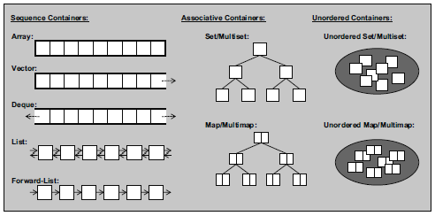
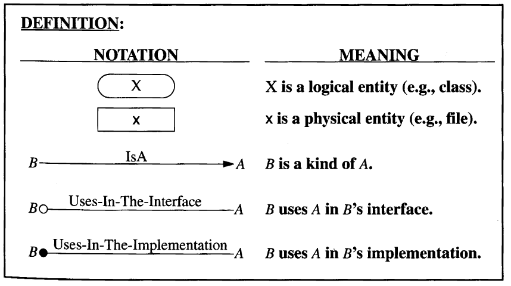
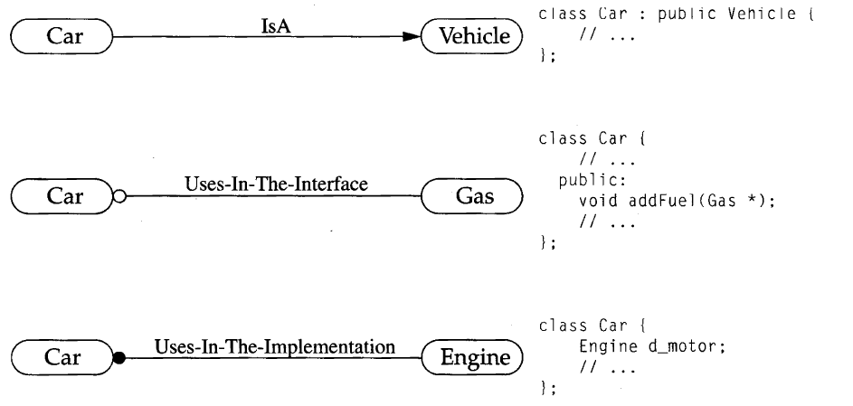

# Index

1. [Professional C++](#professional_c++)
1. [C++ Annotation](#cpp_annotation)
1. [C++ Concurrency in Action](#cpp_concurrency)
1. [C++17](#-c++17)

# Professional C++

using namespace std; // using directive

using std::cout; // using directive

// Namespace nesting, C++17
namespace NetLib::Networking::FTP {
}

namespace MyFTP = NetLib::Networking::FTP; // namespace alias

// hexadecimal floating point literal
0x3.ABCp-10; 0Xb.cp121

3+(ABC/16^-3) * (2^-10)
3+0.6708984375 * (2^-10) = 0.0035848617553...

// Digit separators
23'456'789
0.123'456f

<cstddef> provides the `std::byte` type representing a single byte. // C++17

<<<< --- NOTES FROM LAPTOP --- >>>>>

Module interface files usually have . cppm as extension.

export module employee;   // module declaration

export struct Employee {
char firstInitial;
char lastInitial;
int employeeNumber;
int salary;
};

import employee;

if(<initializer>; <conditional_expression>) {

}

```cpp
enum class Mode { Default, Custom, Standard };
int value { 42 };
Mode mode { /* ... */ };
switch (mode) {
    using enum Mode;
    case Custom:
        value = 84;
        [[fallthrough]];  // fallthrough attribute, intended fallthrough
    case Standard:
    case Default:
        // Do something with value ...
    break;
}
```

switch (<initializer>; <expression>) { <body> }

The advantage of the conditional operator is that it is an expression, not a statement like the if and
switch statement.

// C++20
<=> : Three-way comparison operator, also called the spaceship operator.
result = i <=> 0;

The three-way comparison operator can be used to determine the order of two values.
With a single expression, it tells
you whether a value is equal, less than, or greater than another value. Because it has to return more
than just true or false , it cannot return a Boolean type. Instead, it returns an enumeration-like 2
type, defined in <compare> and in the std namespace.

<compare> provides named comparison functions to interpret the result of an ordering.
These functions are std::is_eq() , is_neq() , is_lt() , is_lteq() , is_gt() , and is_gteq()
returning true if an ordering represents == , != , < , <= , > , or >= respectively, false otherwise.

```cpp
// Function Return Type Deduction
auto addNum(int n1, int n2) {
    return n1 + n2;
}
```

Every function has a local predefined variable __func__ containing the name of the current function.

// Attributes
Attributes are a mechanism to add optional and/or vendor-specific information into source code. Since C++11, there is standardized support for
attributes by using the double square brackets syntax [[ attribute ]] .

[[nodiscard]]
can be used on a function returning a value to let the compiler issue
a warning when that function is called without doing something with the returned value.

```cpp
[[nodiscard]] int func() {
    return 42;
}

int main() {
    func(); // warning C4834: discarding return value of function with 'nodiscard' attribute
}
```

// C++20
A reason can be provided for [[nodiscard]]
[[nodiscard("Return value must be used")]] int func();

[[maybe_unused]] suppress the compiler from issuing warning when something is unused.

```cpp
int func(int param1, [[maybe_unused]] int param2) {
    return param1 * 2.5;
}
```

[[noreturn]] a function never returns control to the call site.

```cpp
[[noreturn]] void forceProgramTermination() {
    std::exit(1);
}
```
[[deprecated]] to mark something as deprecated.
[[deprecated("Unsafe method, please use funcV2")]] void func();

[[likely]] and [[unlikely]] can be used to help compiler in optimizing the code. 
Rarely required because compilers and hardware these days have **_powerful branch prediction_**

```cpp
int value {};
if(value > 11) [[unlikely]] {

} else {}

switch(value) {
    [[likely]] case 1:
        break;
    case 2:
        break;
    [[unlikely]] case 12:
    break;
}

int array[3] = { 0 };
int array[3] = {};
int array[3] {};

<array> => std::size();
<cstddef> => size_t
size_t arraySize { std::size(myArray)};

C++ has a special type of fixed-size container called std::array , defined in <array> . It’s basically a thin wrap-
per around C-style arrays.

```cpp
std::array<int, 3> arr { 3, 6, 9 };
fmt::print("size: {}", arr.size());
fmt::print("2nd: {}", arr[1]);

// CTAD
std::array arr2 {9, 6, 3};
```

C++ supports so-called class template argument deduction (CTAD)
vector class template supports CTAD.

std::pair in <utility>, groups two values of possibly different types.

```cpp
std::pair<double, int> myPair{1.23, 4};
fmt::print("{} {}", myPair.first, myPair.second);
```
std::optional defined in <optional>, holds a value of a specific type, or nothing. 
Often used for parameters and return value. 
Remove the need to return "special" values from functions such as nullptr, -1, EOF and so on.

// Structure Binding
Always use auto keyword for structured bindings
array values {11, 22, 33};
auto [x, y, z] {values};

// C++20: Initializers for Range-Based for Loops
for (<initializer>; <for-range-declaration> : <for-range-initializer>) { <body> }

Initializer lists are defined in <initializer_list> and make it easy to write functions that can
accept a variable number of arguments.

module interface file (.cppm)
module implementation file (.cpp)

// C++11 
Uniform Initialization of structure and class

A benefit of using uniform initialization is that it prevents _narrowing_.

If a narrowing cast is what you need, I recommend using the gsl::narrow_cast() function available 
in the **Guidelines Support Library (GSL)**.

// C++20: Designated Initializers
C++20 introduces designated initializers to initialize data members of so-called aggregates using their
name. An aggregate type is an object of an array type, or an object of a structure or class

A null pointer is a special default value that no valid pointer will ever have and converts to false
when used in a Boolean expression.

The -> (arrow) operator lets you perform both the dereference and the
field access in one step.

int* p { new int[8] };

To follow the const-correctness principle, it’s recommended to declare
member functions that do not change any data members of the object as being
const . These member functions are also called _inspectors_, compared to _mutators_
for non-const member functions.

```cpp
constexpr int getArraySize() { return 32; }
int a[getArraySize()]; 

// C++20: consteval keyword
constexpr keyword specifies that a function could be executed at compile time, but it does not guarantee compile-time execution.
If you really want the guarantee that a function is always evaluated at compile time, you need to use
the C++20 consteval keyword to turn a function into a so-called **immediate function**.

auto& [s, i] { myPair }; // references-to-non-const
const auto& [s, i] { myPair }; // references-to-const

return value optimization (RVO)
named return value optimization (NRVO)

Both RVO and NRVO are forms of copy elision and
make returning objects from functions very efficient. With copy elision, compilers can avoid any
copying of objects that are returned from functions. This results in zero-copy pass-by-value semantics.

5 types of casts
const_cast() => add or cast away constness to a variable
static_ast()
reinterpret_cast()
dynamic_cast()
std::bit_cast() // since C++20

std::invalid_argument defined in <stdexcept>

A type alias provides a new name for an existing type declaration.
using IntPtr = int*;
using string = basic_string<char>;

_Type inference_ allows the compiler to automatically deduce the type of an expression. There are two
keywords for type inference: auto and decltype.

Using auto to deduce the type of an expression strips away reference and const qualifiers.

Copy list initialization:   T obj = {arg1, arg2, ...};
Direct list initialization: T obj {arg1, arg2, ...};

```cpp
// Since C++17
// Copy list initialization
auto a = { 11 };     // initializer_list<int>
auto b = { 11, 22 }; // initializer_list<int>

// Direct list initialization
auto c { 11 };      // int
auto d { 11, 22 };  // Error, too many elements.

// C++11/C++14
auto a = { 11 };     // initializer_list<int>
auto b = { 11, 22 }; // initializer_list<int>

// Direct list initialization
auto c { 11 };      // initializer_list<int> 
auto d { 11, 22 };  // initializer_list<int> 
```

The difference between auto and decltype is that decltype does not strip reference and const
qualifiers.


# C++ Annotation

1. In C, sizeof('c') equals sizeof(int), 'c' being any ASCII character.
  In C++, sizeof('c') is always 1, while an int is still an int.

1. C++ requires very strict prototyping of external functions.

### Differences between C and C++

   i) End-of-line comment
   ii) NULL-pointers vs. 0-pointers
   iii) Strict type checking
   iv) New syntax for casts
       C style : (typename)expression   eg: (float)salary
       C++ style : typename(expression) eg: float(salary)

### C++ new-style casts

   i) The standard cast to convert one type to another is
                static_cast<type>(expression)
   ii) There is a special cast to do away with the const type-modification:
                const_cast<type>(expression)
   iii) A third cast is used to change the interpretation of information:
                reintrepret_cast<type>(expression)
    iv) And, finally, there is a cast form which is used in combination with
        polymorphism is performed run-time to convert.
                dynamic_cast<type>(expression)

### The 'static_cast'- operator

   The static_cast<type>(expression) operator is used to convert one type to an
   acceptable other type. E.g., double to int.

```c++
   intVar = static_cast<int>(12.45);
   intVar += doubleVar; is same as
   intVar = static_cast<int>(static_cast<double>(intVar) + doubleVar);
   // the above expression can be written as to get the same result.
   intVar += static_cast<int>(doubleVar);
```

### The 'const_cast'- operator

   The const_cast<type>(expression) operator is used to do away with the
   const-ness of a (pointer) type.

   eg: string_op(char *s); passing a string
   char const hello[] = "Hello world" will produces the warning
   passing `const char *' as argument 1 of `fun(char *)' discards const
   which can be prevented using the call
   string_op(const_cast<char *>(hello));

### The 'reinterpret_cast'- operator

   The reinterpret_cast<type>(expression) operator is used to reinterpret byte
   patterns. For example, the individual bytes making up a double value can
   easily be reached using a reinterpret_cast<>().

   reinterpret_cast<char *>(&doubleVar)

### Problem with cast

   Using the cast-operators is a dangerous habit, as it suppresses the normal
   type-checking mechanism of the compiler. It is suggested to prevent casts if
   at all possible. If circumstances arise in which casts have to be used,
   document the reasons for their use well in your code, to make double sure
   that the cast is not the underlying cause for a program to misbehave.

### The #define __cplusplus

   Each C++ compiler which conforms to the ANSI standard defines the symbol
   `__cplusplus`: it is as if each source file were prefixed with the preprocessor
   directive #define __cplusplus.

### The usage of standard C functions

   Normal C functions, e.g., which are compiled and collected in a run-time
   library, can also be used in C++ programs. Such functions however must be
   declared as C functions.
   eg:

```cpp
   extern "C" void *xmalloc(unsigned size);
   extern "C"
   {
       .
       . (declarations)
       .
   }
   extern "C"
   {
       #include <myheader.h>
   }
```

 ### Header files for both C and C++


```cpp
    #ifdef __cplusplus
    extern "C"
    {
    #endif
    .
    . (the declaration of C-functions occurs here, e.g.:)
    extern void *xmalloc(unsigned size);
    .
    #ifdef __cplusplus
    }
    #endif
```

 ### The definition of local variables

    In C local variables can only be defined at the top of a function or at the
    beginning of a nested block. In C++ local variables can be created at any
    position in the code, even between statements.
    Furthermore local variables can be defined in some statements, just prior
    to their usage.

### Function Overloading

   In C++ it is possible to define several functions with the same name,
   performing different actions. The functions must only differ in their
   argument lists.

```cpp
   void show(int val)
   void show(double val)
   void show(char *val)
```

   The conversion of a name in the source file to an internally used name is
   called **name mangling**.

 ### Default function arguments

    In C++ it is possible to provide **'default arguments'** when defining a
    function. These arguments are supplied by the compiler when not specified
    by the programmer.

```cpp
    void showstring(char *str = "Hello World!\n")
    {
    }
    showstring("Here's an explicit argument.\n");
    showstring(); // in fact this says: showstring("Hello World!\n");
```

    Default arguments must be known to the compiler when the code is generated
    where the arguments may have to be supplied. Often this means that the
    default arguments are present in a header file:

```cpp
    // sample header file
    extern void two_ints(int a = 1, int b = 4);

    // code of function in, say, two.cc
    void two_ints(int a, int b)
    {
        .
        .
    }
```

 ### The keyword `typedef`

    The keyword `typedef` is in C++ allowed, but no longer necessary when it is
    used as a prefix in union, struct or enum definitions.

```cpp
    struct somestruct
    {
        int a;
        double d;
        charstring[80];
    };
```
    When a struct, union or other compound type is defined, the tag of this type
    can be used as type name (this is somestruct in the above example):

```cpp
    somestruct what;
    what.d = 3.1415;
```

 ### Functions as part of a struct

    In C++ it is allowed to define functions as part of a struct.

```cpp
    struct point            // definition of a screen dot
    {
        int x, y;           // coordinates x/y
        void draw(void);    // drawing function
    };
```

 ### The scope resolution operator ::

    The scope resolution operator can be used in situations where a global
    variable exists with the same name as a local variable:

  ### The keyword `const`

     This keyword is a modifier which states that the value of a variable or of
     an argument may not be modified.

     Variables which are declared const can, in contrast to C, be used as the
     specification of the size of an array,

```cpp
     int const size = 20;
     char buf[size];          // 20 chars big
     char const *buf;
```

     buf is a pointer variable, which points to chars. Whatever is pointed to by
     buf may not be changed: the chars are declared as `const`.
     The pointer buf itself however may be changed. A statement as `*buf = 'a';`
     is therefore not allowed, while `buf++` is.

     In the declaration
     `char *const buf;`
     buf itself is a `const` pointer which may not be changed. Whatever chars are
     pointed to by buf may be changed at will.

     the declaration
     `char const *const buf;`
     is also possible; here, neither the pointer nor what it points to may be
     changed.

 ### References

    Besides the normal declaration of variables, C++ allows **"references"** to be
    declared as _synonyms_ for variables. A reference to a variable is like an
    _alias_; the variable name and the reference name can both be used in
    statements which affect the variable:

```cpp
    int int_value;
    int &ref = int_value;
```

    References serve an important function in C++ as a means to pass arguments
    which can be modified

```cpp
    // C style using pointer
    void increase(int *valp)        // expects a pointer
    {                               // to an int
        *valp += 5;
    }
    increase(&x);

    // C++ style using reference
    void increase(int &valr)            // expects a reference
    {                                   // to an int
        valr += 5;
    }
    increase(x); // function call
```

    References also can lead to extremely `ugly' code. A function can also
    return a reference to a variable, as in the following example:

```cpp
    int &func()
    {
        static int value;
        return (value);
    }
    // This allows the following constructions:
    func() = 20;
    func() += func ();
```

 ### Functions as part of structs


```cpp
    struct person
    {
        char name [80],  address [80];
        void print (void);
    };

    void person::print()
    {
        printf("Name: %s\nAddress:   %s\n", name, address);
    }

    person p;
    strcpy(p.name, "Karel");
    strcpy(p.address, "Rietveldlaan 37");
    p.print();
```

 ### Several new data types

    C: `void`, `char`, `short`, `int`, `long`, `float` and `double`.

    C++: C + `bool`, `wchar_t` and `long double`

    The 'bool' data type
    --------------------
    The type bool represents boolean (logical) values, for which the
    (now reserved) values true and false may be used.

```cpp
    cout << "A true value: "  << true << endl
         << "A false value: " << false << endl;
```

    The 'wchar_t' data type
    -----------------------
    The wchar_t type is an extension of the char basic type, to accomodate wide
    character values, such as the Unicode character set. Sizeof(wchar_t) is 2,
    allowing for 65,536 different character values.

    The 'string' data type
    ----------------------
    Some of the operations that can be performed on strings return indices
    within the strings. Whenever such an operation fails to find an appropriate
    index, the value `string::npos` is returned.

    | Member Function  |    Purpose |
    |------------------|------------|
    | c_str()      |        convert a string object to a standard C-string
                         eg: char const *Cstring = str.c_str(); |
    | at()         |        To get a character from the string.
                         eg: stringOne.at(6) = stringOne.at(0); |
    | compare()    |        To compare two strings
                         eg: if (stringOne.compare(stringTwo) > 0) |
    | append()     |        To append two strings
                         eg: stringOne.append(" world"); |
    | insert()     |        To insert characters somewhere within a string
                         eg: str.insert(4, "o "); |
    | replace()    |    To replace parts of the contents of a string object by
                         another string
                         eg: line.replace(idx, search.size(), replace); |
    | swap()       |       To swaps the contents of two string-objects
                         eg: stringOne.swap(stringTwo); |
    | erase()      |        To remove characters from a string
                         eg: stringOne.erase(5, 6);  |
    | find()       |        To find substrings in a string
                         eg: idx = line.find(search);  |
    | substr()     |   To extract a substring from a string object
                         eg: stringOne.substr(0, 5);  |
    | size()       |        Number of character in a string
                         eg: stringOne.size()  |
    | resize()     |        To inscrease or decrease string size  |
    | find_first_of()    |    |
    | find_first_not_of() |   |
    | find_last_of()      |    |
    | find_last_not_of() |     |


# C++ Concurrency in Action {#cpp_concurrency}

* With C++11 it is possible to write multithreaded C++ programs without relying on platform-specific extensions and enabled you to write portable multithreaded code with guaranteed behavior.

* Technical Specifications for **Concurrency extensions** and **Parallelism** to be incorporated into C++17.

* Concurrency is about two or more separate activities happening at the same time.

* Separate processes can pass messages to each other through all the normal inter-
communication channels (signals, sockets, files, pipes, and so on).

* It is easier to write safe concurrent code with processes rather than threads.

* Threads are much like light-weight processes: each thread runs independently of the others, and each may run a different sequence of instructions. But all threads in a process _share the same address space_, and most of the data can be accessed directly from all threads, global variables remain global, and pointers or references to objects or data can be passed around among threads.

* Application frameworks, such as MFC, and general-purpose C++ libraries, such as Boost and ACE.

* C++ Standard Library was extended to include classes for managing threads, protecting shared data, synchronizing operations between threads, and low-level atomic operations.

```cpp
#include <thread>
void do_some_work();
std::thread t(do_some_work);

struct background_task {
    void operator()() const {
        do_work();
        do_more_work();
    }
}
background_task f;
std::thread t2(f); // functor is copied into storge belonging to thread
```

* `std::thread` works with any callable type.

* _**C++ most vexing parse**_, passing a temporary rather than a named variable

```cpp
std::thread my_thread(background_task()); // WRONG !!
// Declare my_thread function taking single parameter and return thread object

std::thread my_thread( (background_task()) ); // extra set of parentheses
std::thread my_thread{background_task()};
```

* `std::thread` destructor calls `std::terminate()` if thread terminate without join.

* `join()` is a simple and brute-force technique. For more fine-grained control use _condition variable_ and _futures_.

* The call to `join()` is liable to be skipped if an exception is thrown after the thread has been started but before the call to `join()`.

* Thread guard using Resource Acquisition Is Initialization (RAII) idiom

```cpp
class thread_guard {
    std::thread& t;
public:
    explicit thread_guard(std::thread& t_) : t{t_} {}
    ~thread_guard() {
        if(t.joinable()) {
            t.join(); // can be called only once for a given thread
        }
    }
    thread_guard(const thread_gurad&) = delete;
    thread_guard& operator=(const thread_guard&) = delete;
};

std::thread t(func);
thread_guard g(t);
```
* If a thread becomes detached, it isn’t possible to obtain a std::thread object that references it, so it can no longer be joined. Ownership and control of detached threads are passed over to C++ Runtime Library.

```cpp
char buffer[1024];
sprintf(buffer, "%i", some_param);
```

```cpp
struct X {
    void do_lengthy_work();
};
X my_x;
// Supply object pointer as first argument for class member functions
std::thread t(&X::do_lengthy_work, &my_x);
```

* `std::unique_ptr`, provides automatic memory management for dynamically
allocated objects. The _move constructor_ and _move assignment_ operator allow the ownership of an object to be transferred around between `std::unique_ptr` instances

* This moving of values allows objects of this type to be accepted as function
parameters or returned from functions. Where the source object is _temporary_, the
move is automatic, but where the source is a _named value_, the transfer must be
requested directly by invoking std::move().

* It is not possible to just drop a thread by assigning a new value to the std::thread object that manages it.

```cpp
std::thread t1(some_function);
std::thread t2(some_other_function);
t1 = std::move(t2); // Program will be terminated
```

```cpp
// Ownership is transferred
std::thread f() {
    return std::thread(some_function);
 }

 void f(std::thread t);
```

* `std::thread::hardware_concurrency()` function returns an indication of the number of threads that can truly run concurrently for a given execution of a program.

* Thread identifiers are of type `std::thread::id` and can be retrieved in two:  ways. `get_id()` member function or `std::this_thread:: get_id()`.

* _invariants_ (never changing)

* One of the most common cause of bugs in concurrent code is a _race condition_. A race condition is anything where the outcome depends on the relative ordering of execution of operations on tow or more threads.

* A great deal of complexity in writing software that uses concurrency comes from avoiding problematic race conditions.

* The most basic mechanism for protecting shared data is to use synchronization primitive called _mutex_ (mutual exclusion).

* The Thread Library ensures that once one thread has locked a specific mutex, all other threads that try to lock the same mutex have to wait until the thread that successfully locked the mutex unlocks it.

* Mutexes come with their own problems in the form of a _deadlock_.

* Normal interprocess communication channels (signals, sockets, files, pipes, and so on),

* it’s important to understand the implementation costs associated with using any high-level facilities, compared to using the underlying low-level facilities directly. This cost is the _abstraction penalty_.

* the functions and classes for managing threads are declared in <thread>, whereas those for protecting shared data are declared in other headers.

* every thread has to have an initial function, where the new thread of execution begins.

* Once you’ve started your thread, you need to explicitly decide whether to wait for it to finish (by joining with it) or leave it to run on its own (by detaching it).

* The ease with which data can be shared between multiple threads in a single process is not only a benefit; it can also be a big drawback.

* In concurrency, a race condition is anything where the outcome depends on the relative ordering of execution of operations on two or more threads; the threads race to perform their respective operations.

* Because race conditions are generally timing-sensitive, they can often disappear entirely when the application is run under the debugger, because the debugger affects the timing of the program, even if only slightly.

* synchronization primitive called a mutex (mutual exclusion). Mutexes also come with their own problems in the form of a deadlock.

* In C++, you create a mutex by constructing an instance of std::mutex, lock it with a call to the lock() member function, and unlock it with a call to the unlock() member function.

* It isn’t recommended practice to call the member functions directly, instead use std::lock\_guard class template, which implements that RAII idiom for a mutex; it locks the supplied mutex on construction and unlocks it on destruction, ensuring a locked mutex is always correctly unlocked.

* C++17 has a new feature called class template argument deduction, which means that for simple class templates like `std::lock_guard`, the template argument list can often be omitted.

```cpp
std::lock_guard guard(some_mutex); // C++17
std::lock_guard<std::mutex> guard(some_mutex); // < C++11
```

* Don’t pass pointers and references to protected data outside the scope of the lock, whether by returning them from a function, storing them in externally visible memory, or passing them as arguments to user-supplied functions.

* The common advice for avoiding deadlock is to always lock the two mutexes in the same order: if you always lock mutex A before mutex B, then you’ll never deadlock.

* the C++ Standard Library has a cure for this in the form of std::lock—a function that can lock two or more mutexes at once without risk of deadlock.

* attempting to acquire a lock on std::mutex when you already hold it is undefined behavior.

* The std::adopt\_lock parameter is supplied in addition to the mutex to indicate to the std::lock\_guard objects that the mutexes are already locked, and they should adopt the ownership of the existing lock on the mutex rather than attempt to lock the mutex in the constructor.

```cpp
std::lock(lhs.m,rhs.m);
std::lock_guard<std::mutex> lock_a(lhs.m,std::adopt_lock);
std::lock_guard<std::mutex> lock_b(rhs.m,std::adopt_lock);
```

* std::lock provides all-or-nothing semantics with regard to locking the supplied mutexes. The `std::adopt_lock` parameter indicate to the `std::lock_guard` objects that the mutexes
are already locked, and they should adopt the ownership of the existing lock on the mutex rather than attempt to lock the mutex in the constructor.

* The need to synchronize operations between threads like this is such a common scenario that the C++ Standard Library provides facilities to handle it, in the form of condition variables and futures.

* You can detect at compile time the existence of a copy or move constructor that doesn’t throw an exception using the `std::is_nothrow_copy_constructible` and `std::is_nothrow_move_constructible` type traits.

* deadlock, is the biggest problem with having to lock two or more mutexes in order to perform an operation.

* The common advice for avoiding deadlock is to always lock the two mutexes in the
_same order_: if you always lock mutex A before mutex B, then you’ll never deadlock.

* `std::lock` function can lock two or more mutexes at once without risk of deadlock.

* Attempting to acquire a lock on `std::mutex` when you already hold it is undefined behavior. (A mutex that does permit multiple locks by the same thread is provided in
the form of `std::recursive_mutex`.

# C++17 The Complete Guide

### Structure Binding

```cpp
struct MyStruct {
int i = 0;
std::string s;
};
MyStruct ms;

// structured bindings
auto [u,v] = ms;
```
### if and switch with Initialization

```cpp
if (status s = check(); s != status::success) {
    return s;
}

// s is valid for whole if statement
```

```cpp
using namespace std::filesystem;
...
switch (path p(name); status(p).type()) {
```

One strength of C++ is its ability to support the development of header-only libraries. However, up
to C++17, this was only possible if no global variables/objects were needed or provided by such a
library.

Since C++17 you can define a variable/object in a header file as inline and if this definition is
used by multiple translation units, they all refer to the same unique object

According to the **one definition rule** (ODR), a variable or entity had to be defined in exactly one
translation unit.

variable templates (since C++14):
```cpp
template<typename T = std::string>
T myGlobalObject = "initial value";
```

```cpp
class MyClass {
static inline std::string name = ""; // OK since C++17
...
};
inline MyClass myGlobalObj;
// OK even if included/defined by multiple CPP files
```
## Aggregate Extensions

```cpp
struct Data {
    std::string name;
    double value;
};

struct MoreData : Data {
    bool done;
}

// Aggregate Extension
MoreData y{{"test1", 1.2345}, false};
```

* Since C++11 you can specify attributes (formal annotations that enable or disable warnings). With
C++17, new attributes were introduced.

Attribute [[nodiscard]]
Attribute [[maybe_unused]]
Attribute [[fallthrough]]

# C++11

* A **template** is a parametric specification of a set of functions or classes.

* A template that is never used in a program is ignored by the compiler so no code results from it. A template that is not used can contain programming errors, and the program that contains it will still compile and execute; errors in a template will not be identified until the template is used to create code that is then compiled.

```cpp
larger(first, second);` // OK
larger<std::string>(first, second);` // Also OK
```

* The _class_ and _typename_ keywords are interchangeable when specifying template parameters so you can write either when defining a template
```cpp
template<typename T> //OR
template<class T>
```


 * The compiler only _compiles_ the member functions that the program _uses_, so you don’t necessarily get the entire class that would result from a simple substitution of the argument for the template parameter.

```cpp
 template<typename T>
 using ptr = std::shared_ptr<T>;
```

* This template defines `ptr<T>` to be an alias for the smart pointer template type `std::shared_ptr<T>`.

### Containers

* A container is an object that stores and organizes other objects in a particular way. There are three types of containers

1. **Sequence containers**: store objects in a linear organization, similar to an array, but not necessarily in contiguous memory.
1. **Associative containers**: store objects together with associated keys.
1. **Container adapters**: are adapter class templates that provide alternative mechanisms for accessing data stored in an underlying sequence container, or associative container.



# Large Scale C++

* C++ is not just an extension of C: it supports an entirely new paradigm. The object oriented paradigm is notorious for demanding more design effort and savvy than its procedural counterpart.

* Unfortunately, the undisciplined techniques used to create small programs in C++ are totally inadequate for tackling larger projects. That is to say, a naive application of C++ technology does not scale well to larger projects.

* If interfaces are not fully encapsulating, it will be difficult to tune or to enhance implementations. Poor encapsulation will hinder reuse, and any advantage in testability will be eliminated.

* _**Cyclic Dependencies**_ C++ objects have a phenomenal tendency to get tangled up in each other.

* _Hierarchical physical designs_ (i.e., without cyclic interdependencies) are relatively easy to understand, test, and reuse incrementally.

* **Excessive Link-Time Dependencies** Overweight types such as this String class not only increase executable size but can make the linking process unduly slow and painful.

* **Excessive Compile-Time Dependencies** Excessive compile time coupling, which is virtually irrelevant for small projects, can grow to dominate the development time for larger projects. The unnecessary inclusion of one header file by another is a common source of excessive coupling in c++.

* Excessive include directives not only increase the cost of compiling the client, but increase the likelihood that the client will need to be recompiled as a result of a low-level change to the system.

* Upper level typedef in a header file introduce a new type name into the global name space. Instead nest the typedef declaration within a class.
```cpp
class upd_System {
public:
    typedef int TargetId;
};
upd_System::TargetId id;
```

* c++ supports an overwhelmingly rich set of logical design alternatives. For example, _inheritance_ is an essential ingredient of the object-oriented paradigm. Another, called _layering_, involves composing types from more primitive objects, often embedded directly in the class definition.

* Knowing when (and when not) to use a particular language construct is part of what makes the experienced C++ developer so valuable.

* Physical design addresses the issues surrounding the physical entities of a system (e.g., files, directories, and libraries) as well as organizational issues such as compile-time or link-time dependencies between physical entities. For example, making a member ring() of class Telephone an _inline_ function forces any client of Telephone to have seen not only the _declaration_ of `ring()` but also its _definition_ in order to compile.

* Relationships between classes in the logical domain, such as **IsA**, **HasA**, and **Uses**, collapse into a single relationship, DependsOn, between components in the physical domain.

* Design for testability, although rarely the first concern of smaller projects, is of paramount importance when successfully architecting large and very large C++ systems. Testability, like quality itself, cannot be an afterthought: it must be considered from the start-before the first line of code is ever written.

* Placing the source code for cohesive parts of a program in separate files enables the program to be compiled more efficiently, while enabling its parts to be reused in other programs.

* A declaration introduces a name into a scope. A declaration differs from a definition in that it is legal in C++ to repeat a declaration within a given scope. By contrast, there must be exactly one definition of each entity (e.g., class, object, enumerator, or function) used in the program.

* function and static data member declarations are exceptions that, although not definitions, may not be repeated within the definition of a class

```cpp
class NoGood {
    static int i; // declaration
    static int i; // illegal in C++
public:
    int f(); // declaration
    int f(); // illegal in C++
};
```

* When a `.c` file is compiled, the header files are first included (recursively) by the C preprocessor (cpp) to form a single source file containing all the necessary information. This intermediate file (called a translation unit) is then compiled to produce a `.o` file (object file) with the same root name.

* Linkage connects the symbols produced within the various translation units to form an executable program. There are two distinct kinds of linkage: _internal_ and _external_.

* A name has **internal linkage** if it is local to its translation unit and cannot collide with an identical name defined in another translation unit at link time.

```cpp
static int x;
enum Boolean { NO, YES };

```
* `x` is defined at file scope, but the keyword static forces the linkage to be _internal_. **Enumerations are definitions** (not just declarations), but never themselves introduce symbols into the .o file.

* In order for definitions with internal linkage to affect other parts of a program, they must be placed in the header file, not the .c file.

* An important example of a definition with internal linkage is that of a class. The description of class is a definition, not a declaration; hence, it cannot be repeated in a translation unit in the same scope. For classes to be used outside of a single translation unit, they must be defined in a header file.

* A name has _external linkage_ if, in a multi-file program, that name can interact with other translation units at link time.

* Definitions with external linkage produce external symbols in the `.o` file that are accessible by all other translation units for resolving their undefined symbols. Such external symbols must be unique throughout the program or the program will not link.

* Non-inline member functions (including static members) have external linkage, as do non-inline, non-static free (i.e., nonmember) functions.

* Where possible, the C++ compiler substitutes the body of an inline function directly in place of the function call and introduces no symbols into the `.o` file. Sometimes the compiler will elect (for various reasons, such as recursion or dynamic binding) to lay down a _static copy_ of an inline function. This static copy introduces only a local symbol into the current `.o` file, which cannot interact with external symbols.

* static class data members (declared within the class definition) have external linkage:

```cpp
// point.h
class Point {
    static int s_numPoints; // declaration of external object
    // ...
};

// point.c
int Point::s_numPoints; // definition of external object
                        // (initialized to 0 by default)
```

* The c++ language treats enumerations and classes differently, It is not possible in c++ to _declare_ an enumeration without _defining_ it.

```cpp
enum Point; // error
```

* In C++ it is almost always a programming error to place a definition with external linkage in a `.h` file. If you do, and you include that header in more than one translation unit, linking them together will fail.

* It is legal in c++ to place definitions with internal linkage, such as _static functions_ or _static data_, at file scope within a header file, but it is undesirable. Not only do these file-scope definitions pollute the global name space but, in the case of static data and functions, they consume data space in every translation unit that includes the header. Even data declared _const_ at file scope can cause this same problem.

* Definitions with internal but not external linkage can appear at file scope in a `.c` file without affecting the global (symbol) name space. The definitions to be avoided at file scope in `.c` files are data and functions that have not been declared static. Because inline and static free functions have internal linkage, these kinds of functions can be defined at file scope in a `.c` file and not pollute the global name space.

* `typedefs` afford absolutely no compile-time type safety, yet make it difficult to know the actual type. Typedefs do, however, have their place when it comes to defining complex function arguments. For example,
```cpp
typedef int (Person: :*PCPMFDI)(double) canst;
```

* The standard C library provides a macro called `assert` (see assert.h) for guaranteeing that a given expression evaluates to a _non-zero_ value; otherwise an error message is printed and program execution is terminated. Once development is complete, the runtime cost of these redundant tests for coding errors can be eliminated simply by defining the preprocessor symbol **NDEBUG** during compilation.

* Although member function ordering within a class is clearly a matter of style, from a client's point of view it helps to be consistent.

 ```cpp
 class Car {
 // ...
 public:
     // CREATORS
     Car(int cost = 0);
     Car(const Car& car);
     ~Car();

     // MANIPULATORS
     Car& operator=(const Car& car);
     void addFuel(double numberOfGallons);
     void drive(double deltaGasPedal);
     void turn(double anglelnDegrees);
     // ...

     // ACCESSORS
     double getFuel() const;
     double getRPMs() const;
     double getSpeed() const;
     // ...
 ```

* Perhaps the most common pattern in object-oriented design is that of an iterator.

* Repeatedly revisiting and extending the functionality of an object is a well-recognized way of introducing bugs into software.

* The standard approach is to supply an iterator class along with each container class (in the same header file). The iterator is declared a `friend` of the container and therefore has access to its internal organization. The iterator class is defined in the same header file as the container class to avoid the problems associated with **long distance** friendship.

```cpp
class IntSetIter {
    // DATA
    IntSetLink *d_link_p; // root of linked list of integers

    private:
        // NOT IMPLEMENTED
        IntSetIter(const IntSetIter&):
        IntSetIter& operator=(const IntSetIter&);

    public:
    // CREATORS
    IntSetIter{const IntSet& IntSet); // Create an iterator for the specified integer set.
    ~IntSetIter(); // Destroy this iterator (an unnecessary comment).

    // MANIPULATORS
    void operator++{); // Advance the" state of the iteration to next integer in set.

    // ACCESSORS
    int operator()() canst; // Return the value of the current integer.
    operator canst void *() canst; // Return non-zero value if iteration is valid, otherwise 0.
};
```






* Whenever a function names a type in its parameter list or names a type as a return value, that function is said to use that type in its interface.

* Inheritance, along with dynamic binding, distinguishes object-oriented languages (such as C++) from object-based languages (such as Ada) that support user-defined types and layering but not inheritance.

* _Encapsulation_ is a term used to describe the concept of hiding implementation details behind a procedural interface.

### Major Design Rule

1. Keep class data members private.
1. Avoid data with external linkage at file scope.
1. Avoid free functions (except operator functions) at file scope in `.h` files; avoid free functions with external linkage (including operator functions) in `.c` files.
1. Avoid enumerations, typedefs, and constants at file scope in `.h` files.
1. Avoid using preprocessor macros in header files except as include guards.
1. Only classes, structures, unions, and free operator functions should be _declared_ at file scope in a `.h` file; only classes, structures, unions, and inline (member or free operator) functions should be _defined_ at file scope in a `.h` file.
1. Place a unique and predictable (internal) include guard around the contents of each header file.
1. Logical entities declared within a component should not be defined outside that component.
1. The `.c` file of every component should include its own `.h` file as the first substantive line of code.
1. Avoid definitions with external linkage in the `.c` file of a component that are not declared explicitly in the corresponding `.h` file.
1. Avoid accessing a definition with external linkage in another component via a local declaration; instead, include the `.h` file for that component.


### Minor Design Rule

1. Place a redundant (external) include guard around each preprocessor include directive in every header file.
1. Use a consistent method (such as a `d_` prefix) to highlight class data members.
1. Use a consistent method (such as an uppercase first letter) to distinguish type names.
1. Use a consistent method (such as all uppercase with underscore) to identify immutable values such as enumerators, const data, and preprocessor constants.
1. The root names of the `.c` file and the `.h` file that comprise a component should match exactly.
1. Providing only a functional interface for class data member grants class authors the level of control necessary to ensure the integrity of their objects.

### Guideline

1. Document the interfaces so that they are usable by others; have at least one other developer review each interface.
1. Explicitly state conditions under which behavior is undefined.
1. Be consistent about identifier names; use either uppercase or underscore but not both to delimit words in identifiers.
1. Be consistent about names used in the same way; in particular adopt consistent method names and operators for recurring design patterns such as iteration.
1. Clients should include header files providing required type definitions directly; except for non-private inheritance, avoid relying on one header file to include another.

### Principle

1. The use of assert statements can help to document the assumptions you make when implementing your code.
1. Logical design addresses only architectural issues; physical design addresses organizational issues.
1. A component is the appropriate fundamental unit of design.
1. Latent usage errors can be avoided by ensuring that the `.h` file of a component parses by itself-without externally-provided declarations or definitions.
1. A compile-time dependency almost always implies a link-time dependency.
1. The DependsOn relation for components is transitive.
1. A component defining a function will usually have a physical dependency on any component defining a type used by that function.
1. A component defining a class that IsA or RasA user-defined type always has a compile-time dependency on the component defining that type.

* Unlike friendship, which explicitly denotes who has access to private details, making class data protected results in an unbounded breach of encapsulation.

* Since macros are not part of C++, they cannot be placed inside the scope of a class.

* A more compelling reason to avoid defining classes entirely in a `.c` file might be that it cannot then be tested directly.

* An incorrectly declared function with C++ linkage can at least be caught at link time, but incorrect local declarations of functions from the Standard C Library (with C linkage) could go undetected until runtime.

* Except for inline functions, all class member functions and static data members in C++ have external linkage.

* page 156

# Exceptional C++

* C++ language doesn't allow to modify temporaries of builtin type.

```cpp
Date* f(); // function that returns a Date*
p = --f(); // error, but could be "f() - 1"
```

### Guidelines

1. Never dereference an invalid iterator.

1. Prefer passing objects by const& instead of passing by value.

1. Prefer precomputing values that won't change, instead of recreating objects unnecessarily.

1. For consistency, always implement _postincrement_ in terms of _preincrement_, otherwise your users will get surprising (and often unpleasant) results.

1. Prefer _preincrement_. Only use _postincrement_ if you're going to use the original value.

1. Watch out for hidden temporaries created by implicit conversions. One good way to avoid this is to make constructors explicit when possible and avoid writing conversion operators.

1. Be aware of object lifetimes. Never, ever, ever return pointers or references to local automatic objects; they are completely unuseful because the calling code can't follow them, and (what's worse) the calling code might try.

1. Reuse code, especially standard library code, instead of handcrafting your own. It's faster, easier, and safer.

1. If a function isn't going to handle (or translate or deliberately absorb) an exception, it should allow the exception to propagate up to a caller who can handle it.

1. Always structure your code so that resources are correctly freed and data is in a consistent state even in the presence of exceptions.

1. Observe the canonical exception safety rules: Never allow an exception to escape from a destructor or from an overloaded operator `delete()` or operator `delete[]()`; write every destructor and deallocation function as though it had an exception specification of `throw()`.

1. Observe the canonical exception-safety rules: In each function, take all the code that might emit an exception and do all that work safely off to the side. Only then, when you know that the real work has succeeded, should you modify the program state (and clean up) using only nonthrowing operations.

1.  Never make exception safety an afterthought. Exception safety affects a class's design. It is never _just an implementation detail_.

1.  Prefer cohesion. Always endeavor to give each piece of code, each module, each class, each function, a single, well-defined responsibility.

1.  Understand the basic, strong, and nothrow exception-safety guarantees.

1.  Observe the canonical exception-safety rules: Always use the **resource acquisition is initialization** idiom to isolate resource ownership and management.

1.  Design with reuse in mind.

1.  Always be exception-aware. Know what code might emit exceptions.

1.  Understand the basic, strong, and nothrow exception-safety guarantees.

1. Prefer writing `a op= b;`  instead of `a = a op b;` (where op stands for any operator). It's clearer, and it's often more efficient.

1. If you supply a standalone version of an operator (for example, `operator+` ), always supply an assignment version of the same operator (for example, `operator+=` ) and prefer implementing the former in terms of the latter. Also, always preserve the natural relationship between `op` and `op=` (where `op` stands for any operator).

1. The standard requires that operators `= () [] and ->` must be _members_, and class-specific operators `new, new[], delete, and delete[]` must be _static_ members. For all other functions:
    * if the function is operator>> or operator<< for stream I/O, or
    * if it needs type conversions on its leftmost argument, or
    * if it can be implemented using the class's public interface alone,

make it a nonmember (and friend if needed in the first two cases) if it needs to behave virtually, add a virtual member function to provide the virtual behavior, and implement it in terms of that else make it a member

1. Make base class destructors virtual (unless you are certain that no one will ever attempt to delete a derived object through a pointer to base).

1. When providing a function with the same name as an inherited function, be sure to bring the inherited functions into scope with a using-declaration if you don't want to hide them. `using Base::f;`

1. Never change the default parameters of overridden inherited functions.

1. Never use public inheritance except to model true Liskov IS-A and WORKS-LIKE-A. All overridden member functions must require no more and promise no less.

1. Never inherit publicly to reuse code (in the base class); inherit publicly in order to be reused (by code that uses base objects polymorphically).

1. When modeling **is implemented in terms of**, always prefer membership/containment, not inheritance. Use private inheritance only when inheritance is absolutely necessary—that is, when you need access to protected members or you need to override a virtual function. Never use public inheritance for code reuse.

1. Avoid public virtual functions; prefer using the Template Method pattern instead.

1. Know about and use design patterns.

1. For widely used classes, prefer to use the **compiler-firewall idiom (Pimpl Idiom)** to hide implementation details. Use an _opaque pointer_ (a pointer to a declared but undefined class) declared as `struct XxxxImpl; XxxxImpl* pimpl_;` to store private members (including both state variables and member functions)

```cpp
class Map {
private:
    struct MapImpl;
    MapImpl* pimpl_;
};
```

* **Pointer to implementation** or **pImpl** is a C++ programming technique that removes implementation details of a class from its object representation by placing them in a separate class, accessed through an opaque pointer.

```cpp
/* |INTERFACE| User.h file */

#pragma once
#include <memory> // PImpl
#include <string>
using namespace std;

class User {
public:
    // Constructor and Destructors

    ~User();
    User(string name);

    // Asssignment Operator and Copy Constructor

    User(const User& other);
    User& operator=(User rhs);

    // Getter
    int getSalary();

    // Setter
    void setSalary(int);

private:
    // Internal implementation class
    class Impl;

    // Pointer to the internal implementation
    unique_ptr<Impl> pimpl;
};
```

```cpp
/* |IMPLEMENTATION| User.cpp file */

#include "User.h"
#include <iostream>
using namespace std;

struct User::Impl {
    Impl(string name) : name(name){};
    ~Impl();
    void welcomeMessage() {
        cout << "Welcome, " << name << endl;
    }
    string name;
    int salary = -1;
};

// Constructor connected with our Impl structure
User::User(string name) : pimpl(new Impl(name)) {
    pimpl->welcomeMessage();
}

// Default Constructor
User::~User() = default;

// Assignment operator and Copy constructor
User::User(const User& other) : pimpl(new Impl(*other.pimpl))
{}

User& User::operator=(User rhs) {
    swap(pimpl, rhs.pimpl);
    return *this;
}

// Getter and setter
int User::getSalary() {
    return pimpl->salary;
}

void User::setSalary(int salary) {
    pimpl->salary = salary;
    cout << "Salary set to " << salary << endl;
}
```

1. Prefer containment (a.k.a. "composition", "layering", "HAS-A", "delegation") to inheritance. When modeling IS-IMPLEMENTED-INTERMS-OF, always prefer expressing it using containment, not inheritance.

1. Never `#include` unnecessary header files.

1. Prefer to `#include <iosfwd>` when a forward declaration of a stream will suffice.

1. Never `#include` a header when a forward declaration will suffice.

1. Never inherit when composition is sufficient.

1. Avoid inlining or detailed tuning until performance profiles prove the need.

1. Understand the five major distinct memory stores, why they're different, and how they behave:
    * stack (automatic variables);
    * free store (new/delete );
    * heap ( malloc /free);
    * global scope (statics, global variables, file scope variables, and so forth);
    * const data (string literals, and so forth).

1. Prefer using the free store `(new/delete)`. Avoid using the heap `(malloc/free)`.

1. Always provide both class-specific new (or new[]) and class-specific delete (or delete[]) if you provide either.

1. Never treat arrays polymorphically.

1. Prefer using vector or deque instead of arrays.

1. Never write a copy assignment operator that relies on a check for self assignment in order to work properly; a copy assignment operator that uses the create-a-temporary-and-swap idiom is automaticially both strongly exception-safe and safe for self-assignment.

```cpp
template <class T>
void swap(T& a, T& b)
{
    T temp(a);
    a = b;
    b = temp;
}

template<typename T>
void StackImpl<T>::Swap(StackImpl& other) throw()
{
    swap(v_,     other.v_ );
    swap(vsize_, other.vsize_ );
    swap(vused_, other.vused_ )
}

// Elegant Copy Assignment
Stack& operator=(const Stack& other)
{
    Stack temp(other);
    Swap(temp);
    return *this;
}
```

1. Avoid writing conversion operators. Avoid non-explicit constructors.

1. Always endeavor to write exception-safe code. Always structure code so that resources are correctly freed and data is in a consistent state even in the presence of exceptions.

1. Avoid the _dusty corners_ of a language; use the simplest techniques that are effective.

1. Avoid unnecessarily terse or clever code, even if it's perfectly clear to you when you first write it.

1. It's all right to use a self-assignment check as an optimization to avoid needless work.

1. Prefer using the form `T t(u);` instead of `T t = u;` where possible. The former usually works wherever the latter works, and has other advantages—for example, it can take multiple parameters.

1. Avoid const pass-by-value parameters in _function declarations_. Still make the parameter const in the _same function's definition_ if it won't be modified.

1. When using return-by-value for non-builtin return types, prefer returning a const value.

1. Prefer new-style casts.

1. Avoid casting away const. Use mutable instead.

1. Avoid downcasts.

1. Avoid inlining or detailed tuning until performance profiles prove the need.

1. Avoid using global or static objects. If you must use a global or static object, always be very careful about the order-of-initialization rules.

1. Always list base classes in a constructor's initialization list in the same order in which they appear in the class definition.

1. Always list the data members in a constructor's initialization list in the same order in which they appear in the class definition.

* `string` isn't really a class; it's a typedef of a template. So `string` really means `basic_string<char, char_traits<char>, allocator<char>>,`

```cpp
typedef basic_string<char> string;
```

* The `char_traits` template supplies character comparison functions named `eq()` and `lt()` for equality and less-than comparisons, and `compare()` and `find()` functions to compare and search sequences of characters.

* Public inheritance should normally model IS-A/WORKS-LIKE-A as per the **Liskov Substitution Principle (LSP)**.

* The standard library does not use traits objects polymorphically. In this case, inheritance is used merely for convenience (well, some would say laziness); inheritance is not being used in an object-oriented way.

* exception-safe: works properly in the presence of exceptions and exception-neutral: propagates all exceptions to the caller, without causing integrity problems in the object.

* The standard stack<> is actually a container adapter that's implemented in terms of another container.

* Using better encapsulation techniques can get rid of even this try block. That means we can write a strongly exception-safe and exception-neutral generic container, without using try or catch—very natty, very elegant.

* When deciding between private inheritance and containment (class as private member variable), my rule of thumb is always to prefer the latter and use inheritance only when absolutely necessary.

* Single parameter constructor can cause _implicit conversion_.

* The reason why `operator+=` is more efficient is that it operates on the left-hand object directly and returns only a reference, not a temporary object. On the other hand, `operator+` must return a temporary object.

* Canonical forms for `operator+=` and `operator+`

```cpp

T& T::operator+=(const T& other) {
    // ...
    return *this;
}

// Return type should be const T, to prevent usage like "a+b=c"
const T operator+(const T& a, const T& b) {
    T temp(a);
    temp += b; // implement in terms of op+=
    return temp;
}
```

* `operator+` should not be a member function.

```cpp
a = b + 1.0; // OK
a = 1.0 + b;
// not OK bcoz member operator+ requires a complex as left-hand argument
```

* `operator<<` should have a return type of `ostream &` and should return a reference to the stream in order to permit chaining.

* Always return stream references from `operator<<` and `operator>>`.

* Overload resolution is done on the static type (here Base), not the dynamic type. like overloads, default parameters are taken from the static type (here Base) of the object.

* Public inheritance should be used to model one thing and one thing only, a true interface IS-A relationship that obeys the Liskov Substitution Principle.

* Inheritance is nearly the strongest relationship you can express in C++ (second only to friendship),

* compilers are allowed to let an empty base subobject occupy zero space; whereas an empty member object must occupy nonzero space, even if it doesn't have any data.

* The standard library helpfully provides the header `iosfwd`, which contains forward declarations for all the stream templates (including `basic_ostream`) and their standard typedefs (including ostream). So all we need to do is replace `#include <ostream>` with `#include <iosfwd>`.

* You always have to have full definitions for base classes in a header file, so that the compiler can determine X's object size, virtual functions, and other fundamentals.

* A Pimpl is just an opaque pointer (a pointer to a forward-declared, but undefined, helper class) used to hide the private members of a class.

```cpp
// file x.h
class X
{
    // public and protected members
private:
    // private members; whenever these change,
    // all client code must be recompiled
};

// Instead
// file x.h
class X
{
    // public and protected members
private:
    struct XImpl;
    XImpl* pimpl_;
    // a pointer to a forward-declared class
};

// file x.cpp
struct X::XImpl
{
    // private members; fully hidden, can be
    // changed at will without recompiling clients
};

Every X object dynamically allocates its XImpl object.
```

* In C++, when anything in a class definition changes (even private members), all users of that class must be recompiled. To reduce these dependencies, a common technique is to use an opaque pointer to hide some of the implementation details.

* Always follow the age-old sage advice: _First make it right, then make it fast_. Never optimize neither for _speed_, nor for _size_, until your profiler and other tools tell you that you should.

* An extra rule that C++ uses when looking up names: **Koenig Lookup** (simplified): If you supply a function argument of class type (here x, of type A::X), then to look up the correct function name the compiler considers matching names in the namespace (here A) containing the argument's type.

* **Interface Principle**: For a class X, all functions, including free functions, that both "Mention" X Are "supplied with" X are logically part of X, because they form part of the interface of X.

* `operator<<` can't be a member, because it requires a stream as the left-hand argument, and `operator+` shouldn't be a member in order to allow conversions on the left-hand argument.

* Koenig lookup says that, if you supply a function argument of class type (here parm, of type NS::T), then to find the function name the compiler is required to look, not just in the usual places, such as the local scope, but also in the namespace (here, NS) that contains the argument's type.

* If in the same namespace you supply a class and a free function that mentions that class, the compiler will enforce a strong relationship between the two.

* Use namespaces wisely. If you put a class into a namespace, be sure to put all helper functions and operators into the same namespace too. If you don't, you may discover surprising effects in your code.

* Stack memory allocation is typically much faster than for dynamic storage (heap or free store) because each stack memory allocation involves only a stack pointer increment rather than more-complex management.

* At least one parameter of an overloaded operator must be of class type.

* The standard C++ string has no implicit conversion to a const char*.

* Classes with reference members shouldn't be assigned. If one needs to change the object that a reference refers to, one really ought to be using a pointer instead.

* `T t = u;` This is always _initialization_; it is never _assignment_, and so it never calls `T::operator=()`. Yes, I know there's an `=` character in there, but don't let that throw you. That's just a syntax holdover from C, not an assignment operation.

```cpp
int f( int );
int f( const int ); // redeclares f(int)
                    // no overloading, there's only one function

int g( int& );
int g( const int& ); // not the same as g(int&)
                    // g is overloaded
```

* const pass-by-value is unuseful and misleading at best.

* If your class contains a member that could change even for const objects and operations, make that member mutable.

* Only `dynamic_cast` is not equivalent to a C-style cast. All other new-style casts have old-style equivalents.

* `char`, `signed char`, and `unsigned char` are three distinct types. Even though there are implicit conversions between them, they are unrelated, so pointers to them are unrelated.

* `dynamic_cast` can navigate the inheritance hierarchy and perform cross-casts.

* Forwarding functions are useful tools for handing off work to another function or object, especially when the hand-off is done efficiently.

* The order of initialization for global variables (including class statics) between translation units is _undefined_.

* Nonvirtual base classes are initialized in left-to-right order as they are declared.

# More Exceptional C++

## Guidelines

1. Prefer readability. Avoid writing terse code (brief, but difficult to understand and maintain). Eschew obfuscation.

1. Prefer extensibility.

1. Prefer encapsulation. Separate concerns. Balanced judgment is one hallmark of the experienced programmer. Good separation of concerns is a second hallmark of sound engineering.

```cpp
std::cin: std::basic_istream<char, std::char_traits<char>>
std::cout: std::basic_ostream<char, std::char_traits<char>>
```

* `basic_ios` provides a convenient `rdbuf()` member function that returns the `streambuf` used inside a given stream object, in this case either cin or a temporary ifstream, both of which are derived from `basic_ios`. Second, `basic_ostream` provides an `operator<<()` that accepts just such a `basic_streambuf` object as its input, which it then happily reads to exhaustion.

* In C++, there are four major ways to get polymorphic behavior:

    * virtual functions [Run-Time Polymorphism]
    * templates [Compile-Time Polymorphism]
    * overloading and
    * conversions

* Avoid writing code that solves only the immediate problem. Writing an extensible solution is almost always better as long as we don't go overboard.

* As far as possible, one piece of code - function or class - should know about and be responsible for one thing.

* The standard algorithm `remove()` does not physically remove objects from a container; the size of the container is unchanged after `remove()` has done its thing. Rather, `remove()` shuffles up the _unremoved_ objects to fill in the gaps left by removed objects, leaving at the end one _dead_ object for each removed object. Finally, `remove()` returns an iterator pointing at the first "dead" object, or, if no objects were removed, `remove()` returns the `end()` iterator.

* The standard `advance()` algorithm for iterators is already aware of iterator categories, and is automatically optimized for random-access iterators. In particular, it will take constant time for random-access iterators, instead of the linear time required for other iterators.

* A **predicate** is a pointer to a function, or a function object (an object that supplies the function call operator, `operator()()`), that gives a yes/no answer to a question about an object.

* **Traits class:** A class that encapsulates a set of types and functions necessary for template classes and template functions to manipulate objects of types for which they are instantiated.

### Calling Base Class virtual function

```cpp
class Foo {
public:
    int x;
    virtual void printStuff() { std::cout << x << std::endl; }
};

class Bar : public Foo {
public:
    int y;
    void printStuff() {
        Foo::printStuff(); // calls base class' function
        std::cout << y << std::endl;
    }
};
```

# C++ Template Complete Guide

* The keyword `typename` introduces a type parameter. This is by far the most common kind of template parameter in C++ programs, but other parameters are possible.

* For historical reasons, you can also use the keyword `class` instead of `typename` to define a type parameter. The keyword `typename` came relatively late in the evolution of the C++98 standard.

* `::max` is to ensure that our `max()` template is found in the global namespace.

* Templates aren’t compiled into single entities that can handle any type. Instead, different entities are generated from the template for every type for which the template is used.

* The process of replacing template parameters by concrete types is called _instantiation_. It results in an _instance_ of a template.

* Note also that `void` is a valid template argument provided the resulting code is valid.

* When a function template is used in a way that triggers its instantiation, a compiler will (at some point) need to see that template’s definition. This breaks the usual compile and link distinction for ordinary functions, when the declaration of a function is sufficient to compile its use. To overcome this implement each template inside a header file.

* Specify (or qualify) explicitly the type of T to prevent the compiler from attempting type deduction. `max<double>(4, 7.2); // OK`

* type deduction does not work for default call arguments if default argument for the template parameter is not declared.

```cpp
template<typename T>
void f(T = "");

f(1);  // OK
f();   // Error: Cannot deduce T

template<typename T = std::string>
void f(T = "");

f();   // OK
```

* If a return type depends on template parameters, the simplest and best approach to deduce the return type is to let the compiler find out. Since C++14, this is possible by simply not declaring any return type.

```cpp
// C++14
template<typename T1, typename T2>
auto max (T1 a, T2 b)
{
    return b < a ? a : b;
}

// C++11
template<typename T1, typename T2>
auto max (T1 a, T2 b) -> decltype(b<a?a:b)
{
    return b < a ? a : b;
}

// If T is a reference type
#include <type_traits>
template<typename T1, typename T2>
auto max (T1 a, T2 b) -> typename std::decay<decltype(true?a:b)>::type
{
    return b < a ? a : b;
}
```

* the type trait `std::decay<>` returns the resulting type in a member `type`. It is defined by the standard library in `<type_trait>`. Because the member `type` is a type, you have to qualify the
expression with `typename` to access it

```c++
// C++11
#include <type_traits>
template<typename T1, typename T2>
std::common_type_t<T1,T2> max (T1 a, T2 b)
{
    return b < a ? a : b;
}

// C++14
std::common_type_t<T1,T2>
```

* it is possible to have default arguments for leading function template parameters even if parameters without default arguments follow

```c++
template<typename RT = long, typename T1, typename T2>
RT max (T1 a, T2 b)
{
    return b < a ? a : b;
}

int i; long l;
max(i, l); // returns long (default argument of template parameter for return type)
max<int>(4, 42);
```

* A nontemplate function can coexist with a function template that has the same name and can be instantiated with the same type.

```c++
int max (int a, int b)
{
    return b < a ? a : b;
}

// maximum of two values of any type:
template<typename T>
T max (T a, T b)
{
    return b < a ? a : b;
}
```

* It is also possible to specify explicitly an _empty template argument_ list. This syntax indicates that only templates may resolve a call, but all the template parameters should be deduced from the call arguments:

```c++
::max<>(7, 42); // calls max<int> (by argument deduction)
```

### class template

```c++
template<typename T>
class Stack {
    std::vector<T> elem;
    ...
};

template<typename T>
void Stack<T>::push(T const& e) {
    elem.push_back(e);
}
```

* `back()` returns the last element and `pop_back()` removes the last element

* To use an object of a class template, until C++17 you must always specify the template arguments explicitly.

* code is instantiated _only for template (member) functions_ that are called. For class templates, member functions are instantiated only if they are used. This, of course, saves time and space and allows use of class templates only partially.

* The term **_concept_** is often used to denote a set of constraints that is repeatedly required in a template library.

Page 71