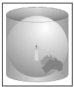
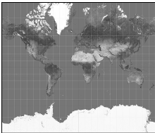
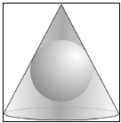
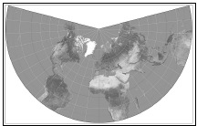
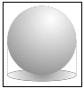
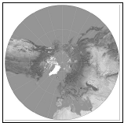
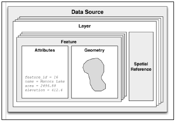
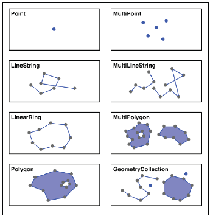
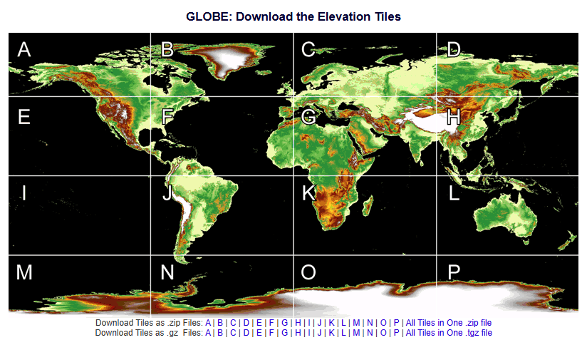

# Geospatial Development

## WMTS and WMS

* **WMS (Web Map Service)**: WMS is a standard protocol for serving geospatial data as images (png, jpeg) over the web.

* **WMTS (Web Map Tile Service)**: WMTS is a standard protocol for serving pre-rendered map tiles over the web.

* The main difference between WMS and WMTS is the way in which the map data is served to the client. WMS serves map data as a single image which is rendered on an ad hoc bases, while WMTS serves map data as a set of tiles.

---

* The term **geospatial** refers to finding information that is located on the earth's surface.

* geospatial data is represented as a series of **coordinates**, often in the form of latitude and longitude values. Additional attributes, such as temperature, soil type, height, or the name of a landmark, are also often present.

* A **Projection** is a way of representing the earth's surface in two dimensions (2D). Every piece of geospatial data has a projection associated with it.

* PostGIS spatially-enabled database toolkit

* geocode location using:

http://nominatim.openstreetmap.org/search?format=json&q="Pier 39,San Francisco, CA"

* To find the location of Coit Tower, San Francisco
http://nominatim.openstreetmap.org/search?format=json&q="Coit Tower, San Francisco, CA"

* **Mash-ups** are applications that combine data and functionality from more than one source. 

* Google Map, Mapnik, OpenLayers, and MapServer allow you to create mash-ups that overlay own data onto a map.

* Tools such as PROJ.4, PostGIS, OGR, and GDAL are all excellent geospatial toolkits

* The Open Geospatial Consortium (http://www.opengeospatial.org) is an international standards organization that aims to define standard formats and protocols for sharing and storing geospatial data.

* These standards, including GML, KML, GeoRSS, WMS, WFS and WCS.

* GIS (Geographic Information Systems). In GIS we deal with _mathematical model_ of the Earth's surface. Representing points, lines and areas on the surface of the Earth is a rather complicated process.

* The point's **latitude** is the angle that this line makes in the north-south direction, relative to the equator.

* The point's **longitude** is the angle that this line makes in the east-west direction, relative to an arbitrary starting point (typically the location of the Royal Observatory in Greenwich, England).

* The horizontal lines, representing points of equal latitude, are called **parallels**, while the vertical lines, representing points of equal longitude are called **meridians**.

* The meridian at zero longitude is often called the **prime meridian**

* The meridian at zero longitude is called **prime meridian**

* The **great-circle distance** is the length of a semicircle going between two points on the surface of the Earth, where the semicircle is centered around the middle of the Earth. The **Haversine formula** is used to calculate great-circle distance.

## Projections

* Creating a two-dimensional (2D) map from the three-dimensional (3D) shape of Earth is a process known as **Projection**. A Projection is a mathematical transformation that "unwraps" the 3D shape of the Earth and places it onto a 2D plane.

* There are three main groups of projections:
    * Cylindrical
        * Mercator projection
        * Equal-area cylindrical projection
        * Universal transverse Mercator
    * Conical
        * Albers equal-area projection
        * Lambert conformal conic projection
        * equidistant projection 
    * Azimuthal
        * Gnomonic projection
        * Lambert equal-area azimuthal projection
        * orthographic projection

| Projection | Image | Image |
|------------|-------|--------|
| Cylindrical |  |   |
| Conic |  |   |
| Azimuthal |  |  |

* Every projection distorts the Earth's surface in some way. some projections are more suited to a given purpose, but no projection can do everything.

## Coordinate Systems

* Two types of coordinate systems
    * Projected coordinate systems (UTM)
        * coordinates that refer to a point on a two dimensional map that represents the surface of the Earth.
        * first convert the Earth into a 2D Cartesian plane and then places points onto that plane.
        * to work with it, we must know which projection was used to create 2D map.

    * Unprojected coordinate systems (lat/lon)
        * These are coordinates that refer directly to a point on the Earth's surface.
        * These coordinates accurately represent a desired point on the Earth's surface, but difficult to perform distance and other geospatial calculations.

* lat/lon coordinate system represents the longitude value of zero by a line running north-south through the Greenwich observatory in England. A latitude value of zero represents a line running around the equator.

* For projected coordinate systems, we typically define an origin and the map units.

* **Universal Transverse Mercator (UTM)** coordinate system divides the world into _60_ different _zones_, each 6° of longitude in width, where each zone uses a different map projection to minimize projection errors. Within a given zone, the coordinates are measured as the number of meters from the zone's origin, which is the intersection of the equator and the central meridian for that zone. False northing and false easting values in meters are then added to the distance away from this reference point to avaoid having to deal with negative numbers.
    
## Datums

* A **datum** is a mathematical model of the Earth used to describe locations on Earth's surface. A datum consists of a set of reference points, often combined with a model of the shape of the Earth.

* There are 3 main **reference datums** that cover large areas:
    * NAD 27
    * NAD 83
    * WGS 84: World Geodetic System
        A global datum covering the entire Earth. It uses a model of the Earth's shape (the Earth Gravitational Model of 1996, EGM 96). Global Positioning System (GPS) satellites uses WGS84.

* A LineString (Polyline) represents a path as a connected series of line segments.LineStrings are often used in geospatial data to represent roads, rivers, contour lines and so on.

* There are two main types of GIS data:
    * Raster format data
        * Digital Raster Graphics (DRG) - store digital scans of paper maps
        * Digital Elevation Model (DEM) - store elevation data
        * Band Interleaved by Line (BIL)
        * Band Interleaved by Pixel (BIP)
        * Band Sequential (BSQ) - used by remote sensing systems

    * Vector format data
        * Shapefile: open specification by ESRI
        * Simple Features: OpenGIS standard for storing geographical data along with attributes
        * TIGER/Line: text-based format previously used by US Census Bureau

* **Raster formats** are generally used to store _bitmapped images_, such as scanned paper maps or aerial photographs.
* **Vector formats** represent spatial data using _points_, _lines_ and _polygons_.

## Installing GDAL (Geospital Data Abstraction Library)

* `sudo apt-get install -y libgdal-dev gdal-bin python3-gdal`

* On Windows OS, download the Wheel from [cgohlke](https://github.com/cgohlke/geospatial-wheels/releases) and activate the virtual environment and run the command `pip install .\GDAL-3.10.1-cp311-cp311-win_amd64.whl`

* GDAL and OGR are the two most popular libraries for reading and writing geospatial data.

* Originally GDAL (Geospatial Data Abstraction Library) was for working with raster-format geospatial data, while OGR (Open GIS Simple Feature Reference) intended to work with vector-format data.

* These two libraries are now partially merged.

* Default installation of GDAL allows to read data in **100** different raster file formats and write data in **71** different formats.

* OGR, by default, supports reading data in **42** different vector file formats and writing data in **39** different formats.

* To read and write raster-format data, GDAL library makes use of a `dataset` object (`gdal.Dataset`). Each dataset is broken down into multiple **bands**, where each band contains a single piece of raster data.

* Each band within a raster dataset is represented by a `gdal.Band` object.

* `band.ReadRaster()` - read some or all band data into binary string, then use `struct` library for parsing
* `band.ReadArray()` - read some band data, storing the cell values directly into NumPy array object
* `band.WriteRaster()` -
* `band.WriteArray()` -

* OGR uses the term **data source** to represent a file or other source of vector-format data. A data source consists of one or more **layers**, where each layer represents a set of related information.

* Each layer is made up of a list of **features**. For each feature, the layer has a **geometry**, which is the actual piece of geospatial data representing the feature's shape or position in space, along with a list of **attributes** that provide additional meta-information about the feature.

* Each layer has a **spatial reference** that identifies the projection and datum used by the layer's features.

* The GDAL/OGR library and associated command-line tools are all written in C and C++.

* `pyproj` Python library is use to convert data from one projection or datum to another. `pyproj` is a Python wrapper around another library called `PROJ.4` written by US Geological Survery.

* `pyproj` consists of just two classes: `Proj` and `Geod`. `Proj` converts between longitude and latitude values and native map (x,y) coordinates, while `Geod` performs various great-circle distance and angle calculations

* `Proj` is a _cartographic transformation_ class, allowing to convert geographic coordinates (lat, lon) into cartographic coordinates (x, y, meter by default) and vice versa.

* Geod class provides following methods:

* `fwd()` - take starting point, an azimuth and a distance and return ending point and back azimuth
* `inv()` - takes two coordinates and return the forward and back azimuth as well as distance between them
* `npts()` - calculates the coordinates for a number of points spaced equidistantly along a geodesic line running from start to end point

## EPSG

* EPSG (European Petroleum Survey Group) was a scientific organization that developed and maintained a database of coordinate reference system (CRS), map projections and related geodetic parameters.

* EPSG:4326 refers to the WGS84 geographic coordinate system and **EPSG:32631** refers to UTM zone 31N.

* EPSG codes for UTM zones in the Northern Hemisphere start with code **326**
* EPSG codes for UTM zones in the Southern Hemisphere start with **327**

* `gdalwarp.exe -s_srs EPSG:4326 -t_srs EPSG:3857 2025-02-04_13-09-21-829_00_00.tif output.tif`

* The library of choice for performing computational geometry in Python is **Shapely**.

* Shapely is a Python package for manipulation and analysis of 2D geospatial geometries, based of C++ GEOS library. Shapely provides a Pythonic interface to GEOS.

* GEOS is itself based on a library called the Java Topology Suite.

* Shapely Modules
    * `shapely.geometry`: Defines all the core geometric shape classes used by Shapely
    * `shapely.wkt`: Provides functions to convert between Shapely geometry object and Well-Known Text (WKT) formatted strings
    * `shapely.wkb`: Provides functions for converting between Shapely geometry objects and Well-Known binary (WKB) formatted binary data
    * `shapely.ops`: Provides functions for performing operations on a number of geometry objects at once

* Shapely geometry types in `shapely.geometry`

* Shapely is a _spatial_ manipulation library rather than a _geospatial_ manipulation library. It has no concept of geographical coordinates.

* Shapely documentation:  https://shapely.readthedocs.io/en/stable/

* Converting geospatial data into images requires a suitable toolkit, like **Mapnik**.

* Mapnik is a freely-available library for building mapping applications. Mapnik takes geospatial data from a **PostGIS** database, **shapefile**, or any other format supported by GDAL/OGR, and turns it into clearly-rendered, good-looking images

* TM World Borders Dataset: 

* Vector-based geospatial data represents physical features as collections of points, lines and polygons.

* OpenStreetMap does not use a standard format such as shapefiles to store its data. Instead, it has developed its own *XML-based format* for representing geospatial data in the form of **nodes** (single points), **ways** (sequences of points that define a line), **areas** (closed ways that represent polygons), and **relations** (collections of other elements). Any element (node, way, or relation) can have a number of tags associated with it that provide additional information about that element.

* OpenStreetMap provides two APIs
    * **Editing API**: retrieve and make changes to map dataset
    * **Overpass API**L read-only interface to map data

* `Planet.osm` (entire OpenStreetMap database) is available in two formats: a compressed XML-format file containing all nodes, ways and relations, or a special binary format called PBF(Protocolbuffer Binary Format). PBF format is faster to read.

* US Census Bureau provide large amount of geospatial data under the name **TIGER (Topologically Integrated Geographic Encoding and Referencing System)**. TIGER data includes information on
    * streets
    * railways
    * rivers
    * lakes
    * geographic boundaries
    * legal and statistical areas (school districts, urban regions)

* Up until 2006, TIGER data was in a custom text-based format call TIGER/Line. Since 2007, all TIGER data has been produced in the form of shapefiles, which are called TIGER/Line shapefiles.

* Download the TIGER data from this website https://www2.census.gov/geo/tiger/TIGER2020/

* The Natural Earth (https://www.naturalearthdata.com) website provides public-domain vector and raster map data at high, medium and low resolutions.

* World Borders Dataset:  

* Google Earth displays satellite and aerial photographs carefully stitched together to provide the illusion that you are viewing the Earth's surface from above.

* satellite imagery in the form of raster-format geospatial data.

* Raster format can include other useful information like **Digital Elevation Maps (DEM)**, containing the height of each point on the Earth's surface.

* DEM data can be used to simulate the shading effect of hills using a technique called **Shaded Relief Imagery**.

* **Landsat** is the world's most comprehensive source of satellite imagery. Landsat is an ongoing effort to collect images of the Earth's surface. A group of dedicated satellites have been continuously gathering images since 1972.

* Landsat imagery includes
    * black and white
    * RGB
    * Infrared and Thermal

* Color images are typically at a resolution of 30 meters per pixel, while black and white images from Landsat 7 are at a resolution of 15 meters per pixel.

* Landsat images are typically available in the form of **GeoTIFF** file format. GeoTIFF is a geospatially tagged TIFF image file format, allowing images to be georeferenced onto the Earth's surface.

* Landsat 7 generates separate red, green and blue bands as well as three different infrared bands, a thermal band and a high-resolution 'panchromatic' (black-and-white) band.

* Global Land One-Kilometer Base Elevation (GLOBE) is an international effort to produce high quality, medium-resolution digital elevation model data for the entire world.

* The **National Elevation Dataset (NED)** is a high-resolution digital elevation model, which covers the continental United States, Alaska, Hawaii and other US territories. Most of US is covered by elevation data at a resolution of either 30 or 10 meters per cell.

* The **GEOnet Names Server** (geonames) provides a large database of place names. It is an official repository of non-American place names. Geonames database contains approximately 6 million features and 10 million names.

* **Geographic Names Information System (GNIS)** is the US equivalent of the GEOnet Names Server containing name information for the United States.

* [Lonboard](https://github.com/developmentseed/lonboard) is a Python library for fast, interfactive geospatial vector data visualization in Jupyter.

* **datum** is a mathematical model of the earth's shape, while a **projection** is a way of translating points on the earth's surface into points on a two dimensional map.

* www.webgis.com provides shapefiles describing land use and land cover, called **LULC** data files.

## Websites

https://mygeodata.cloud/  - GeoJSON to SHP file
