# GStreamer

[Work Related](#work-related)

* Gstreamer is a multi-platform, modular, open-source, **media streaming framework**.

## Library Installation
```
$ apt-get install gstreamer1.0-tools \
                  libgstreamer1.0-dev \
                  gstreamer1.0-plugins-\* 
                  gstreamer1.0-libav 
                  libgstrtspserver-1.0-0 
                  libgstrtspserver-1.0-dev
```
### GStreamer Core: 

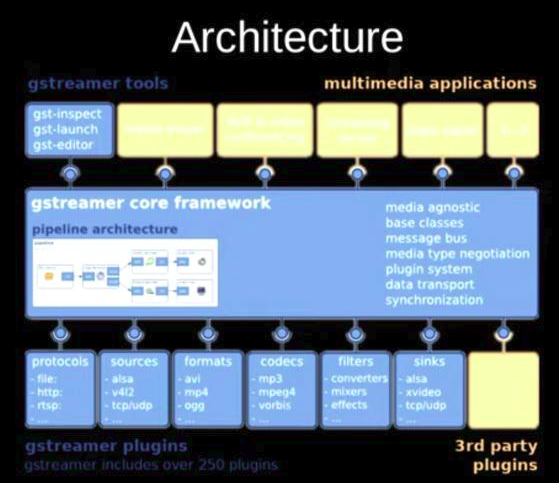


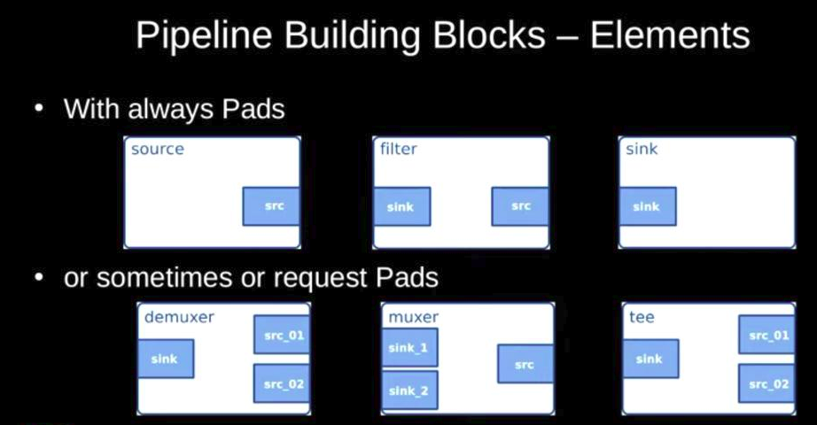

* Hierarchical pipelines: Provides Bins containing Elements, linked by Pads.

* Communication: Buffers, Events, Queries, Messages

* GStreamer framework uses **GObject** and **GLib** libraries.

* GStreamer is built on top of **GObject** (for object orientation) and **GLib** (for common algorithms) libraries. GStreamer functions have `gst_` prefix and GLiba and GObject use `g_` prefix.

* Latency management (buffering)

### gst_init(&argc, &argv)
* Initializes all internal structures
* Check what plug-ins are available
* Executes any command-line option intended for GStreamer

### gst_parse_launch
* GStreamer is a framework designed to handle _multimedia flows_. Media travels from the **“source”** elements (the producers), down to the **“sink”** elements (the consumers), passing through a series of intermediate elements performing all kinds of tasks. 

* The set of all the interconnected elements is called a **“pipeline”**.

* `gst_parse_launch` is a shortcut to build simple pipelines. `gst_parse_launch` takes textual representation of a pipeline and turns it into an acutal pipeline. There is a tool built completely around `gst_parse_launch()` called `gst-launch-1.0`.

* `playbin` is a special element which acts as a source and as a sink and is a whole pipeline. Internally, it creates and connects all necessary elements to play the media.

* Every GStreamer element has an associated state.

* `gst_object_unref(pipeline)` unreferencing the pipeline will destroy it and all its contents.

* The **elements** are GStreamer's basic construction blocks.

* New elements can be created using `gst_element_factory_make()` function.

### Few handy elements are
1. Bins
    1. playbin
    2. uridecodebin
    3. decodebin
2. File input/output
    1. filesrc
    2. filesink
3. Network
    1. souphttpsrc
4. Test media generation
    1. videotestsrc
    2. audiotestsrc
5. Video adapters
    1. videoconvert
    2. videorate
    3. videoscale
6. Audio adapters
    1. audioconvert
    2. audioresample
    3. audiorate
7. Multithreading
    1. queue
    2. queue2
    3. multiqueue
    4. tee
8. Capabilities
    1. capsfilter
    2. typefind
9. Debugging
    1. fakesink
    2. identity

* Naming an element is useful to retrieve it later if pointer is not available.

* `videotestsrc` is a source element (it produces data), which creates a test video pattern.

* `autovideosink` is a sink element (it consumes data), which dispalys on a window the images it receives. There exist several _video sinks_, depending on the operating system, with a varying range of capabilities. autovideosink _automatically selects_ and instantiates the best one.

* All elements in GStreamer must typically be contained inside a pipeline before they can be used, because it takes care of some _clocking_ and _messaging_ functions. 

* A **pipeline** is a particular type of _bin_, which is the element used to contain other elements.

* To add many elements use `gst_bin_add_many()`. To add individual elements use `gst_bin_add()`.

* To link the elements use `gst_element_link()`.

* All GStreamer elements are a particular kind of GObject. GObject offers _**property**_ facilities. Properties are read with `g_object_get()` and written to with `g_object_set()`.

* The names and possible values of all the properties an element exposes can be found using the `gst-inspect-1.0` tool

* `GstMessage` is a very versatile structure which can deliver virtually any kind of information. Fortunately, GStreamer provides a series of parsing functions for each kind of message.

* GStreamer bus is the object responsible for delivering to the application the `GstMessage`s generated by elements, in order and to the application thread. Actual streaming of media is done in another thread than the application.

* A multiplexed (or muxed) file contains audio and video together inside a _container_ file. The elements responsible for opening such containers are called _**demuxers**_. Some example of container formats are
    1. Matroska (MKV)
    2. Quick Time (QT, MOV)
    3. Ogg
    4. Advanced Systems Format (ASF, WMV, WMA)

* If a container embeds multiple streams, the demuxer will separate them and expose them through different output ports.

* The ports through which GStreamer elements communicate with each other are called **pads (GstPad)**. Data enter an element through **sink pads** and exists an element through **source pads**. source elements only contain source pads, sink elements only contain sink pads, and filter elements contain both.

* A demuxer contains one sink pad, through which muxed data arrives, and multiple source pads, one for each stream found in the container.

* `uridecodebin` will internally instantiate all the necessary elements (source, demuxers and decoders) to turn a URI into raw audio and/or video streams.

* `audioconvert` is useful for converting between different audio formats.

* `audioresample` is useful for converting between different audio sample rates.

* `autoaudiosink` will render the audio stream to audio card.

* `GSignals` are a crucial point in GStreamer. They notify (by means of callback) when something interesting has happened. Singals are identified by a name and each `GObject` has its own signals.

* The signals that a `GstElement` generates can be found in its documentation or using `gst-inspect-1.0` tool.

### GStreamer States
State   |  Description |
--------|---------------|
NULL    | Initial State of an element |
READY   | Element is ready to go to PAUSED |
PAUSED  | ready to accept and process data |
PLAYING | Element is PLAYING, the clock is running and data is flowing |

* `GstQuery` is a mechanism that allows asking an element or pad for a piece of information.

* Build a pipeline composed of a single element, a playbin. playbin is in itself a pipeline, so we directly use the playbin element as pipeline.

* Without a timeout `gst_bus_timed_pop_filtered()` will not return until a message is received on the bus.

```c++
gst_bus_timed_pop_filtered(bus, 100*GST_MSECOND,
    GST_MESSAGE_STATE_CHANGED | GST_MESSAGE_ERROR | GST_MESSAGE_EOS | GST_MESSAGE_DURATION);
```

* Tell GStreamer to output the video to a window of our choice. The specific mechanism depends on the operating system (or rather, on the windowing system), but GStreamer provides a layer of abstraction for the sake of platform independence. This independence comes through the `GstVideoOverlay` interface, that allows the application to tell a video sink the handler of the window that should receive the rendering.

* **Pads** allow information to enter and leave an element. The _Capabilities_ (or Caps) of a Pad, specify what kind of information can travel through the Pad.
Example: 1. RGB video with a resolution of 320x200 pixels and 30 fps
 2. 16-bits per sample audio, 5.1 channels at 44100 samples per seconds
 3. Compressed formats like mp3 or h264

 * Actual infomration traveling from Pad to Pad must have only one well-specified type. Through a process known as _negotiation_, two linked Pads agree on a common type, and thus Capabilities of Pads become fixed.

 * In order for two elements to be linked together, they must share a common subset of Capabilities.

 * `GstElementFactory` is in charge of instantiating a particular type of element, identified by its factory name.

 * `audiotestsrc` produces a synthetic tone. `wavescope` consumes an audio signal and renders a waveform as if it was an oscilloscope.

 * The element used to inject application data into a GStreamer pipeline is `appsrc` and used to extract GStreamer data back to the application is `appsink`.

 * `appsrc` and `appsink` are so versatile that they offer their own API, which can be accessed by linking against the `gstreamer-app` library.

 * Data travels through a GStreamer pipeline in chunks called _buffers_.

 * `GstDiscoverer` is a utility object found in the `pbutils` library (Plug-in Base utilities) that accepts a URI or list of URIs, and returns information about them. It can work in synchronous or asynchronous modes.

 * `gst-discoverer-1.0` tool is an application that only displays data, but does not perform any playback.

 * `gst-launch-1.0` tool accepts a textual description of a pipeline, instantiates it, and sets it to the PLAYING state. It allows you to quickly check if a given pipeline works, before going through the actual implementation using GStreamer API calls.

* Fast-forward, reverse-playback and slow-motion are all techniques collectively known as _trick modes_ and they all have in common that modify the normal playback rate.

* GStreamer provides two mechanisms to change the playback rate: _Step Events_ and _Seek Events_. Step Events allow skipping a given amount of media besides changing the subsequent playback rate (only to positive values). Seek Events, additionally, allow jumping to any position in the stream and set positive and negative playback rates.

* 
 ```
 gst-launch-1.0 videotestsrc ! videoconvert ! autovideosink

 gst-launch-1.0 videotestsrc pattern=11 ! videoconvert ! autovideosink

 gst-launch-1.0 videotestsrc \
 ! videoconvert \
 ! tee name=t \
 ! queue \
 ! autovideosink t. \
 ! queue \
 ! autovideosink

 gst-launch-1.0 souphttpsrc location=https://www.freedesktop.org/software/gstreamer-sdk/data/media/sintel_trailer-480p.webm \
 ! matroskademux name=d d.video_0 \
 ! matroskamux \
 ! filesink location=sintel_video.mkv

 ```

 * Both audio video together
 ```
# no link between audiosink and videosrc
$ gst-launch-1.0 audiotestsrc \
! audioconvert \
! autoaudiosink videotestsrc \
! videoconvert \
! autovideosink

$ gst-launch-1.0 audiotestsrc \
! audioconvert \
! autoaudiosink audiotestsrc wave=pink-noise \
! spacescope \
!  videoconvert \
! autovideosink

$ gst-launch-1.0 audiotestsrc freq=440 volume=0.3 \
! queue \
! a. audiotestsrc freq=880 volume=0.3 \
! queue \
! a. adder name=a \
! audioconvert \
! autoaudiosink

$ gst-launch-1.0 filesrc location=test.ogg \
  ! oggdemux name=d d. \
  ! queue ! vorbisdec ! audioconvert ! audioresample autoaudiosink d. \
  ! queue ! theoradec ! videoconvert ! videoscale ! autovidosink
 ```

* `spacescope` element takes audio as input and output BGRx video output.

```
# edgetv
$ gst-launch-1.0 v4l2src device=/dev/video0 \
! video/x-raw,width=640,height=480,framerate=30/1 \
! videoconvert \
! timeoverlay \
! edgetv \
!  ximagesink

# rippletv
$ gst-launch-1.0 v4l2src device=/dev/video0 \
! video/x-raw,width=640,height=480,framerate=30/1 \
! videoconvert \
! timeoverlay \
! rippletv \
!  ximagesink
```
* A `tee` copies to each of its output pads everything coming through its input pad.

* `filesink` location property specifies the name of the file.

### GStreamer Test Patterns

|  Pattern                             | Pattern                  |
|--------------------------------------|--------------------------|
| 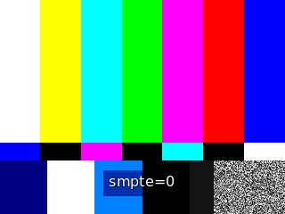           | 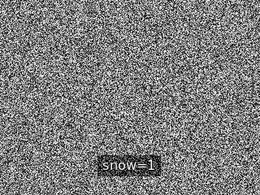 |
| 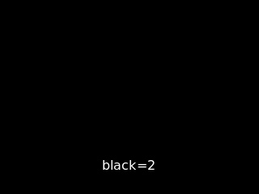           |  |
| 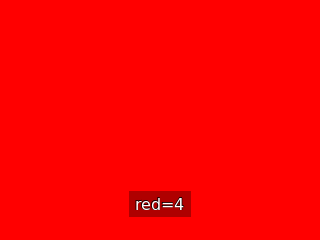                | 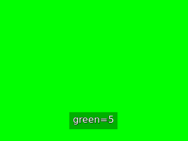 |
| 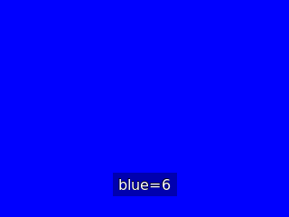             | 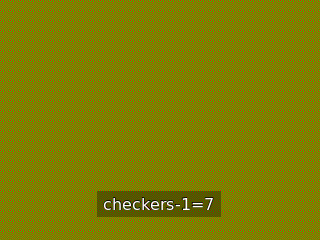 |
| 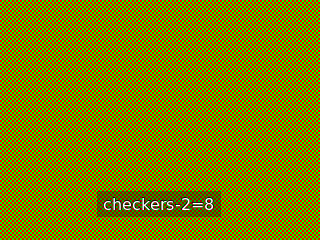 | 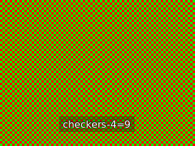 |
| 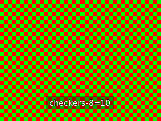 | 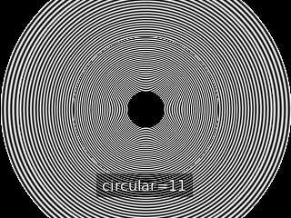 |
|            | 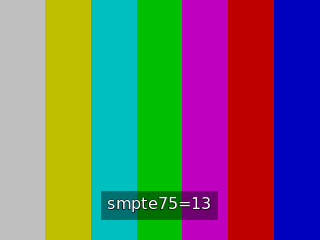 |
|  | 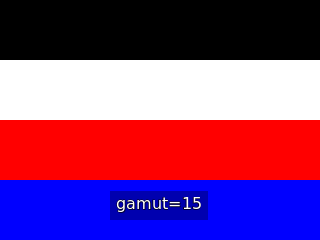 |
|  |  |
| 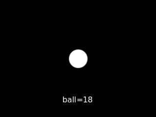             | 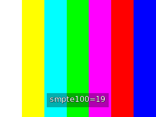 |
| 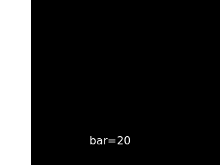               |  |
| 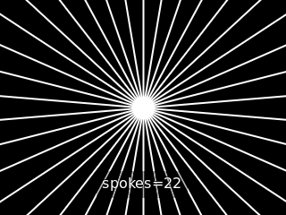         | 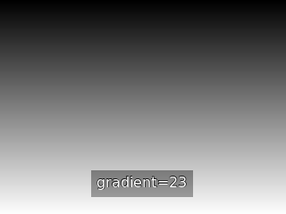 |
| 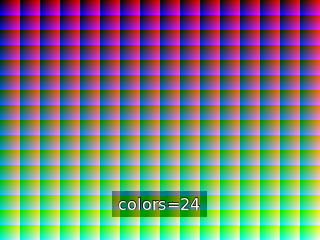         |                                  |

### Send Images as videos
* Use `pattern_gen.c` file to generate all 24 built-in patterns of `videotestsrc`. Save the images as `pattern-%02d.png`.
* To generate all 24 patterns use the following shell commands:
```
# compile source code
$ gcc pattern_gen.c -o pattern_gen `pkg-config --cflags --libs gstreamer-1.0`

# For generating all pattern 
$ for i in {0..24}; do ./pattern_gen $i; done
```
* To continuously show these images as video
```
gst-launch-1.0 multifilesrc location="pattern-%02d.png" loop=true \
! decodebin \
! videoconvert \
! ximagesink
```

* To send the images only once use `num-buffers=24`
```
gst-launch-1.0 multifilesrc location="pattern-%02d.png" loop=true num-buffers=24 \
! decodebin \
! videoconvert \
! ximagesink
```

* To send the images on a UDP port. Since we are sending raw video over UDP, it will cause following error "Attempting to send a UDP packets larger than maximum size (307200 > 65507)". We need to encript the video for sending over UDP port.

```
gst-launch-1.0 multifilesrc location="pattern-%02d.png" loop=true \
! decodebin \
! videoconvert \
! videorate \
! video/x-raw,framerate=4/1 \
! udpsink host=127.0.0.1 port=6000
```

```
gst-launch-1.0 multifilesrc location="pattern-%02d.png" loop=true \
! decodebin \
! videoconvert \
! videorate \
! video/x-raw,framerate=4/1 \
! x264enc \
! h264parse \
! rtph264pay \
! udpsink host=127.0.0.1 port=6000
```

```
# Use agingtv module with webcam
gst-launch-1.0 -vvv v4l2src device=/dev/video0 \
! videoconvert \
! video/x-raw,width=640,heigh=480  \
! agingtv dusts=false \
! ximagesink
```
* send video test src as RPT and receive it

```
# sender pipeline
gst-launch-1.0 -v videotestsrc \
! video/x-raw,width=1024,height=768,framerate=30/1 \
! timeoverlay halignment=center valignment=bottom  shaded-background=true font-desc="Sans, 24" \
! videoscale \
! videoconvert \
! x264enc \
! rtph264pay \
! udpsink host=127.0.0.1 port=5000

# receiver pipeline
gst-launch-1.0 -v udpsrc port=5000 \
caps = "application/x-rtp, media=(string)video, clock-rate=(int)90000, encoding-name=(string)H264, payload=(int)96" \
! rtph264depay \
! decodebin \
! videoconvert \
! autovideosink
```

* Installing v4l2-utils

```
$ sudo apt install v4l-utils
$ v4l2-ctl --info -d /dev/video1 --list-formats
```

* Record webcam to a file
```
# -e is important because after press ctrl-c the pipeline will not just stop but is being 
# properly shut down by sending an EOS signal through the pipeline.
$ gst-launch-1.0 -e v4l2src device=/dev/video0 \
! videoconvert \
! x264enc \
! "video/x-h264,stream-format=(string)byte-stream"  \
! h264parse \
! qtmux \
! filesink location=test.mp4 sync=false

# Play RTSP stream
$ gst-launch-1.0 rtspsrc location=rtsp://smartlink.local:8554/camera/0 \
! rtph264depay \
! avdec_h264 \
! autovideosink sync=false

# for RTSP stream
$ gst-launch-1.0 rtspsrc location=rtsp://192.168.168.102:8554/camera/0 \
! rtph264depay \
! h264parse \
! mp4mux \
! filesink location=flight_video1.mp4
```

* **FFmpeg** is a command line application which consists of a library of free / open source software. Includes **libavcodec**, a library for audio/video codecs used by several other projects, and **libavformat**, a library for audio/video container mux and demux container. The project name comes from the MPEG standard video group, append “FF” for “fast forward”.

* GStreamer can also send data using UDP or TCP. GStreamer can also send one source to many using **multiudp** so that the client can receive streams simultaneously. 

* x264 [error]: baseline profile doesn't support 4:2:2
Use caps filter "video/x-raw,format=i420" between video convert and x264enc. This should resolve the format issue.

If u want 264  main porofile then use caps filter "video/x-h264,profile=main" this would give 4 2 2 video

## Work Related
```
gst-launch-1.0 -v videotestsrc \
! video/x-raw,format=I420,width=640,height=480,framerate=30/1,is-live=1 \
! textoverlay text="Cam-1" valignment=top halignment=left font-desc="Sans, 22" shaded-background=true \
! timeoverlay valignment=bottom halignment=center shaded-background=true \
! videoconvert \
! x264enc \
! h264parse \
! rtph264pay \
! udpsink host=127.0.0.1 port=5000
```
### Inserting caption
```
tail -n 1000 -f captions.srt | gst-launch-1.0 -v fdsrc \
! subparse \
! txt. videotestsrc is-live=true \
! video/x-raw, width =800, height=480, framerate=10/1 \
! videoconvert \
! decodebin \
! textoverlay name=txt \
! xvimagesink
```
### tee example
```
gst-launch-1.0 v4l2src device=/dev/video0 \
! tee name=t t. \
! queue \
! video/x-raw,width=640,height=480 \
! videoconvert \
! autovideosink t. \
! queue \
! video/x-raw,width=640,height=480 \
! videoconvert \
! autovideosink -v

# Display video and save one frame per second
gst-launch-1.0 v4l2src device=/dev/video0 \
! tee name=t t. \
! queue \
! video/x-raw,width=640,height=480 \
! videoconvert \
! autovideosink t. \
! queue \
! video/x-raw,width=640,height=480 \
! timeoverlay \
! videorate \
! video/x-raw,framerate=1/1 \
! videoconvert \
! jpegenc \
! multifilesink location="test-%05d.jpeg"
```

### Caption file format
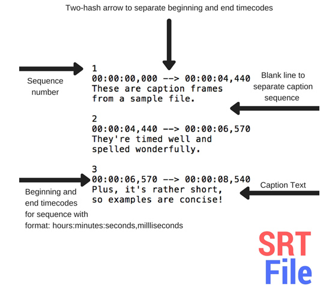

**Cairo**: Cairo is a 2D graphics library with support for multiple output devices. Currently supported output targets include the X Window System (via both Xlib and XCB), Quartz, Win32, image buffers, PostScript, PDF, and SVG file output. Experimental backends include OpenGL, BeOS, OS/2, and DirectFB.

**Pango**: Pango is a library for laying out and rendering of text, with an emphasis on internationalization. Pango can be used anywhere that text layout is needed, though most of the work on Pango so far has been done in the context of the GTK widget toolkit. Pango forms the core of text and font handling for GTK.

### Send webcam video as JPEG images
#### Sender
$ gst-launch-1.0 v4l2src device=/dev/video0 \
! image/jpeg,width=640,height=480,framerate=30/1 \
! videorate \
! image/jpeg,framerate=1/1 \
! rtpjpegpay \
! udpsink host=127.0.0.1 port=6666

#### Receiver
$ gst-launch-1.0 udpsrc port=6666 \
! application/x-rtp,encoding-name=JPEG,payload=26 \
! rtpjpegdepay \
! jpegparse \
! jpegdec \
! autovideosink

#### Sender (with timeoverlay)
gst-launch-1.0 v4l2src device=/dev/video0 \
! image/jpeg,width=640,height=480,framerate=30/1 \
! videorate \
! image/jpeg,framerate=1/1 \
! jpegdec \
! timeoverlay \
! jpegenc \
! rtpjpegpay \
! udpsink host=127.0.0.1 port=6666

### Check USB WebCam Resolution
use `lsusb` command
Examine the output of `lsusb` and find a line describing webcam
```
$ lsusb
Bus 002 Device 001: ID 1d6b:0003 Linux Foundation 3.0 root hub
Bus 001 Device 004: ID 0461:4e84 Primax Electronics, Ltd USB Optical Mouse
Bus 001 Device 003: ID 0461:0010 Primax Electronics, Ltd HP PR1101U / Primax PMX-KPR1101U Keyboard
Bus 001 Device 024: ID 0bda:8152 Realtek Semiconductor Corp. RTL8152 Fast Ethernet Adapter
Bus 001 Device 005: ID 0bda:0169 Realtek Semiconductor Corp. Mass Storage Device
**Bus 001 Device 023: ID 05a3:9520 ARC International Camera**
Bus 001 Device 001: ID 1d6b:0002 Linux Foundation 2.0 root hub
Bus 004 Device 001: ID 1d6b:0003 Linux Foundation 3.0 root hub
Bus 003 Device 001: ID 1d6b:0002 Linux Foundation 2.0 root hub

# Use Bus and Device number to get more information
$ lsusb -s 001:023 -v

# Or else use v4l2-ctl
$ v4l2-ctl --list-formats-ext

# or ffmpeg
$ ffmpeg -f video4linux2 -list_formats all -i /dev/video0
[video4linux2,v4l2 @ 0x5591e869e6c0] Compressed:       mjpeg :          Motion-JPEG : 640x480 320x240 800x600 1024x768 1280x720 1280x1024 1600x1200 1920x1080 2048x1536 2592x1944 640x480
[video4linux2,v4l2 @ 0x5591e869e6c0] Raw       :     yuyv422 :           YUYV 4:2:2 : 640x480 320x240 800x600 1024x768 1280x720 1280x1024 1600x1200 1920x1080 2048x1536 2592x1944 640x480

```


