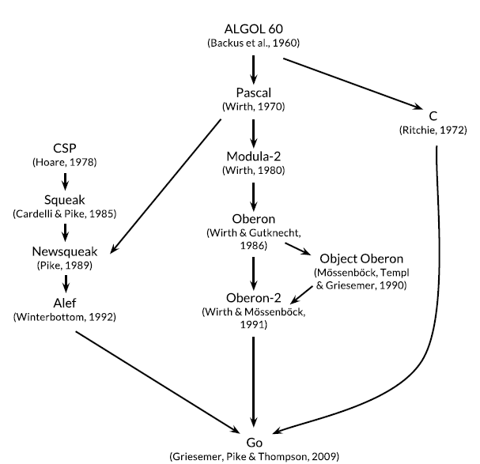

# Go Programming

* Go facilities for concurrency are new and efficient. 
* Go has automatic memory management or _garbage collection_
* Go is suited for building **infrastructure like networked servers**

* Go is "C for the 21st century".

* Go inherits following from C
    * expression syntax,
    * control-flow statements
    * basic data types,
    * call-by-value parameter passing
    * pointers
    * efficient machine code

* _communicating sequential processes (CSP)_

* In CSP, a program is a parallel composition of processes that have no shared state; the processes communicate and synchronize using **channels**.

* Only through simplicity of design can a system remain stable, secure , and coherent as it grows.

* Go has comparatively few features:
    * No implicit numeric conversions
    * No constructors or destructors
    * No operator overloading
    * No default parameter values
    * No inheritance
    * No generics
    * No exceptions
    * No macros
    * No function annotations
    * No thread-local storage

* Go's aggregate types are _structs_ and _arrays_

* You'll need to choose a directory to be your Go workspace and set the `GOPATH` environment variable to point to it

* https://golang.org  blog.golang.org  play.golang.org tour.golang.org

* Go code is organized into packages (similar to libraries/modules). Each source file begins with a `package` declaration. `package main` for example.

* `package main` is special, it defines a standalone executable program, not a library.

* You must import exactly the packages you need. A program will not compile if there are missing imports or if there are unnecessary ones.

* `i++` are statements, not expressions as they are in most languages in the C family

* The built-in function `make` creates a new empty map; it has other uses too.

* Each call to `input.Scan()` reads the next line and removes the newline character from the end; the result can be retrieved by calling `input.Text()`.