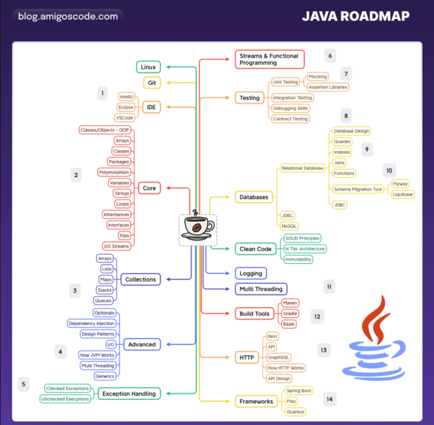
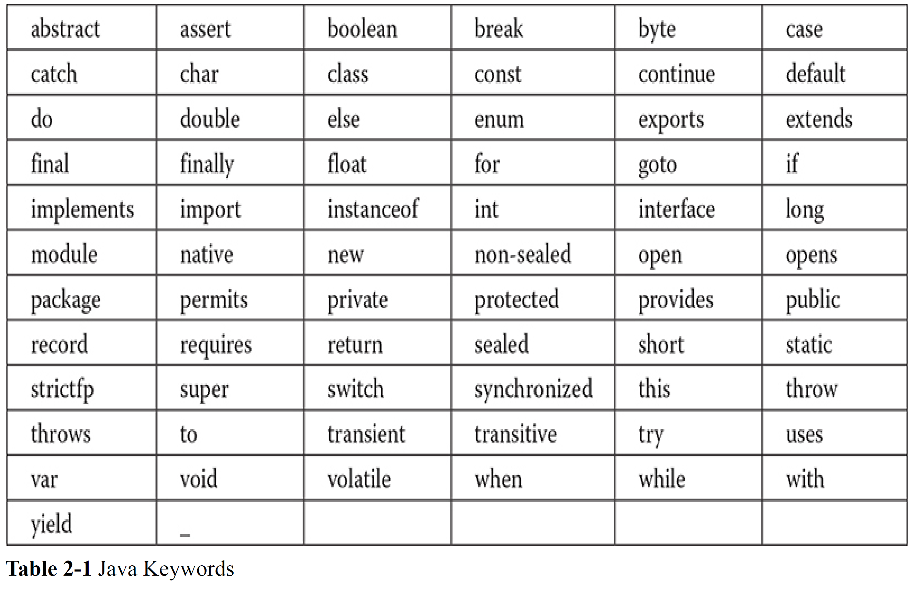

# Java Road Map



# Core Java - Volume I - Fundamentals

* Java is a whole platform, with a huge library, containing lots of reusable
code, and an execution environment that provides services such as security,
portability across operating systems, and automatic garbage collection

* 11 buzzwords:
    1. Simple
    2. Object-Oriented
    3. Distributed
    4. Robust
    5. Secure
    6. Architecture-Neutral
    7. Portable
    8. Interpreted
    9. High-Performance
    10. Multithreaded
    11. Dynamic

* Java omits many rarely used, poorly understood, confusing features of C++

* There is no
need for header files, pointer arithmetic (or even a pointer syntax), structures,
unions, operator overloading, virtual base classes, and so on.


* The size of the basic interpreter and class support is about 40K;
the basic standard libraries and thread support (essentially a self-contained
microkernel) add another 175K

* There is now a separate Java Micro Edition with a smaller
library, suitable for embedded devices.

* The major
difference between Java and C++ lies in multiple inheritance, which Java has
replaced with a simpler concept of interfaces. Java has a richer capacity for
runtime introspection (discussed in Chapter 5) than C++.

* The single biggest difference between Java and C/C++ is that
Java has a pointer model that eliminates the possibility of overwriting
memory and corrupting data.

* It wasn’t until Java 9 that the jshell tool supported rapid and
exploratory programming

* Java programs that work on web pages are called applets.

* Java 8 embraces a "functional" style of programming that makes it easy to express computations that can be executed
concurrently.

* Java has the edge in server-side programming and in cross-platform client applications

* The `javac` program is the Java compiler. It compiles the file
`Welcome.java` into the file `Welcome.class`. The `java` program launches
the Java virtual machine. It executes the bytecodes that the compiler placed in
the class file.

* Note that Java does not have any unsigned versions of the int,
long, short,or byte types.

* Unlike C and C++, there are no “implementation-dependent” aspects of the
specification. The sizes of the primitive data types are specified, as is the
behavior of arithmetic on them

* an int in Java is always a 32-bit integer

* Java 9 that the jshell tool supported rapid and
exploratory programming.

* Starting in 2018, Java versions are released every six months, to enable faster
introduction of features.

* Java has the edge in
server-side programming and in cross-platform client applications.

* When you run the
program, you specify a class name without a .java or
.class extension.

* The JShell program provides a "read-evaluate-print loop," or REPL.

* everything in a Java program
lives inside a class.

* You need to make the file name for the source code the same as the name of the
public class, with the extension .java appended

* If the main method exits normally, the Java program
has the exit code 0, indicating successful completion. To terminate the
program with a different exit code, use the System.exit method.

* There are eight primitive types in Java. int, short, long, byte, float, double, char, boolean

* In Java, the sizes of all numeric types
are platform-independent. In contrast, C and C++ programs use the most efficient integer type for each processor.

* Starting with Java 7, you can write numbers in binary, with a prefix 0b or 0B. 0b1001 is 9.

* Note that Java does not have any unsigned versions of the int,
long, short,or byte types.

* call
Byte.toUnsignedInt(b) to get an int value between 0 and 255,

* Starting with Java 10, you do not need to declare the types of local
variables if they can be inferred from the initial value. Simply use the
keyword var instead of the type
`var greeting = "Hello";`

* In Java, you use the keyword `final` to denote a constant.

* Set up a class constant with the keywords `static final`.

* methods tagged with the `strictfp` keyword must use strict floatingpoint
operations that yield reproducible results

* You can avoid the `Math` prefix for the mathematical methods and constants by adding the following line to the top of your source file:

`import static java.lang.Math.*;`

* https://www.netlib.org/master_counts2.html#fdlibm

* A `>>>` operator fills the top bits with zero, unlike `>>` which extends the sign bit into the top bits. There is no `<<<` operator.

* In C/C++, there is no guarantee as to whether >> performs an arithmetic
shift (extending the sign bit) or a logical shift (filling in with zeroes).
Implementors are free to choose whichever is more efficient. That
means the C/C++ >> operator may yield implementation-dependent
results for negative numbers. Java removes that uncertainty.

* Strings are Immutable, i.e., The String class gives no methods that let you change a character in an existing string

* To test whether two strings are equal, use the equals method: `s.equals(t)`

* `if (str != null && str.length() != 0)`

* The Scanner class is defined in the
java.util package.

* Java 6 introduces a `Console` class specifically for reading passwords from console

* Reading and writing files:

```java
import java.nio.charset.StandardCharsets;
Scanner in = new Scanner(Path.of("myfile.txt"), StandardCharsets.UTF_8);
in.readLine();

PrintWriter out = new PrintWriter("myfile.txt", StandardCharsets.UTF_8);

// tell the compiler that you are aware of the possibility of an "input/output" exception.
public static void main(String[] args) throws IOException
{
Scanner in = new Scanner(Path.of("myfile.txt"), StandardCharsets.UTF_8);
. . .
}
```

* There is no goto, but there is a “labeled”
version of break that you can use to break out of a nested loop

* In C++, it is possible to redefine a variable inside a nested block. The
inner definition then shadows the outer one. This can be a source of
programming errors; hence, Java does not allow it.

* couple of handy classes in the `java.math` package:
`BigInteger` and `BigDecimal`.

* Unlike C++, Java has no programmable operator overloading

* To find the number of elements of an array, use array.length

* In Java, the [] operator is predefined to perform bounds checking.

* In the `main` method of a Java program, the name of the program is not
stored in the `args` array.

* designer of the Pascal language, Niklaus Wirth, called his famous book on
programming Algorithms + Data Structures = Programs

* The most common relationships between classes are
    * Dependence ("uses–a")
    * Aggregation ("has–a")
    * Inheritance ("is–a")


* violet UML Editor: http://alexdp.free.fr/violetumleditor/page.php

* UTC is the
Coordinated Universal Time, the scientific time standard which is, for practical
purposes, the same as the more familiar GMT, or Greenwich Mean Time.

* the standard Java library contains
two separate classes: the `Date` class, which represents a point in time, and the
`LocalDate` class, which expresses days in the familiar calendar notation

* Java objects are constructed on the heap and that
a constructor must be combined with new.

* As of Java 10, you can declare local variables with the var keyword instead of
specifying their type

* If you apply a method to a `null` value, a `NullPointerException` occurs.

* As of Java 9, the Objects class has a convenience method for this purpose:
`name = Objects.requireNonNullElse(n, "unknown");`

* a method can access the private data of _all objects of its class_.

* You can define an instance field as final. Such a field must be initialized
when the object is constructed

* The Java programming language _always uses call by value_.

* in a
class, if you don’t initialize a field, it is automatically initialized to a
default (0, false, or null).

* If the _first statement of a constructor_ has the form `this(. . .)`, then the
constructor calls another constructor of the same class.

```java
public Employee(double s)
{
    // calls Employee(String, double)
    this("Employee #" + nextId, s);
    nextId++;
}
```

* Do not use the finalize method for cleanup.

* Java allows you to group classes in a collection called a `package`.

* The java.time.* syntax is less tedious. It has no negative effect on code
size.

* A form of the import statement permits the importing of static methods and
fields, not just classes
`import static java.lang.System.*;`

* To place classes inside a package, put the name of the package at the top of your
source file, before the code that defines the classes in the package
```java
package com.horstmann.corejava;
public class Employee
{
}
```

* All source files in the `com.horstmann.corejava` package should be in a subdirectory `com/horstmann/corejava`

* you still must compile and run classes from the base directory:

```java
javac com/mycompany/PayrollApp.java
java com.mycompany.PayrollApp
```

* The virtual machine won't find the classes if the packages don’t match the directories.

* If you don't specify either `public` or `private`, the feature (that is, the class, method, or variable) can be accessed by
all methods in the _same package_.

* Nowadays, you should use
modules to encapsulate packages.

* Starting with Java 6, you can specify a wildcard for a JAR file directory
`c:\classdir;.;c:\archives\*`
`/home/user/classdir:.:/home/user/archives/'*'` // In UNIX, * must be escaped

* The class path lists all directories and archive files that are starting points for
locating classes.

* `java.lang` package is always
imported by default

```
export CLASSPATH=/home/user/classdir:.:/home/user/archives/archive.jar
set CLASSPATH=c:\classdir;.;c:\archives\archive.jar

jar cvf jarFileName file1 file2 .
jar cvf CalculatorClasses.jar *.class icon.gif

```

* In C++, you need to declare a member function as virtual if you
want dynamic binding. In Java, dynamic binding is the default behavior;
if you do not want a method to be virtual, you tag it as final.

* In C++, a class can have multiple superclasses. Java does not support
multiple inheritance

* Classes that cannot be extended are called final classes, and you
use the final modifier in the definition of the class to indicate this.

```java
if (staff[1] instanceof Manager)
{
    boss = (Manager) staff[1];
}
```

```
// Comiple all files from abstractClasses package
javac .\abstractClasses\PersonTest.java

// Run the main class, java uses dot notation
java abstractClasses.PersonTest
```

* In Java, a protected field is accessible by any class in the same package.

* the default hashCode method in the Object
class derives the hash code from the object’s memory address.

* Whenever an
object is concatenated with a string by the “+” operator, the Java compiler
automatically invokes the toString method to obtain a string representation
of the object.

* The Object class defines the toString method to print the class name and
the hash code of the object.

* In Java, you can set the size of an array at
runtime.

* The `ArrayList` class is similar to an array,
but it automatically adjusts its capacity as you add and remove elements, without
any additional code.

* All primitive types have class counterparts. int -> Integer

* the type parameter inside the angle brackets cannot be a **primitive type**. It is not possible to form an
`ArrayList<int>`. Here, the `Integer` wrapper class

* The designers of Java found the wrappers a convenient place to put certain basic methods, such as
those for converting strings of digits to numbers.

* All enumerated types are subclasses of the class Enum

* A program that can analyze the capabilities of classes is called reflective

* Just as methods in an interface are automatically public, fields are always
public static final.

* the Java programming language has an important
interface built into it, called Cloneable.

* As of Java 8, you are allowed to add static methods to interfaces.

* You can supply a lambda expression whenever an object of an interface with a
single abstract method is expected. Such an interface is called a _functional interface_.

* In fact, conversion to a functional interface is the only thing that you can do with
a lambda expression in Java.

* The Java API defines a number of very generic functional interfaces in the
`java.util.function` package like `Predicate` and `Supplier<T>` 

* The expression `System.out::println` is a method reference. It directs the
compiler to produce an instance of a _functional interface_, overriding the single
abstract method of the interface to call the given method

* Common Functional Interfaces

| Functional Interface | Parameter Types | Return Type | Abstract Method Name | Description | Other Methods |
|----------------------|-----------------|-------------|----------------------|-------------|---------------|
| `Runnable` | none | void | `run` | Runs an action without arguments or return value | |
| `Supplier<T>` | none | T | `get` | Supplies a value of type T | |
| `Consumer<T>` | T | void | `accept` | Consumes a value of type T | and Then |
| `BiConsumer<T, U>` | T, U | void | `accept` | Consumes values of types T and U | andThen |
| `Function<T, R>` | T | R | `apply` | A function with argument of type T | compose, andThen, identity |
| `BiFunction<T, U, R>` | T, U | R | `apply` | A function with arguments of types T and U | andThen |
| `UnaryOperator<T>` | T | T | `apply` | A unary operator on the type T | compose, andThen, identity |
| `BinaryOperator<T>` | T,T | T | `apply` | A binary operator on the type T | andThen, maxBy, minBy |
| `Predicate<T>` | T | boolean | `test` | A boolean valued function | and, or, negate, isEqual |
| `BiPredicate<T, U>` | T, U | boolean | `test` | A boolean valued function with two arguments | and, or, negate |


* If you design your own interface with a single abstract method, you can
tag it with the `@FunctionalInterface` annotation. This has two
advantages. The compiler gives an error message if you accidentally add
another abstract method. And the javadoc page includes a statement that
your interface is a **functional interface**.

* In the Java programming language, an exception object is always an instance of
a class derived from `Throwable`.

* A `RuntimeException` happens because you made a programming error. Any
other exception occurs because a bad thing, such as an I/O error, happened to
your otherwise good program.

* In summary, a method must declare all the checked exceptions that it might
throw. Unchecked exceptions are either beyond your control (Error) or result
from conditions that you should not have allowed in the first place
(RuntimeException).

* in C++, a function may throw any exception if no throw
specification is given. In Java, a method without a throws specifier
may not throw any checked exceptions at all.

* As of Java 7, you can catch multiple exception types in the same catch clause.

```java
try
{
    code that might throw exceptions
} catch (FileNotFoundException | UnknownHostException e)
{
    emergency action for missing files and unknown hosts
}
```

* Since Java 7, there is a more elegant solution, the try-with-resources
statement

* The code in the finally clause executes whether or not an exception was
caught.

* Assertions are a commonly used idiom of defensive programming. The assertion mechanism allows you to put in checks during testing and to have
them automatically removed in the production code.

* By default, assertions are disabled. Enable them by running the program with the
`-enableassertions` or `-ea` option

* The introduction of generics in Java 5 constitutes the most significant change in
the Java programming language since its initial release


# Effective Java

* Java programming language's fundamental libraries: `java.lang`, `java.util`, and `java.io`, and
subpackages such as `java.util.concurrent` and `java.util.function`.

* Code should be reused rather than copied


# Jave - The Complete Reference 13th Ed

* Some address perceived weaknesses of Java in novel ways. These
newer languages include Kotlin, which uses the same bytecode
representation but aims to be simpler and easier to learn, and Ruby, a
dynamically interpreted language with a straightforward syntax to allow
applications to be developed quickly.

* An _applet_ is a special kind of Java program that is designed to be
transmitted over the Internet and automatically executed inside a Javacompatible
web browser.

* applet support being removed by JDK 11

* **Bytecode** is a highly optimized set
of instructions designed to be executed by what is called the **Java Virtual
Machine** (JVM), which is part of the **Java Runtime Environment** (JRE).

* HotSpot technology provides a just-in-time (JIT) compiler for bytecode.

* Today, major releases occur every six months

* A **servlet** is a small program
that executes on the server.

* One of the most important was the new **stream API**, which is
packaged in `java.util.stream`. The stream API supports _pipeline operations_
on data and is optimized for lambda expressions. Another new package was
`java.util.function`. It defines a number of functional interfaces, which
provide additional support for lambda expressions

* Another key change in JDK 11 is that **JavaFX** was no longer included in the
JDK. Instead, this GUI framework has become a separate open-source project.

* Humans manage complexity through abstraction.

* The Java
compiler requires that a source file use the .java filename extension. By convention, the name of the main class
should match the name of the file that holds the program.

* To actually run the program, you must use the Java application launcher
called **java**.

* There are 68 keywords currently defined in the Java language 

* The Java language limits the uses of its keywords and divides them into two categories: 51
_reserved words_ and 17 _contextual keywords_.



* Because of Java’s portability requirement, all
data types have a strictly defined range. For example, an int is always 32
bits, regardless of the particular platform

* Java does not support unsigned,
positive-only integers

* Java manages the
meaning of the high-order bit differently, by adding a special "unsigned
right shift" operator. Thus, the need for an unsigned integer type was
eliminated.

* beginning with JDK 15, Java added a feature called
a text block, which gives you more control and flexibility when multiple
lines of text are needed

* Although blocks can be nested, you cannot declare a
variable to have the same name as one in an outer scope.

```java
int a = 10;
{
    int a = 20; // compile time error, a already defined
}
```

* in Java all arrays are dynamically allocated

```java
int a1[] = new int[3];
int[] a2 = new int[3]; // same as above
```

* Beginning with JDK 10, it is now possible to let the compiler infer the
type of a local variable based on the type of its initializer, thus avoiding the
need to explicitly specify the type.

* To support local variable type inference, the contextsensitive
keyword var was added

* For each shift left (<<), the high-order
bit is shifted out (and lost), and a zero is brought in on the right.

* When you are shifting right, the top (leftmost) bits exposed by the right
shift are filled in with the previous contents of the top bit. This is called
**sign extension** and serves to preserve the sign of negative numbers when
you shift them right.

```
11111000 => -8
>> 1
11111100 => -4
```

* you will generally want to shift a zero into the high-order bit no matter what its
initial value was. This is known as an **unsigned shift** (>>>).

* shift-right operator, >>>, always shifts zeros into the high-order bit.

* **break** statement can also be employed by itself to provide a “civilized” form of
the goto statement.
