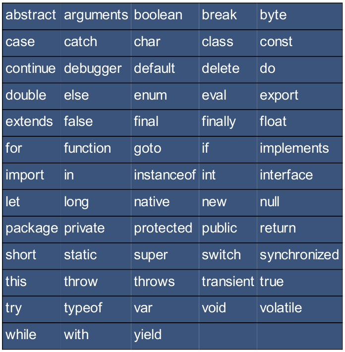
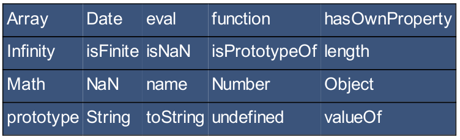

# Javascript

* Javascript is a dynamic programming language.

* Javascript has dynamic typing and first class functions.

* Javascript can be added in between <head></head> and body <body></body> tags.

* Any code should be enclosed by the script tag <script></script>

```javascript
<script type="text/javascript">alert("Hello World");</script>
<script src="main.js"></script>  <!-- external script -->
```

* Primitive Types: Numbers, Strings, Booleans

* special Data Types: null, undefined

* Object Types: Object, Array

* Same variable can be used as more than one type

* Variable names are case sensitive, can only start with a letter, an underscore (_) or $.

* Unsigned Right Shift Operator (>>>) is like >> operator, except that the bits shifted in on the left are always zeros.

* `==` Checks if value of two operands is equal or not; `!==` not equal to. `===`

* Javascript does not have block scope. Instead, the scopr is the same as the function or script that precedes it.

```javascript
var x = 1;
{
    var x = 2;
}
console.log(x); // output 2
```

* `finally` block will be executed even if there is no catch block.

* String properties: length, ...

* String methods: `charAt()`, `split()`, `slice()`





* All HTML elements and attributes are nodes in the Document Object Model (DOM). The idea of DOM is that every node is an object and its properties can be changed with CSS code.

* To work with a particular id, you use the getElementById method, and if you want to interact
with the content of the same element, then you use the innerHTML property.

* DOM methos

| methods | description |
|---------|-------------|
| getElementById | |
| getElementsByTagName | |
| getElementsByClassName | |
| getElementById(id).onclick = function() |
| element.attribute = | to change the attribute |
| element.setAttribute(att, val) | to set attribute |

* If a function is invoked with missing arguments, the values will be set to undefined.

* **Function statement** is where a statement begins with the word "function". If not it's a function expression.

```javascript
// Function statement
function fncName(params){
}

// Function expression
var variableName = function(parameters){
};
```

* Function name can be omitted in a function expression to create an anonymous function.

* An IIFE(Immediately Invoked Function Expression) is a JS function that runs as soon as it is defined. IIFE prevents accessing variables within function as well as polluting the global scope.

```javascript
// IIFE
(function(){

})();

// Arrow IIFE
(() => {

})();

// async IIFE
(async () => {

})();
```

* When you assign a value to a variable that has not been declared, it will automatically become global.

* **Hoisting** is when function and variable declarations are moved to the top of their scope. This is the _default_ behaviour of JavaScript. A variable can either be declared after it has been used, or used before it has been declared.

* Javascript only hoists declaratoins, not initializations.

```javascript
var x=5;
elem=document.getElementById("demo");
elem.innerHTML = x+" "+y; // y undefined here
var y=7; // y declaration is hoisted but not initalization
```

* A closure is an inner function that has access to the variables of the outer function.

*

| HTML Event | Description |
|------------|-------------|
| `onchange` | |
| `onclick`  | |
| `onmouseover` | |
| `onmouseout` | |
| `onkeydown` | |
| `onload` ||

*
```javascript
var person = {
    firstName: "Aamir",
    lastName: "Ali"
};

var person = new Object();
person.firstName = "Aamir";
person.lastName = "Ali";
```

* The value of **"this"** when using in a function is the object that the function belongs to. However, when **"this"** is used in an object, it is the object itself.

* *Constructors* are functions used to create multiple instances of an object by using the `new` keyword. If you need to create
multiple objects of the same type, then you will need to create an object constructor, and then you can create new instances of the object with different values.

* Constructor function starts with a capital letter by convention.

```javascript
var Fruit = function Fruit(name, color) {
    this.name = name;
    this.color = color;
    this.info = function() { reutrn "I am a "+ this.color+ " "+this.name};
}
```

* **Prototypes** allow us to define properties and methods to all instances of a particular object.

* Every function has a property called "Prototype". All JavaScript objects inhert their properties and methods from their prototype.

# Eloquent JavaScript

* JavaScript was introduced in 1995 as a way to add programs to web pages in the
Netscape Navigator browser

* **ECMAScript**: a standard document to describe the way the JavaScript language should work.

* 2015 - Version 6

* JavaScript uses a fixed number of bits, 64 of them, to store a single number
value.

* There are three special values in JavaScript that are considered numbers but don’t behave like normal numbers. `Infinity`, `-Infinity` and `NaN`.

* You can use single quotes, double quotes, or backticks to mark strings,

* Backtick-quoted strings, usually called _template literals_, can embed other values. When you write something inside `${}` in a template literal, its result will be
computed, converted to a string, and included at that position.

```javascript
`half of 100 is ${100/2}`
```
* `typeof` operator produces a string value naming the type of the value you give it. `console.log(typeof 4.5)`

* There is only one value in JavaScript that is not equal to tself, and that is `NaN`. `console.log(NaN == NaN); // false`.

* There are two special values, written `null` and `undefined`, that are used to denote the absence of a _meaningful_ value.

* A fragment of code that produces a value is called an _expression_.

* To catch and hold values, JavaScript provides a thing called a
_binding_, or _variable_: `let caught = 5 * 5;`

* The words `var` and `const` can also be used to create bindings.

* The `Number.isNaN` function is a standard JavaScript function that returns `true` only if the argument it is given is `NaN` .

* Bindings declared with `let` and `const` are in local to the block that they are declared in.

* In pre-2015 JavaScript, only functions created new scopes, so old-style bindings, created with the `var` keyword, are visible
throughout the whole _function_ that they appear in - or throughout the global scope, if they are not in a function.

* Each local scope can also see all the local scopes that
contain it, and all scopes can see the global scope. This approach to binding visibility is called _lexical scoping_.

* When the function keyword is used at the start of a statement, it is called a _function declaration_.

```javascript
function square(x) {
    return x * x;
}
```

* Function declarations are not part of the regular top-to-bottom
flow of control. They are conceptually moved to the top of their scope and can be used by all the code in that scope.

* **Arrow functions**: Instead of function keyword, it uses an arrow (`=>`).

```javascript
const power = (base, exponent) => {

}

const square1 = (x) => { return x * x; };
const square2 = x => x * x;
```

* JavaScript is extremely broad-minded about the number of arguments you
pass to a function. If you pass too many, the extra ones are ignored. If you
pass too few, the missing parameters get assigned the value undefined .

```javascript
let a = [1, 2, 3, 4, 5];
a.length;
a["length"];
```

* Values of the type _object_ are arbitrary collections of properties.

* The `delete` operator when applied to an object property, will remove the named property from the object.

* The binary `in` operator, when applied to a string and an object, tells you
whether that object has a property with that name. `"left" in obj`.

* To find out what properties an object has, you can use the `Object.keys` function.

```javascript
const score = {visitors: 0, home: 0};
score = {visitors:1, home: 1}; // NOT ALLOWED
score.visitors = 1; // Allowed
```

* Arrays have an `includes` method that checks whether a given value exists in
the array.

* `for...in` loop iterates over the keys, `for...of` iterates over values.

| array method | description |
|--------------|-------------|
| `shift()`    | remove the first element of the array |
| `unshift()`  | add new element at the beginning of the array |
| `push()`     | add new element to the end of array |
| `pop()`      | remove last element from array |
| `sort()`     | sorts array alphabetically |
| `reverse()`  | reverse content of array |
| `indexOf()`  | search from start to end and return index of found element otherwise -1 |
| `lastIndexOf()` | search from end to start |
| `slice()`    | takes start and end indices and returns an array |
| `concat()`   | glue arrays together |


| string method | description |
|---------------|-------------|
| `slice()` | |
| `indexOf()` | |
| `trim()` | |
| `padStart()` | |
| `split()` | |
| `repeat()` | |

* **Rest all parameters** `function max(...numbers)`

* `Math.random` function returns a new pseudorandom number between zero (inclusive) and one (exclusive) every time you call it. To get a whole random number use `Math.floor(Math.random() * 10))`

* A popular serialization format is called **JSON** (pronounced
“Jason”), which stands for **JavaScript Object Notation**. In JSON, all property names have to be surrounded by double quotes, and only simple data expressions are allowed - no function calls, bindings etc.

* JavaScript provides `JSON.stringify` and `JSON.parse` to convert data to and from JSON format.

* **Abstractions** hide details and give us the ability to talk about problems at a higher (or more abstract) level.

* Functions that operate on other functions, either by taking them as arguments or by returning them, are called _higher-order functions_.

* `filter` is a standard array method.

* The `map` method transforms an array by applying a function to all of its elements and building a new array from the returned values.

* The `some` method is another higher-order function. It takes a test function and tells you whether that function returns true for any of the elements in the array.

* The `some()` method tests whether at least one element in the array passes the test implemented by the provided function.

* JavaScript uses UTF-16 unicode format. Most characters are described by using a single 16-bit code point.

* JavaScript’s charCodeAt method gives you a code unit, not a full character
code. The codePointAt method, added later, does give a full Unicode character.

* The `this` keyword in method body automatically points at the object that it was called on.

* Arrow functions are different—they do not bind their own this but can see
the this binding of the scope around them.

* A _prototype_ is another object that is used as a fallback
source of properties. When an object gets a request for a property that it does
not have, its prototype will be searched for the property, then the prototype’s
prototype, and so on.

* Functions derive from `Function.prototype`, and arrays derive from `Array.prototype`.

* You can use `Object.create` to create an object with a specific prototype.

```javascript
let protoRabbit = {
    speak(line) {
        console.log(`The ${this.type} rabbit says '${line}'`);
    }
};
let killerRabbit = Object.create(protoRabbit);
```

* The most widely used approach to bolted-on JavaScript modules is called `CommonJS` modules. Node.js uses it and is the system used by most packages on NPM.

* The main concept in `CommonJS` modules is a function called `require`. When you call this with the module name of a dependency, it makes sure the module is loaded and returns its interface.

* The spread operator `...` is used to unpack, or "spread out," the elements of an array (or any other iterable object, such as strings) in a context where individual values are expected.


## JavaScript The Good Parts

* The very **good** ideas include _functions_, _loose typing_, _dynamic objects_, and an _expressive object literal notation_. The **bad** ideas include a programming model based on _global variables_.

* A controversial feature in JavaScript is **prototypal inheritance**. JavaScript has a class-free object system in which objects inherit properties directly from other objects.

* Javascript's one choice that was particularly bad: JavaScript depends on global variables for linkage. All of the top-level variables of all compilation units are tossed together in a common namespace called the _global object_.

* JSLint, a JavaScript parser that can
analyze a JavaScript program and report on the bad parts that it contains.

* JavaScript has a single number type. Internally, it is represented as 64-bit floating
point, the same as Java’s double . Unlike most other programming languages, there is
no separate integer type.

* `NaN` is not equal to any value, including itself. You can detect `NaN` with the `isNaN(number)` function.

* The value `Infinity` represents all values greater than 1.79769313486231570e+308.

* JavaScript has a `Math` object that contains a
set of methods that act on numbers.

* All characters in JavaScript are 16 bits wide.

* The \u convention allows for specifying character code points numerically. `"A" === "\u0041"`. `Strings` have a `length` property.

* In web browsers, each `<script>` tag delivers a compilation unit that is compiled and immediately executed. Lacking a linker, JavaScript throws them all together in a common global
namespace.

* Unlike many other languages, blocks in JavaScript **do not create a new scope**, so variables should be defined at the
top of the function, not in blocks.

* The `for in` enumerates the property names (or keys) of an object. On each iteration, another property name string from the object is assigned to the variable.

```javascript
for (myvar in obj) {
    if (obj.hasOwnProperty(myvar)) {
        ...
    }
}
```

* JavaScript does not allow a line end between the return and the expression.

* Objects in JavaScript are mutable keyed collections. In JavaScript, _arrays are objects_, _functions are objects_,
_regular expressions are objects_, and, of course, _objects are objects_.

* An object is a container of properties, where a property has a name and a value. A property name can be any string, including the empty string. A property value can be
any JavaScript value except for `undefined`.

* Objects in JavaScript are **class-free**.

* Objects are passed around by reference. They are never copied.

* Every object is linked to a prototype object from which it can inherit properties. All objects created from object literals are linked to `Object.prototype`, an object that
comes standard with JavaScript.

* The `delete` operator can be used to remove a property from an object.

* Objects produced from object literals are
linked to `Object.prototype`. Function objects are linked to `Function.prototype` (which is itself linked to `Object.prototype`). Every function is also created with two
additional hidden properties: the function’s context and the code that implements the function’s behavior.

* In addition to the declared parameters, every function receives two additional parameters: `this` and `arguments`. The `this` parameter is very important in object oriented programming, and its value is determined by the invocation pattern. There are four patterns of invocation in JavaScript:
    * the method invocation pattern,
    * the function invocation pattern,
    * the constructor invocation pattern, and
    * the apply invocation pattern.

* The patterns differ in how the bonus parameter `this` is initialized.

* There is no run-time error when the number of arguments and the number of parameters do not match. If there are too many argument values, the extra argument values will be ignored. If there are too few argument values, the `undefined` value will be substituted for the missing values. There is no type checking on the argument values: any type of value can be passed to any parameter.

* When a function is stored as a property of an object, we call it a _method_.

* When a function is invoked with Function invocation pattern, `this` is bound to the global object.

* Functions that are intended to be used with the new prefix are called constructors. By
convention, they are kept in variables with a capitalized name.


# TypeScript

* A JavaScript superset, add types to JavaScript.

* Non-JavaScript Features like Interfaces or Generics, Meta-Programming features like Decorators.

*
* `sudo npm i -g typescript`

* Core Types

    * number (integer + floating point)
    * string
    * boolean
    * object (key-value pair, {})
    * Array (flexible/strict)
    * Tuple [1, 2] (array push is allowed)
    * Enum
    * Any
    * Union Type

* Type alias

```typescript
type Combinable = number | string
```

* Typescript is statically typed, JS is dynamically type.

wget https://packages.microsoft.com/config/ubuntu/20.04/packages-microsoft-prod.deb -O packages-microsoft-prod.deb
sudo dpkg -i packages-microsoft-prod.deb
rm packages-microsoft-prod.deb

# Useful Links


Live Server vs code extension: spin local development web server
Vetur vs code extension
Material Icon Theme

lite-server

`sudo npm install -g @vue/cli`

`npm install` to install all dependencies of the project within the project directory.

* Babel

* Prettier VS code extension