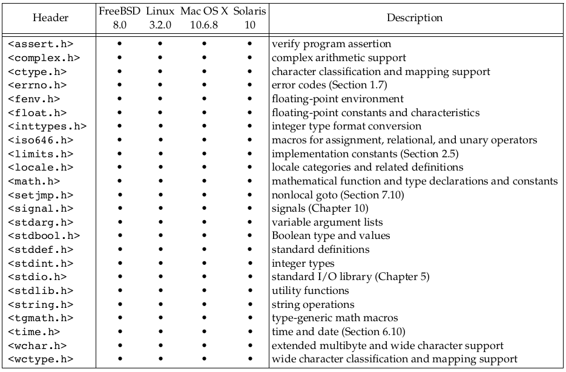
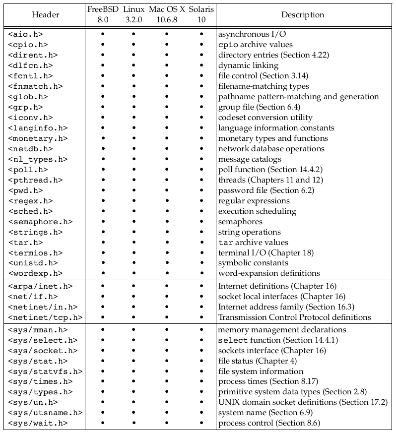
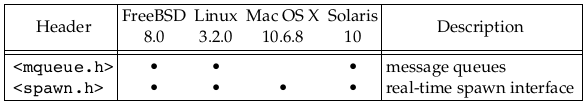

# Linux System Programming

* Typical services of any operating system are executing a new program, opening a file, reading a file, allocating a region of memory, getting the current time of day, and so on.

* The interface to the kernel is a layer of software called the _system calls_. Libraries of common functions are built on top of the system call interface.

* Linux is the kernel used by the GNU operating system.

* /etc/passwd. composed of seven colon-separated fields: 
`sar:x:205:105:Stephen Rago:/home/sar:/bin/ksh`

1. the login name, 
1. encrypted password, 
1. numeric user ID (205), 
1. numeric group ID (105), 
1. a comment field, 
1. home directory (/home/sar), and 
1. shell program (/bin/ksh).

* A `shell` is a command-line interpreter that reads user input and executes commands.

* The Bourne-again shell is the GNU shell provided with all Linux systems.

* A directory is a file that contains directory entries.

* The `stat` and `fstat` functions return a structure of information containing all the attributes of a file.

* The only two characters that cannot appear in a filename are the _slash character_ (/) and the _null_ character.

* In the root directory, (..) dot-dot is the same as dot.

* A process can change its working directory with the chdir function.

* Unbuffered I/O is provided by the functions `open`, `read`, `write`, `lseek`, and `close`.

* The standard I/O functions such as `printf`, `fgets` provide a buffered interface to the unbuffered I/O functions. Using standard I/O relieves us from having to choose optimal buffer sizes.

* The `fgets` function reads an entire line. The `read` function, in contrast, reads a specified number of bytes.

* An executing instance of a program is called a `process`. The UNIX System guarantees that every process has a unique numeric identifier
called the process ID.

* There are three primary functions for process control: `fork`, `exec`, and `waitpid`. The exec function has seven variants.

* each line returned by `fgets` is terminated with a newline character,
followed by a null byte.
```c
if (buf[strlen(buf) - 1] == '\n')
    buf[strlen(buf) - 1] = 0;
```

* `execlp` function wants a null-terminated argument, not a newline-terminated argument.

* `fork` returns the non-negative process ID of the new child process to the parent, and returns 0 to the child.

* The combination of fork followed by exec is called spawning a new process on some operating systems.

* All threads within a process share the same address space, file descriptors, stacks, and process-related attributes. Each thread executes on its own stack, although any thread can access the stacks of other threads in the same process.

* The file `<errno.h>` defines the symbol errno and constants for each value that errno can assume.

* Two functions are defined by the C standard to help with printing error messages.

```c
#include <string.h>
// map errnum to error message
char *strerror(int errnum);

#include <stdio.h>
// produce error message based on current errno
void perror(const char *msg);
```

* Groups are normally used to collect users together into projects or departments. This allows the sharing of resources, such as files, among members of the same group.

* `/etc/group` file maps group names into numeric group IDs.

* functions `getuid` and `getgid` return the user ID and the group ID.

* Signals are a technique used to notify a process that some condition has occurred. The process has three choices for dealing with the
signal.
1. Ignore the signal
1. Let the default action occur
1. Provide a function that is called when the signal occurs 

* UNIX systems maintain two different time values:
    1. **Calendar time**: number of seconds since the Epoch: 00:00:00 January 1, 1970. primitive system data type `time_t` holds these values.
    1. **Process time**: (CPU time) measures CPU resources used by a process. measured in clock ticks. Primitive system data type `clock_t` holds these time values.

* The _user CPU time_ is the CPU time attributed to _user instructions_. The _system CPU time_ is the CPU time attributed to the _kernel_ when it executes on behalf of the process.

* Use `time` command to measure the clock time, user time, and system time of any process.

```shell
$ cd /usr/include
$ time -p grep _POSIX_SOURCE */*.h > /dev/null
```

* Linux 3.2.0 has 380 system calls and FreeBSD 8.0 has over 450. The system call interface has always been documented in Section 2 of the UNIX
Programmer ’s Manual.

* The technique used on UNIX systems is for each system call to have a function of the same name in the standard C library. The user process calls this function, using the standard C calling sequence. This function then invokes the appropriate kernel service, using whatever technique is required on the system.

* Section 3 of the UNIX Programmer ’s Manual defines the general-purpose library functions available to programmers.

* The UNIX system call that handles memory allocation, sbrk(2), is not a general-purpose memory manager.

* The process control system calls (`fork`, `exec`, and `waitpid`) are usually invoked by the user’s application code directly. But
some library routines like `system` and `popen` exist to simplify certain common cases.

* An important part of all the standardization efforts is the
specification of various limits that each implementation must define.

* ANSI is the **American National Standards Institute**, the U.S. member in the **International Organization for Standardization (ISO)**. IEC stands for the **International Electrotechnical Commission**.

* The intent of the ISO C standard is to provide portability of conforming C programs to a wide variety of operating systems, not only
the UNIX System.

* The C standard defines not only the syntax and semantics of the
programming language but also a standard library. This library is important because all contemporary UNIX systems, provide the
library routines that are specified in the C standard.

* **POSIX (Portable Operating System Interface)** is a family of standards initially developed by the **IEEE (Institute of Electrical
and Electronics Engineers)**. 

* POSIX originally referred only to operating system interface but later extended to include many standards including shell and utilities.

### ISO C Header


### POSIX Required Headers


### POSIX optional Headers


### X/Open System Interface (XSI) headers


* The **Single UNIX Specification**, a superset of the POSIX.1 standard, specifies additional interfaces that extend the functionality provided by the POSIX.1 specification.

* The **X/Open System Interfaces (XSI)** option in POSIX.1 describes optional interfaces and defines which optional portions of POSIX.1 must be supported for an
implementation to be deemed _XSI conforming_. Only XSI conforming implementations can be called **UNIX systems**.

* UNIX **System V Release 4 (SVR4)** was a product of AT&T’s UNIX System Laboratories.

* The **Berkeley Software Distribution (BSD)** releases were produced and distributed by
the Computer Systems Research Group (CSRG) at the University of California at Berkeley.

* **FreeBSD** is based on the 4.4BSD-Lite operating system.

* **Linux** is an operating system similar to that of a UNIX System; it is freely available under the GNU Public License.

* **Mac OS X** is based on entirely different technology than prior versions. The core
operating system is called _Darwin_, and is based on a combination of the Mach kernel, the FreeBSD operating system, and an object-oriented framework for drivers and other kernel extensions. As of version 10.5, the Intel port of Mac OS X has been certified to be a UNIX system.

* **Solaris** is the version of the UNIX System developed by Sun Microsystems (now
Oracle). Solaris is based on System V Release 4, but includes more than fifteen years of
enhancements from the engineers at Sun Microsystems. It is arguably the only commercially successful SVR4 descendant, and is formally certified to be a UNIX system.

### Other UNIX Systems

* **AIX**, IBM’s version of the UNIX System
* **HP-UX**, Hewlett-Packard’s version of the UNIX System
* **IRIX**, the UNIX System version shipped by Silicon Graphics
* **UnixWare**, the UNIX System descended from SVR4 sold by SCO

The runtime limits are obtained by calling one of the following three functions.
```c
#include <unistd.h>
long sysconf(int name);
long pathconf(const char *pathname, int name);
long fpathconf(int fd, int name);
```

* we can use the `ulimit` command built into the Bourne-again shell to change the maximum number of files our processes can have open at one time.

* feature test macro to be defined before any header files are included by the C program.
```
cc -D_POSIX_C_SOURCE=200809L file.c
```

* The header `<sys/types.h>` defines some implementation-dependent data types, called the primitive system data types.


## File I/O

* The term _unbuffered I/O_ means that each read or write invokes a system call in the kernel. These unbuffered I/O functions are not part of ISO C, but are part of POSIX.1 and the Single
UNIX Specification.

* By convention, UNIX System shells associate file descriptor 0 with the standard input of a process, file descriptor 1 with the standard output, and file descriptor 2 with
the standard error.

* magic numbers 0, 1, and 2 should be replaced in POSIX-compliant applications with the symbolic constants `STDIN_FILENO`, `STDOUT_FILENO`, and `STDERR_FILENO` to improve readability.
These constants are defined in the <unistd.h> header.

```c
#include <fcntl.h>
int open(const char *path, int oflag, ... /* mode_t mode */ );
int openat(int fd, const char *path, int oflag, ... /* mode_t mode */ );
```

* The `openat` function gives threads a way to use relative pathnames to open files in directories other than the current working directory. All threads in the same process share the same current working directory, so this makes it difficult for multiple threads in the same process to work in different directories at the same time.

* The **time-of-check-to-time-of-use (TOCTTOU)** errors is that a program is vulnerable if it makes two file-based function calls where the second call depends on the results of the first
call. Because the two calls are not atomic, the file can change between the two calls,
thereby invalidating the results of the first call, leading to a program error.

```c
#include <fcntl.h>
int creat(const char *path, mode_t mode);
# Equivalent to
open(path, O_WRONLY | O_CREAT | O_TRUNC, mode);

#include <unistd.h>
int close(int fd);
```

* When a process terminates, all of its open files are closed automatically by the kernel.

* Every open file has an associated _current file offset_, normally a non-negative integer
that measures the number of bytes from the beginning of the file. An open file’s offset can be set explicitly by calling `lseek`.

```c
#include <unistd.h>
off_t lseek(int fd, off_t offset, int whence);

// whence - SEEK_SET, SEEK_CUR, SEEK_END

// get current offset
off_t currpos;
currpos = lseek(fd, 0, SEEK_CUR);
```

* This technique can also be used to determine if a file is capable of seeking. If the file
descriptor refers to a pipe, FIFO , or socket, lseek sets errno to ESPIPE and returns −1.

* The file’s offset can be greater than the file’s current size, in which case the next
write to the file will extend the file. This is referred to as _creating a hole_ in a file and is
allowed. Any bytes in a file that have not been written are read back as 0.

* `od -c file.hole`

* Even though you might enable 64-bit file offsets `off_t`, your ability to create a
file larger than 2 GB (2^31 −1 bytes) depends on the underlying file system type.

```c
#include <unistd.h>
ssize_t read(int fd, void *buf, size_t nbytes);
ssize_t write(int fd, const void *buf, size_t nbytes);
```

* UNIX kernel closes all open file descriptors in a process when that process terminates.

* The UNIX System supports the sharing of open files among different processes.

* _atomic operation_ refers to an operation that might be composed of multiple steps. If the operation is performed atomically, either all the steps are performed (on success) or none are performed (on failure).

* An existing file descriptor is duplicated by either `dup` or `dup2` function.

```c
#include <unistd.h>
int dup(int fd);
int dup2(int fd, int fd2);
```

* If _fd2_ is already open, it is first closed. If _fd_ equals _fd2_, then `dup2` returns
_fd2_ without closing it. Otherwise, the `FD_CLOEXEC` file descriptor flag is cleared for _fd2_, so that _fd2_ is left open if the process calls exec.

* Because both descriptors _fd_ and _fd2_ point to the same file table entry,
they share the same file status flags—read, write, append, and so on—and the same
current file offset. Each descriptor has its own set of file descriptor flags.

* Traditional implementations of the UNIX System have a buffer cache or page cache in
the kernel through which most disk I/O passes. This is called _delayed write_.

```c
#include <unistd.h>
int fsync(int fd);
int fdatasync(int fd);
void sync(void);
```

* The function `fsync` refers only to a single file, specified by the file descriptor fd,
and waits for the disk writes to complete before returning.

* The `fcntl` function can change the properties of a file that is already open.

```c
#include <fcntl.h>
int fcntl(int fd, int cmd, ... /* int arg */ );
```

* The fcntl function is used for five different purposes.
1. Duplicate an existing descriptor (cmd = F_DUPFD or F_DUPFD_CLOEXEC)
2. Get/set file descriptor flags (cmd = F_GETFD or F_SETFD)
3. Get/set file status flags (cmd = F_GETFL or F_SETFL)
4. Get/set asynchronous I/O ownership (cmd = F_GETOWN or F_SETOWN)
5. Get/set record locks (cmd = F_GETLK, F_SETLK, or F_SETLKW)

* Currently, only one file descriptor flag is defined: the `FD_CLOEXEC` flag.

* File status flags


```shell
$ ./a.out 0 < /dev/tty
read only
$ ./a.out 1 > temp.foo
$ cat temp.foo
write only
$ ./a.out 2 2>>temp.foo
write only, append
$ ./a.out 5 5<>temp.foo
read write
```

* The clause `5<>temp.foo` opens file `temp.foo` for reading and writing on file descriptor 5.

* synchronous-write flag causes each write to wait for the data to be written to disk before returning.

* Mac OS X 10.6.8, uses the **HFS** file system.

* UNIX System implementations use ioctl for many miscellaneous device operations. Some
implementations have even extended it for use with regular files.

```c
#include <unistd.h>        /* System V */
#include <sys/ioctl.h>     /* BSD and Linux */
int ioctl(int fd, int request, ...);
```

* Newer systems provide a directory named /dev/fd whose entries are files named 0, 1,
2, and so on. Opening the file /dev/fd/n is equivalent to duplicating descriptor n,
assuming that descriptor n is open.

`fd = open("/dev/fd/0", mode); `

* The main use of the /dev/fd files is from the shell. It allows programs that use
_pathname arguments_ to handle standard input and standard output in the same
manner as other pathnames.

* The special meaning of `-` as a command-line argument to refer to the standard
input or the standard output is a kludge that has crept into many programs. There are
also problems if we specify `-` as the first file, as it looks like the start of another
command-line option. Using /dev/fd is a step toward uniformity and cleanliness.

```shell
filter file2 | cat file1 - file3 | lpr
filter file2 | cat file1 /dev/fd/0 file3 | lpr // same as above
```

```
digit1>&digit2
# Bash notation says redirect descriptor digit1 to the same file as descriptor digit2.
./a.out > outfile 2>&1
./a.out 2>&1 > outfile
```
