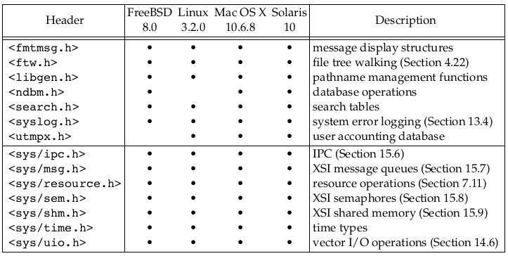

# Linux System Programming

* Typical services of any operating system are executing a new program, opening a file, reading a file, allocating a region of memory, getting the current time of day, and so on.

* The interface to the kernel is a layer of software called the _system calls_. Libraries of common functions are built on top of the system call interface.

* Linux is the kernel used by the GNU operating system.

* /etc/passwd. composed of seven colon-separated fields: 
`sar:x:205:105:Stephen Rago:/home/sar:/bin/ksh`

1. the login name, 
1. encrypted password, 
1. numeric user ID (205), 
1. numeric group ID (105), 
1. a comment field, 
1. home directory (/home/sar), and 
1. shell program (/bin/ksh).

* A `shell` is a command-line interpreter that reads user input and executes commands.

* The Bourne-again shell is the GNU shell provided with all Linux systems.

* A directory is a file that contains directory entries.

* The `stat` and `fstat` functions return a structure of information containing all the attributes of a file.

* The only two characters that cannot appear in a filename are the _slash character_ (/) and the _null_ character.

* In the root directory, (..) dot-dot is the same as dot.

* A process can change its working directory with the chdir function.

* Unbuffered I/O is provided by the functions `open`, `read`, `write`, `lseek`, and `close`.

* The standard I/O functions such as `printf`, `fgets` provide a buffered interface to the unbuffered I/O functions. Using standard I/O relieves us from having to choose optimal buffer sizes.

* The `fgets` function reads an entire line. The `read` function, in contrast, reads a specified number of bytes.

* An executing instance of a program is called a `process`. The UNIX System guarantees that every process has a unique numeric identifier
called the process ID.

* There are three primary functions for process control: `fork`, `exec`, and `waitpid`. The exec function has seven variants.

* each line returned by `fgets` is terminated with a newline character,
followed by a null byte.
```c
if (buf[strlen(buf) - 1] == '\n')
    buf[strlen(buf) - 1] = 0;
```

* `execlp` function wants a null-terminated argument, not a newline-terminated argument.

* `fork` returns the non-negative process ID of the new child process to the parent, and returns 0 to the child.

* The combination of fork followed by exec is called spawning a new process on some operating systems.

* All threads within a process share the same address space, file descriptors, stacks, and process-related attributes. Each thread executes on its own stack, although any thread can access the stacks of other threads in the same process.

* The file `<errno.h>` defines the symbol errno and constants for each value that errno can assume.

* Two functions are defined by the C standard to help with printing error messages.

```c
#include <string.h>
// map errnum to error message
char *strerror(int errnum);

#include <stdio.h>
// produce error message based on current errno
void perror(const char *msg);
```

* Groups are normally used to collect users together into projects or departments. This allows the sharing of resources, such as files, among members of the same group.

* `/etc/group` file maps group names into numeric group IDs.

* functions `getuid` and `getgid` return the user ID and the group ID.

* Signals are a technique used to notify a process that some condition has occurred. The process has three choices for dealing with the
signal.
1. Ignore the signal
1. Let the default action occur
1. Provide a function that is called when the signal occurs 

* UNIX systems maintain two different time values:
    1. **Calendar time**: number of seconds since the Epoch: 00:00:00 January 1, 1970. primitive system data type `time_t` holds these values.
    1. **Process time**: (CPU time) measures CPU resources used by a process. measured in clock ticks. Primitive system data type `clock_t` holds these time values.

* The _user CPU time_ is the CPU time attributed to _user instructions_. The _system CPU time_ is the CPU time attributed to the _kernel_ when it executes on behalf of the process.

* Use `time` command to measure the clock time, user time, and system time of any process.

```shell
$ cd /usr/include
$ time -p grep _POSIX_SOURCE */*.h > /dev/null
```

* Linux 3.2.0 has 380 system calls and FreeBSD 8.0 has over 450. The system call interface has always been documented in Section 2 of the UNIX
Programmer ’s Manual.

* The technique used on UNIX systems is for each system call to have a function of the same name in the standard C library. The user process calls this function, using the standard C calling sequence. This function then invokes the appropriate kernel service, using whatever technique is required on the system.

* Section 3 of the UNIX Programmer ’s Manual defines the general-purpose library functions available to programmers.

* The UNIX system call that handles memory allocation, sbrk(2), is not a general-purpose memory manager.

* The process control system calls (`fork`, `exec`, and `waitpid`) are usually invoked by the user’s application code directly. But
some library routines like `system` and `popen` exist to simplify certain common cases.

* An important part of all the standardization efforts is the
specification of various limits that each implementation must define.

* ANSI is the **American National Standards Institute**, the U.S. member in the **International Organization for Standardization (ISO)**. IEC stands for the **International Electrotechnical Commission**.

* The intent of the ISO C standard is to provide portability of conforming C programs to a wide variety of operating systems, not only
the UNIX System.

* The C standard defines not only the syntax and semantics of the
programming language but also a standard library. This library is important because all contemporary UNIX systems, provide the
library routines that are specified in the C standard.

* **POSIX (Portable Operating System Interface)** is a family of standards initially developed by the **IEEE (Institute of Electrical
and Electronics Engineers)**. 

* POSIX originally referred only to operating system interface but later extended to include many standards including shell and utilities.

### ISO C Header


### POSIX Required Headers


### POSIX optional Headers


### X/Open System Interface (XSI) headers


* The **Single UNIX Specification**, a superset of the POSIX.1 standard, specifies additional interfaces that extend the functionality provided by the POSIX.1 specification.

* The **X/Open System Interfaces (XSI)** option in POSIX.1 describes optional interfaces and defines which optional portions of POSIX.1 must be supported for an
implementation to be deemed _XSI conforming_. Only XSI conforming implementations can be called **UNIX systems**.

* UNIX **System V Release 4 (SVR4)** was a product of AT&T’s UNIX System Laboratories.

* The **Berkeley Software Distribution (BSD)** releases were produced and distributed by
the Computer Systems Research Group (CSRG) at the University of California at Berkeley.

* **FreeBSD** is based on the 4.4BSD-Lite operating system.

* **Linux** is an operating system similar to that of a UNIX System; it is freely available under the GNU Public License.

* **Mac OS X** is based on entirely different technology than prior versions. The core
operating system is called _Darwin_, and is based on a combination of the Mach kernel, the FreeBSD operating system, and an object-oriented framework for drivers and other kernel extensions. As of version 10.5, the Intel port of Mac OS X has been certified to be a UNIX system.

* **Solaris** is the version of the UNIX System developed by Sun Microsystems (now
Oracle). Solaris is based on System V Release 4, but includes more than fifteen years of
enhancements from the engineers at Sun Microsystems. It is arguably the only commercially successful SVR4 descendant, and is formally certified to be a UNIX system.

### Other UNIX Systems

* **AIX**, IBM’s version of the UNIX System
* **HP-UX**, Hewlett-Packard’s version of the UNIX System
* **IRIX**, the UNIX System version shipped by Silicon Graphics
* **UnixWare**, the UNIX System descended from SVR4 sold by SCO

The runtime limits are obtained by calling one of the following three functions.
```c
#include <unistd.h>
long sysconf(int name);
long pathconf(const char *pathname, int name);
long fpathconf(int fd, int name);
```

* we can use the `ulimit` command built into the Bourne-again shell to change the maximum number of files our processes can have open at one time.

* feature test macro to be defined before any header files are included by the C program.
```
cc -D_POSIX_C_SOURCE=200809L file.c
```

* The header `<sys/types.h>` defines some implementation-dependent data types, called the primitive system data types.


## File I/O

* The term _unbuffered I/O_ means that each read or write invokes a system call in the kernel. These unbuffered I/O functions are not part of ISO C, but are part of POSIX.1 and the Single
UNIX Specification.

* By convention, UNIX System shells associate file descriptor 0 with the standard input of a process, file descriptor 1 with the standard output, and file descriptor 2 with
the standard error.

* magic numbers 0, 1, and 2 should be replaced in POSIX-compliant applications with the symbolic constants `STDIN_FILENO`, `STDOUT_FILENO`, and `STDERR_FILENO` to improve readability.
These constants are defined in the <unistd.h> header.

```c
#include <fcntl.h>
int open(const char *path, int oflag, ... /* mode_t mode */ );
int openat(int fd, const char *path, int oflag, ... /* mode_t mode */ );
```

* The `openat` function gives threads a way to use relative pathnames to open files in directories other than the current working directory. All threads in the same process share the same current working directory, so this makes it difficult for multiple threads in the same process to work in different directories at the same time.

* The **time-of-check-to-time-of-use (TOCTTOU)** errors is that a program is vulnerable if it makes two file-based function calls where the second call depends on the results of the first
call. Because the two calls are not atomic, the file can change between the two calls,
thereby invalidating the results of the first call, leading to a program error.

```c
#include <fcntl.h>
int creat(const char *path, mode_t mode);
# Equivalent to
open(path, O_WRONLY | O_CREAT | O_TRUNC, mode);

#include <unistd.h>
int close(int fd);
```

* When a process terminates, all of its open files are closed automatically by the kernel.

* Every open file has an associated _current file offset_, normally a non-negative integer
that measures the number of bytes from the beginning of the file. An open file’s offset can be set explicitly by calling `lseek`.

```c
#include <unistd.h>
off_t lseek(int fd, off_t offset, int whence);

// whence - SEEK_SET, SEEK_CUR, SEEK_END

// get current offset
off_t currpos;
currpos = lseek(fd, 0, SEEK_CUR);
```

* This technique can also be used to determine if a file is capable of seeking. If the file
descriptor refers to a pipe, FIFO , or socket, lseek sets errno to ESPIPE and returns −1.

* The file’s offset can be greater than the file’s current size, in which case the next
write to the file will extend the file. This is referred to as _creating a hole_ in a file and is
allowed. Any bytes in a file that have not been written are read back as 0.

* `od -c file.hole`

* Even though you might enable 64-bit file offsets `off_t`, your ability to create a
file larger than 2 GB (2^31 −1 bytes) depends on the underlying file system type.

```c
#include <unistd.h>
ssize_t read(int fd, void *buf, size_t nbytes);
ssize_t write(int fd, const void *buf, size_t nbytes);
```

* UNIX kernel closes all open file descriptors in a process when that process terminates.

* The UNIX System supports the sharing of open files among different processes.

* _atomic operation_ refers to an operation that might be composed of multiple steps. If the operation is performed atomically, either all the steps are performed (on success) or none are performed (on failure).

* An existing file descriptor is duplicated by either `dup` or `dup2` function.

```c
#include <unistd.h>
int dup(int fd);
int dup2(int fd, int fd2);
```

* If _fd2_ is already open, it is first closed. If _fd_ equals _fd2_, then `dup2` returns
_fd2_ without closing it. Otherwise, the `FD_CLOEXEC` file descriptor flag is cleared for _fd2_, so that _fd2_ is left open if the process calls exec.

* Because both descriptors _fd_ and _fd2_ point to the same file table entry,
they share the same file status flags—read, write, append, and so on—and the same
current file offset. Each descriptor has its own set of file descriptor flags.

* Traditional implementations of the UNIX System have a buffer cache or page cache in
the kernel through which most disk I/O passes. This is called _delayed write_.

```c
#include <unistd.h>
int fsync(int fd);
int fdatasync(int fd);
void sync(void);
```

* The function `fsync` refers only to a single file, specified by the file descriptor fd,
and waits for the disk writes to complete before returning.

* The `fcntl` function can change the properties of a file that is already open.

```c
#include <fcntl.h>
int fcntl(int fd, int cmd, ... /* int arg */ );
```

* The fcntl function is used for five different purposes.
1. Duplicate an existing descriptor (cmd = F_DUPFD or F_DUPFD_CLOEXEC)
2. Get/set file descriptor flags (cmd = F_GETFD or F_SETFD)
3. Get/set file status flags (cmd = F_GETFL or F_SETFL)
4. Get/set asynchronous I/O ownership (cmd = F_GETOWN or F_SETOWN)
5. Get/set record locks (cmd = F_GETLK, F_SETLK, or F_SETLKW)

* Currently, only one file descriptor flag is defined: the `FD_CLOEXEC` flag.

* File status flags


```shell
$ ./a.out 0 < /dev/tty
read only
$ ./a.out 1 > temp.foo
$ cat temp.foo
write only
$ ./a.out 2 2>>temp.foo
write only, append
$ ./a.out 5 5<>temp.foo
read write
```

* The clause `5<>temp.foo` opens file `temp.foo` for reading and writing on file descriptor 5.

* synchronous-write flag causes each write to wait for the data to be written to disk before returning.

* Mac OS X 10.6.8, uses the **HFS** file system.

* UNIX System implementations use ioctl for many miscellaneous device operations. Some
implementations have even extended it for use with regular files.

```c
#include <unistd.h>        /* System V */
#include <sys/ioctl.h>     /* BSD and Linux */
int ioctl(int fd, int request, ...);
```

* Newer systems provide a directory named /dev/fd whose entries are files named 0, 1,
2, and so on. Opening the file /dev/fd/n is equivalent to duplicating descriptor n,
assuming that descriptor n is open.

`fd = open("/dev/fd/0", mode); `

* The main use of the /dev/fd files is from the shell. It allows programs that use
_pathname arguments_ to handle standard input and standard output in the same
manner as other pathnames.

* The special meaning of `-` as a command-line argument to refer to the standard
input or the standard output is a kludge that has crept into many programs. There are
also problems if we specify `-` as the first file, as it looks like the start of another
command-line option. Using /dev/fd is a step toward uniformity and cleanliness.

```shell
filter file2 | cat file1 - file3 | lpr
filter file2 | cat file1 /dev/fd/0 file3 | lpr // same as above
```

```
digit1>&digit2
# Bash notation says redirect descriptor digit1 to the same file as descriptor digit2.
./a.out > outfile 2>&1
./a.out 2>&1 > outfile
```

```c
#include <sys/stat.h>
int stat(const char *restrict pathname, struct stat *restrict buf );
int fstat(int fd, struct stat *buf );
int lstat(const char *restrict pathname, struct stat *restrict buf );
int fstatat(int fd, const char *restrict pathname, struct stat *restrict buf, int flag);
```

* `stat`: Given a pathname, returns a structure of information about the named file.
* `fstat`: obtains information about the file that is already open on the descriptor _fd_.
* `lstat`: returns information about the symbolic link, not the file referenced by the symbolic link.
* `fstatat`: return the file statistics for a pathname relative to an open directory represented by the _fd_ argument.

```c
struct stat {
    dev_t     st_dev;         /* ID of device containing file */
    ino_t     st_ino;         /* Inode number */
    mode_t    st_mode;        /* File type and mode */
    nlink_t   st_nlink;       /* Number of hard links */
    uid_t     st_uid;         /* User ID of owner */
    gid_t     st_gid;         /* Group ID of owner */
    dev_t     st_rdev;        /* Device ID (if special file) */
    off_t     st_size;        /* Total size, in bytes */
    blksize_t st_blksize;     /* Block size for filesystem I/O */
    blkcnt_t  st_blocks;      /* Number of 512B blocks allocated */

    /* Since Linux 2.6, the kernel supports nanosecond
        precision for the following timestamp fields.
        For the details before Linux 2.6, see NOTES. */

    struct timespec st_atim;  /* Time of last access */
    struct timespec st_mtim;  /* Time of last modification */
    struct timespec st_ctim;  /* Time of last status change */

#define st_atime st_atim.tv_sec      /* Backward compatibility */
#define st_mtime st_mtim.tv_sec
#define st_ctime st_ctim.tv_sec
};
```

### Unix File Types
1. Regular File
2. Directory File
3. Block Special File
4. Character Special file
5. FIFO: A type of file used for communication between processes. It’s sometimes
called a named pipe.
6. Socket: A type of file used for network communication between processes.
7. Symbolic link: A type of file that points to another file.


* Every process has six or more IDs associated with it.


* When we execute a program file, the effective user ID of the process is usually the
real user ID, and the effective group ID is usually the real group ID. However, we can
also set a special flag in the file’s mode word (st_mode) that says, "When this file is
executed, set the effective user ID of the process to be the _owner of the file_ (st_uid)". Similarly, we can set another bit in the file’s mode word that causes the effective group ID to be the group owner of the file (st_gid). These two bits in the file’s mode word are called the _set-user-ID_ bit and the _set-group-ID_ bit.

* The UNIX System program that allows anyone to change his or her password, passwd(1), is a set-user-ID program.

* whenever we want to open any type of file by name, we must have execute permission in each directory mentioned in the name, including the current directory, if it is implied. This is why the execute permission bit for a directory is often called the _search bit_.

* Read permission for a directory lets us read the directory, obtaining a list of
all the filenames in the directory. Execute permission lets us pass through the
directory when it is a component of a pathname that we are trying to access.

* The two owner IDs are properties of the _file_, whereas  the two effective IDs and the supplementary group IDs are properties of the _process_.

* when we open a file, the kernel performs its access tests based on the effective user and group IDs. Sometimes, however, a process wants to test accessibility based on the real user and group IDs.

```c
#include <unistd.h>
int access(const char *pathname, int mode);
int faccessat(int fd, const char *pathname, int mode, int flag);
```

* file mode creation mask that is associated with every process. The `umask` function sets the file mode creation mask for the process and returns the previous value.

```c
#include <sys/stat.h>
mode_t umask(mode_t cmask);
```

* `umask` value is expressed in octal, with one bit representing one permission to be masked off.

```c
#include <sys/stat.h>
int chmod(const char *pathname, mode_t mode);
int fchmod(int fd, mode_t mode);
int fchmodat(int fd, const char *pathname, mode_t mode, int flag);
```

* On versions of the UNIX System that predated _demand paging_, this bit was known as the **sticky bit**. If it was set for an executable program file, then the first time the program was executed, a copy of the program’s text was saved in the swap area when the process terminated. The program would then load into memory more quickly the next time it was executed, because the swap area was handled as a contiguous file, as compared to the possibly random location of data blocks in a normal UNIX file system.

```c
#include <unistd.h>
int chown(const char *pathname, uid_t owner, gid_t group);
int fchown(int fd, uid_t owner, gid_t group);
int fchownat(int fd, const char *pathname, uid_t owner, gid_t group, int flag);
int lchown(const char *pathname, uid_t owner, gid_t group);
```

```c
#include <unistd.h>
int truncate(const char *pathname, off_t length);
int ftruncate(int fd, off_t length);
```

* truncate an existing file to length bytes. If the previous size of the file was greater than length, the data beyond length is no longer accessible.

```c
#include <unistd.h>
int symlink(const char *actualpath, const char *sympath);
int symlinkat(const char *actualpath, int fd, const char *sympath);
```

* It is not required that actualpath exist when the symbolic link is created.

* Three streams are predefined and automatically available to a process: standard input, standard output, and standard error. These streams refer to the same files as the file
descriptors `STDIN_FILENO`, `STDOUT_FILENO`, and `STDERR_FILENO`, respectively.

* The goal of the buffering provided by the standard I/O library is to use the minimum number of read and write calls.

* Standard I/O library provides three types of buffering:
    * Fully buffered
    * Line buffered
    * Unbuffered

* The standard error stream, for example, is normally unbuffered so that any error
messages are displayed as quickly as possible, regardless of whether they
contain a newline.

* Change default buffering by calling following functions

```c
#include <stdio.h>
void setbuf(FILE *restrict fp, char *restrict buf );
int setvbuf(FILE *restrict fp, char *restrict buf, int mode, size_t size);
```

* The ISO C standard defines two functions that are provided by the standard I/O library to assist in creating temporary files.

```c
#include <stdio.h>
# generates a string that is a valid pathname and that does not match the name of any existing file.
char *tmpnam(char *ptr);

FILE *tmpfile(void);
```

```c
#include <stdlib.h>
char *mkdtemp(char *template);
int mkstemp(char *template);
```

```c
#include <stdio.h>
# memory stream
FILE *fmemopen(void *restrict buf, size_t size, const char *restrict type);
```

* The UNIX System’s password file, called the user database by POSIX.1, contains the
fields shown in Figure 6.1. These fields are contained in a passwd structure that is
defined in <pwd.h>.


* The nobody user name can be used to allow people to log in to a system, but
with a user ID (65534) and group ID (65534) that provide no privileges.

* Some systems provide the `vipw` command to allow administrators to edit the
password file. The `vipw` command serializes changes to the password file and makes
sure that any additional files are consistent with the changes made.

* The encrypted password is a copy of the user’s password that has been put through a
one-way encryption algorithm. Because this algorithm is one-way, we can’t guess the
original password from the encrypted version.

```c
#include <stdlib.h>
void exit(int status);
void _Exit(int status);

#include <unistd.h>
void _exit(int status);
```

* Three functions terminate a program normally: `_exit` and `_Exit`, which return to the kernel immediately, and `exit`, which performs certain cleanup processing and then
returns to the kernel.

* With ISO C, a process can register at least 32 functions that are automatically called by `exit`. These are called _exit handlers_ and are registered by calling the `atexit` function.

* The only way a program can be executed by the kernel is if one of the `exec`  functions is called. The only way a process can voluntarily terminate is if _exit or _Exit is called, either explicitly or implicitly (by calling exit). A process can also be involuntarily terminated by a signal.

* The `size(1)` command reports the sizes (in bytes) of the text, data, and bss
segments.

* **Shared libraries** remove the common library routines from the executable file, instead maintaining a single copy of the library routine somewhere in memory that all processes reference. This reduces the size of each executable file but may add some runtime overhead, either when the program is first executed or the first time each shared library function is called. Another advantage of shared libraries is that library functions can be replaced with new versions without having to relink edit every program that uses the library (assuming that the number and type of arguments haven’t changed).

* Process ID 0 is usually the scheduler process and is often known as the _swapper_. No program on disk corresponds to this process, which is part of the kernel and is known as a system process. 

* Process ID 1 is usually the `init` process and is invoked by the kernel at the end of the bootstrap procedure. The program file for this process was `/etc/init` in older versions of the UNIX System and is `/sbin/init` in newer versions.

* `init` usually reads the system-dependent initialization files — the `/etc/rc*` files or `/etc/inittab` and the files in `/etc/init.d`, and brings the system to a certain state.

* In Mac OS X 10.4, the init process was replaced with the launchd process, which performs the same set of tasks as init, but has expanded functionality.

* An existing process can create a new one by calling the `fork` function.

```c
#include <unistd.h>
pid_t fork(void);
```

* The return value in the child is 0, whereas the return value in the parent is the process ID of the new child.

* The child gets _a copy of the parent’s data space, heap, and stack_. Note that this is a copy for the child; the parent and the child do not share these portions of memory. The parent and the child do share the text segment.

```c
if ((pid = fork()) < 0) 
{
    printf("fork error");
}
/* child process */
else if (pid == 0) 
{
    globvar++;
    var++;
}
/* parent process */
else 
{
    sleep(2);
}
```

* In general, we never know whether the child starts executing before the parent, or vice versa. The order depends on the scheduling algorithm used by the kernel. If it’s
required that the child and parent synchronize their actions, some form of interprocess communication is required.

* `strlen` will calculate the length of a string not including the terminating null byte, `sizeof` calculates the size of the buffer, which does include the terminating null byte.

* One characteristic of `fork` is that all file descriptors that are open in the parent are duplicated in the child.

* A race condition occurs when multiple processes are trying to do something with shared data and the final outcome depends on the order in which the processes run.

* To avoid race conditions and to avoid polling, some form of signaling is required between multiple processes.

* When a process calls one of the `exec` functions, that process is completely replaced by the new program, and the new program starts executing at its main function.

* `exec` merely replaces the current process — its text, data, heap, and stack segments — with a brand-new program from disk.

```c
#include <unistd.h>
int execl(const char *pathname, const char *arg0, ... /* (char *)0 */ );
int execv(const char *pathname, char *const argv[]);
int execle(const char *pathname, const char *arg0, ... /* (char *)0, char *const envp[] */ );
int execve(const char *pathname, char *const argv[], char *const envp[]);
int execlp(const char *filename, const char *arg0, ... /* (char *)0 */ );
int execvp(const char *filename, char *const argv[]);
int fexecve(int fd, char *const argv[], char *const envp[]);

// l stands for list and v stands for vector
```

* first four take a pathname argument, the next two take a filename argument, and the last one takes a file descriptor argument.

* If either `execlp` or `execvp` finds an executable file using one of the path prefixes, but the file isn’t a machine executable that was generated by the link editor, the function
assumes that the file is a shell script and tries to invoke `/bin/sh` with the filename as input to the shell.

* If this null pointer is specified by the constant 0, we must cast it to a pointer; if we don’t, it’s interpreted as an integer argument. If the size of an integer is different
from the size of a char *, the actual arguments to the exec function will be wrong.

* The letter `p` means that the function takes a _filename_ argument and uses the `PATH` environment variable to find the executable file.

* The letter `l` means that the function takes a _list_ of arguments and is mutually exclusive with the letter `v`, which means that it takes an _argv[] vector_. Finally, the letter `e` means that the function takes an `envp[]` array instead of using the current environment. 

* every open descriptor in a process has a _close-on-exec_ flag (FD_CLOEXEC). If this flag is set, the descriptor is closed across an `exec`. Otherwise, the descriptor is left open
across the `exec`. The default is to leave the descriptor open across the `exec` unless we specifically set the close-on-exec flag using `fcntl`.

* In many UNIX system implementations, only one of these seven functions, `execve`, is a system call within the kernel. The other six are just library functions that eventually
invoke this system call.

* Normally, the real user ID is set by the `login(1)` program when we log in and never changes. Because `login` is a superuser process, it sets all three user IDs when it calls setuid.

* Historically, the UNIX System provided processes with only coarse control over their scheduling priority. The scheduling policy and priority were determined by the kernel.

* A process could choose to run with _lower priority_ by adjusting its nice value (thus a process could be "nice" and reduce its share of the CPU by adjusting its nice value).
Only a privileged process was allowed to increase its scheduling priority.

# Cryptograph basics

* Cryptography is a collection of mathematical techniques for protecting information. The process of using cryptography to scramble a message is called _encryption_. The process of unscrambling the message by use of appropriate key is called _decryption_.

* Data Encryption Standard (DES) is a symmetric algorithm, which means that it uses the same key for encryption as for decryption.


# NCURSES

* the designers of UNIX invented a mechanism named `termcap`. It is a file that lists all the capabilities of a particular terminal, along with the escape sequences needed to achieve a particular effect. In the later years, this was replaced by `terminfo`.

* The `Curses` library forms a wrapper over working with raw terminal codes, and provides highly flexible and efficient API (Application Programming Interface). It provides functions to move the cursor, create windows, produce colors, play with mouse etc. The application programs need not worry about the underlying terminal capabilities.

* `NCURSES` is a clone of the original System V Release 4.0 (SVr4) `curses`. It is a freely distributable library, fully compatible with older version of `curses`. 

* Its sister libraries `panel`, `menu` and `form` provide an extension to the basic curses library. These libraries usually come along with `curses`.

* when we called `printw` the data is actually written to an imaginary window, which is not updated on the screen yet. The job of `printw` is to update a few flags and data structures and write the data to a buffer corresponding to `stdscr`. In order to show it on the screen, we need to call `refresh()` and tell the curses system to dump the contents on the screen.

* don't forget to end the curses mode. Otherwise your terminal might behave strangely after the program quits. endwin() frees the memory taken by curses sub-system and its data structures and puts the terminal in normal mode.

* `raw()` and `cbreak()` are use to disable line buffering. The difference between these two functions is in the way control characters like suspend (CTRL-Z), interrupt and quit (CTRL-C) are passed to the program. In the raw() mode these characters are directly passed to the program without generating a signal. In the cbreak() mode these control characters are interpreted as any other character by the terminal driver. 

* `echo()` and `noecho()`: 
* `keypad()`: It enables the reading of function keys like F1, F2, arrow keys etc.

* `halfdelay()`: enable the half-delay mode, which is similar to the cbreak() mode in that characters typed are immediately available to program. However, it waits for 'X' tenths of a second for input and then returns ERR, if no input is available. 

*  1. `addch()` class: Print single character with attributes
   1. `printw()` class: Print formatted output similar to printf()
   1. `addstr()` class: Print strings

* `addch(ch | A_BOLD | A_UNDERLINE);`

# Syslog

* `Syslog` is a _standard_ for message logging. It has been the standard logging mechanism on Linux/Unix systems for a very long time. Although most of the distros now ship with `journald` – a `systemd` based logger – `Syslog` still exists and is generally used in conjunction with `journald`.

* Syslog generally referring to the following 3 things:
    * *Syslog Daemon*: `rsyslog` is the Syslog daemon shipped with most of the distros.
    * *Syslog Message Format*: defined by a standard (for eg RFC5424).
    * *Syslog Protocol*: Can use TCP and TLS in addition to UDP (legacy protocol)

* `syslog` logs are written in text format to files whereas `journald` logs are written in binary and required `journalctl` command to view them.

* Generally, logs are written under `/var/log` directory.

* Watch the logs are real time using
```shell
$ sudo tail -f /var/log/syslog     # Ubuntu/Debian
$ sudo tail -f /var/log/messages   # RedHat
```

* Kernel logs (kern.log), boot logs (boot.log).

* `rsyslog` daeomn's configuration file is `/etc/rsyslog.conf`.

* By default rsyslog listens on port 514.

* To log a message from command line 
```shell
$ logger "I just logged a message"
```

## logrotate

* `logrotate` utility is used to clean up the logs on a periodic basis.

* `logrotate` will rename or compress the main log when a condition is met so that the next event is recorded on an empty file.

* In addition, it will remove “old” log files and will keep the most recent ones.

* The configuration file `(/etc/logrotate.conf)` may indicate that other, more specific settings may be placed on individual `.conf` files inside `/etc/logrotate.d`.

```shell
/var/log/syslog
{
        rotate 3
        daily
        size=2M
        missingok
        notifempty
        delaycompress
        compress
        postrotate
                /usr/lib/rsyslog/rsyslog-rotate
        endscript
}
```

```shell
/var/log/squid/access.log {
    monthly
    create 0644 root root
    rotate 5
    size=1M
    dateext
    dateformat -%d%m%Y
    notifempty
    mail gabriel@mydomain.com
}
```

* By default, the installation of logrotate creates a crontab file inside /etc/cron.daily named logrotate. 
