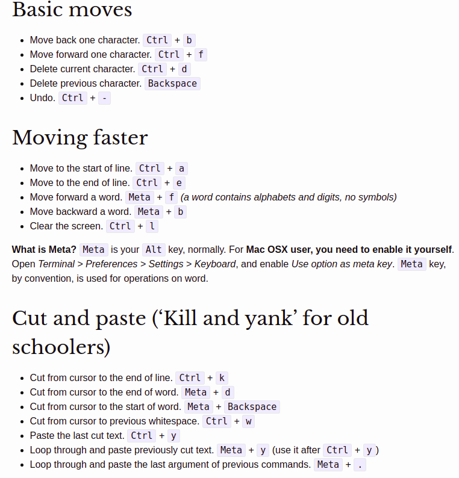

# Bash Shell

## Table Of Contents

[1. Symbolic Links](#1-symbolic-links) <br>
[2. Secure Shell (SSH)](#2-secure-shell-ssh-server-installation) <br>
[3. Using SCP](#3-secure-transfer-files-using-scp) <br>
[4. find Command](#4-find-command) <br>
[5. vi Editor](#5-vi-editor) <br>
[6. Usefull commands](#6-usefull-commands) <br>

* Bash command line shortcuts
```shell
Ctrl+K  Cut from curser till the end of line
Ctrl+U  Cut from curser till beginning of line
Ctrl+W  Cut words backwards
Ctrl+Y  Paste from clilp board
Ctrl+x+e Continue editing current line in text editor (uses $EDITOR)
Alt+.   Paste previous command's last argument
```

* Bash is "Bourne Again Shell". Bourne shell is developed by GNU.
* Different shells
    1. **sh** - Bourne Shell
    1. **bash** - Bourne Again Shell
    1. **csh** - C shell
    1. **tcsh** - Turbo C shell
    1. **ksh** - Korn shell

* `/etc/shells` file lists all available shells on the systems

* **Unoffical Bash Strict Mode**

```bash
    #!/bin/bash
    set -euo pipefail
    IFS=$'\n\t'
```

* The `set -e` option instructs bash to immediately exit if any command has a non-zero exit status.

* `set -u` affects variables. When set, a reference to any variable you haven't previously defined - with the exceptions of `$*` and `$@` - is an error, and causes the program to immediately exit.

* `set -o pipefail` setting prevents errors in a pipeline from being masked. If any command in a pipeline fails, that return code will be used as the return code of the whole pipeline.

* The **IFS (Internal Field Separator)** variable controls what Bash calls _word splitting_.

```bash
#!/bin/bash
IFS=$' '
items="a b c"
for x in $items; do
    echo "$x"
done

IFS=$'\n'
for y in $items; do
    echo "$y"
done
```

* `set +u` _disables_ this variable strictness, and `set -u` _enables_ it.

* if a reference is made at runtime to an undefined variable, bash has a syntax for declaring a default value, using the `:-` operator:

```bash
bar=${foo:-alpha}  #bar is set to "alpha"
empty_str=${undef_var:-}  #empty_str is set to ""
```


```bash
$ cat /etc/shells
# /etc/shells: valid login shells
/bin/sh
/bin/bash
/bin/rbash
/bin/dash
```

* `cat /etc/issue` will show which Linux distro the container is running,

* Last filed of every user record in `/etc/passwd` indicates default shell for that user.

* "#!" is called sha bang.

* `/bin/sh` is a
link to `bash` shell in Linux.

* shell command line provides two modes to edit the commands in command line.
    1. emacs mode
    1. vi mode

```bash
# show current options, default is emac mode
$ set | grep SHELLOPTS
SHELLOPTS=braceexpand:emacs:hashall:histexpand:history:interactive-comments:monitor

# change to vi mode
$ set -o vi
$ set | grep SHELLOPTS
SHELLOPTS=braceexpand:hashall:histexpand:history:interactive-comments:monitor:vi

# go back to emacs mode
$ set -o emacs
```

customize the readline default key bindings by adding your own
bindings in a `~/.inputrc` File. Global default file is `/etc/inputrc`.

Search command history by pressing **Ctrl+R**
Repeat previous command: **!!** or **!-1**
In emacs mode, press **Ctlr+P**
Execute command that starts with specific word: **!<word-start>**
Clear history: **history -c**
Get command from previous argument to current command: **!!:$**
Get first argument from previous command: **!^**
Substitue specific argument: **!cp:2**

```bash
# display timestamp with history command
$ export HISTTIMEFORMAT='%F %T '
$ history | more

# control history size is HISTSIZE in ~/.bash_profile
HISTSIZE=450
HISTFILESIZE=450

# change history file name using HISTFILE in ~/.bash_profile
HISTFILE=/root/.mycommands

# Eliminate consecutive repeated history entires
$ export HISTCONTROL=ignoredups

# Erase duplicate across history
$ export HISTCONTROL=erasedups

# force history not to remember command
$ export HISTCONTROL=ignorespace

# Ignore specific command from history
$ export HISTIGNORE="pwd:ls:ls -ltr:"

# disable history
$ export HISTSIZE=0
```

By default history is stored in `~/.bash_history`

| Command       | Description |
| ------------- | ----------- |
| !!            | Repeats the previous command       |
| !10           | Repeat the 10 th command from the history        |
| !-2           | Repeat the 2 nd command (from the last) from the history        |
| !string       | Repeat the command that starts with “string” from the history        |
| !?string      | Repeat the command that contains the word “string” from the history        |
| ^str1^str2^   | Substitute str1 in the previous command with str2 and execute it        |
| !!:$          | Gets the last argument from the previous command        |
| !string:n     | Gets the nth argument from the command that starts with “string” from the history.        |

```bash
# find all files that changed within last 24 hours
$ find / -ctime -1 > /tmp/changed-file-list.txt &

# suspend current job
$ find / -ctime -1 > /tmp/changed-file-list.txt
$ bg
$ %2 &

# view all background jobs
$ jobs

# move background job to foreground
$ fg

# kill background job using kill %job-number
$ kill %2

# username - hostname - full path of CWD
$ export PS1="\u@\h \w$ "

$ export PS2="continue-> "
```

```bash
# dark blue prompt
$ export PS1="\e[1;34m\u@\h \w$ \e[m"
```
* \e[ - indicates begining of color prompt
* x;ym - indicate color code
* \e[m - indicate end of color prompt

Color codes:
* Black 0;30
* Blue  0;34
* Green 0;32
* Cyan  0;36
* Red   0;31
* Purple 0;35
* Brown  0;33
Replace 0 with 1 for dark color

Another way is to use following color codes:
* Black \033[30m
* Blue \033[34m
* Green \033[32m
* Cyan \033[36m
* Red \033[31m
* Purple \033[35m
* Brown \033[33m

Sequence of execution of bash startup files
* `/etc/profile` -> execute next step
* `~/.bash_profile` -> end
* `~/.bash_login` -> end
* `~/.profile` -> end

`~/.bashrc` is not directly executed by bash. However, `~/.bash_profile` typically execute `~/.bashrc`.

```bash
if [ -f ~/.bashrc ]; then
    . ~/.bashrc
fi
```

when concatenate the value of a variable with another value, use the `${}` referencing form.

`/etc/profile` checks all `*.sh` file under `/etc/profile.d` and executes them.

"$VAR" - If quoted, it is considered as one word
 $VAR  - iF not quoted, it will be split into multiple words

```bash
states="CA NY UT TX"
for i in $states; do
    echo $i
done
Output
------
CA
NY
UT

for i in "$states"; do
    echo $i
done
Output
------
CA NY UT TX
 ```

 * Executing a shell script like `./script.sh` will spawn a new bash shell and it executes the script.

 * Positional parameters are of the form `$1` to `$N`. When N is more than single digit, it must be enclosed in braces like `${N}`.
 $1, $2 ... ${10}, ${11}

| Command   | Description |
| --------- | ----------- |
| $0        | Script Name       |
| $1        | First parameter   |
| $2        | Second parameter  |
| $*        | All parameters    |
| $@        | All parameters    |
| $#        | Total number of parameters |
| $$        | PID of the shell |
| $!        | PID of most recently executed background process |
| $?        | Exit status of most recently executed command |
| $-        | All options set using bash set builtin command |
| $_        | Gives last argument to previous command. At the shell startup, it gives absolute filename of the shell script being executed. |

```bash
# display all parameters using following single line code-snippet
printf '"%b"\n' "$@" | cat -n
```

`$*` and `$@` are same except when double quoted.
"$*" is converted to "${1}x${2}x${3}x..."

```bash
# get range of parameters ${@:$start:$count}
$ start=2
$ count=3
$ ${@:$start:$count}
$ for i in "${@:$start:$count}"; do
$    echo $i
$ done
```

* `shift` command moves the arguments (positional parameters) to the left by n positions. If no argument is specified, the argument will be moved by 1.

* `echo -n` Do not output trailing newline
* `echo -e` Enable interpretation of backslash escapes

* single quotes '', will not expand variable values, i.e $ symbol will be treated as a literal value.

* Declare variables using `typeset` and `declare` builtins. `typeset` is deprecated.

```bash
# declare integer
$ declare -i variablename

# readonly variable
$ declare -r variablename

# array
$ declare -a array

# associative array
$ declare -A array
```

* Inside shell script use `let` for arithmetic expressions.
```bash
# both are same, no need to have $ on RHS
let total=total+3
let total=$total+3
```

* `((expression))` tells bash to evaluate contents as an expression. This is very much like `let`. However within (()), you can use spaces. (()) allows pre- and post- increment/decrement:
```bash
$ ((total++))
$ ((total--))
$ ((++total))
```

* `expr` is a unix command (not a bash builtin) which can be used to evaluate an expression.

* Bash does not understand floating point arithmetic. It treats numbers containing a decimal point as strings.

### Number Comparison

| Operator   | Description |
| ---------  | ----------- |
| -eq        | Equal to       |
| -ne        | Not Equal to   |
| -gt        | Greater than       |
| -ge        | Greater than or equal to   |
| -lt        | Less than       |
| -le        | Less than or equal to   |

### String Comparison
| Operator   | Description |
| ---------  | ----------- |
| =        | Equal to       |
| ==        | Equal to   |
| !=        | Not Equal to       |
| <        |    |
| >        |        |
| -z        | Zero byte? Is string empty?   |
| -n        | Not empty?   |


```
if [ conditional express ]; then
    statement1
    statement2
else
    statement3
fi

if [ conditional express ]; then
    statement1
    statement2
elif [ conditional expression2 ]; then
    statement3
else
    statement4
fi
```

* In a shell
    * 0 means last command executed successfully
    * 1 means last command execution failed

### File Test Operators
| Operator   | Description |
| ---------  | ----------- |
| -e        | File exists       |
| -f        | It's a regular file   |
| -d        | It's a directory       |
| -b        | It's a block device   |
| -c        | It's a character device       |
| -s        | File is not empty   |
| -p        | It's a pipe   |
| -S        | It's a socket      |
| -h        | It's a symbolic link   |
| -t        | Check if FD is opened in terminal       |
| -r        | File read permission   |
| -w        |        |
| -x        |  |
| -u        | suid set on the file   |
| -g        | sgid set on the file       |
| -k        |  Sticky bit set on file  |
| -O        | You own the file       |
| -G        | File group id and my group id are same   |
| -N        | fiel got modified since last read   |
| f1 -nt f2        | f1 newer than f2       |
| f1 -ot f2        | f1 is older than f2   |
| f1 -ef f2        | Both files are hard linked to same file       |

* **-a** does 'and' comparison inside conditional expression
* **-o** does 'or' comparison inside conditional expression
* **!** is a logical NOT
* **&&** is used to execute sequence of commands only when previous command is successfully executed with a return status of zero.
* **||** execute exactly one command in a sequence of commands.

```bash
if [ $total -ge 50 -a $total -le 100 ]; then
if [ "$input" == "apple" -o "$input" == "orange" ]; then

passwd=/etc/passwd
group=/etc/group

if [ -f $passwd ] && x=`wc -l $passwd|awk '{print $1}'` && \
   [ -f $group ] && y=`wc -l $group|awk '{print $1}'` && let total=$x+$y
then
    echo "Total Lines in $passwd and $group files are: $total"
fi

[ -f /.datafile ] || touch /.datafile
```

* [[]] - Extended Test Command is an advanced variation of []
    * Allows pattern matching
    * =~ regular expresison matching
```bash
    if [[ $name ~= ^b ]];
```

```bash
for varname in list
do
    commands ##Body of the loop
done

# loop through files and directories
cd ~
for item in *
do
    echo "Item $((i++)) : $item"
done
```

* If list is missing from for statement, bash uses positional parameters that were passed into the shell.

```bash
# Use range of numbers using brace expansion
for num in {1..10}

# Range of number with increment
for num in {1..10..2}

# Bash for loop using C syntax
for (( expr1; expr2; expr3 ))
do
    commands
done
```

```bash
# While loop
while expression
do
    commands
done

# until loop
until expression
do
    commands #body of the loop
done
```

* bash until loop is useful as a way of waiting for certain events to occur.

```bash
case var in
pattern1 )
    command1
    command2
    ...
    ;;
pattern2 )
    command3
    command4
    ...
    ;;
esac
```
* Each set of command in case statement should end with two semi-colons (;;)

* case terminator can be `;;`, `;&` and `;;&`

* Bash has a formatted print command `printf`

```bash
read -a arrayname
read -p prompt
read -s # This doesn't echo the value as you enter
read -t 10 # read waits for 10 sec and times out
read -N 5  # return after reading exactly 5 char
read -r    # read \ literally
read       # if no variable, store value in $REPLY internal variable
```

* The bash shell has a hash table where the commands you execute are stored. When you execute the same command next time, bash won't search the PATH variable, instead it will pick up the command from the hash table and run it.

* Use `type` command to identify the type of a particular command. A command can be an alias, a shell builtin, a shell keyword, or an external program.

```bash
type lw
type pwd
```

* `ulimit` control the amount of resources that can be assigned to processes that are started by bash shell.
```bash
# view all current limits
ulimit -a
```

* `shopt` stands for shell options. View all shell options and their current status.

* `truncate` is a command line utility that can be found in most Linux distros. It is used to shrink the size of a file to a desired size.

* The truncation process basically removes all the contents of the file. It does not however remove the file itself, but it leaves it on the disk as a zero byte file. This allows the file to re-used or be continually used by other programs while keeping the overall size in check. This process is also referred to as **“zero out a file”** or to **“empty a file“**. The truncation process also will preserve the inode of the file.

* **noclobber** is a feature in Linux which is used to prevent accidental overwriting of files. If noclobber is set or enabled on your system, the above I/O redirection methods will throw an error.

```
$ truncate -s 0 /var/log/syslog

# Empty file using I/O redirection
$ > /var/log/syslog

$ cp /dev/null /var/log/syslog
$ cat /dev/null > /var/log/syslog
```

#### Bash substring removal
```
# Deletes shortest match of substring from front of $string
${string#substring}

# Deletes longest match of substring from front of $string
${string##substring}
```

### Bash Cli shortcut



## 1. Symbolic Links
[Table Of Contents](#table-of-contents)

* A symlink (also called a symbolic link) is a type of file in Linux that points to another file or a folder on your computer.

* A **hard link** cannot be created for a folder or file in a different file system.

* A symlink can be created using `ln` link command. By default `ln` create hard link. `-s` flag specifies that the link should be soft link.

```bash
ln -s <path to file/folder TO BE LINKED> <path to link TO BE CREATED>

# example
ln -s /home/aamir/flight_test_report.txt tp.txt
ln -s /home/aamir/flight_test_report.txt flight_reports/tp.txt

# symlink for folder
ln -s /home/aamir/workspace ws

# check if a file is symlink
$ ls -l host_ws
lrwxrwxrwx 1 aamir aamir 22 Mar  3 10:09 host_ws -> /home/aamir/workspace/

# Remove symlink
unlink <path-to-symlink>

# Can also use rm
rm <path-to-symlink>
```

The main benefit of `rm` over `unlink` is that we can remove multiple links at once.

```bash
# find broken symlink
find /home/aamir -xtype l

# delete broken symlink
find /home/aamir -xtype l -delete
```

## 2. Secure Shell (SSH) Server Installation
[Table Of Contents](#table-of-contents)

SSH is a cryptographic network protocol used for a secure connection between a client and a server.

```bash
$ sudo apt update
$ sudo apt install openssh-server -y

# verify that installation is successful
$ sudo systemctl status ssh

# Allow Uncomplicated Firewall(UFW) firewall
$ sudo ufw allow ssh

# connect to ssh server
$ ssh user_name@ip_address
```

To determine the public IP address of the machine you’re trying to SSH to, simply visit the following URL: `https://api.ipify.org`

```bash
# To disable SSH
$ sudo systemctl stop ssh

# To start again
$ sudo systemctl start ssh
```
OpenSSH client-side configuration file is `config` is stored in `.ssh` directory under user's home directory.
The `config` file must be readable and writable only by the user and not accessible by others:

```bash
$ touch ~/.ssh/config
$ chmod 600 ~/.ssh/config
```

## 3. Secure Transfer Files Using SCP
[Table Of Contents](#table-of-contents)

SCP (secure copy) allows to securely copy files and directories between two locations.

```bash
scp [options] source destination
```

SCP options <br>
`-P`: Remote host ssh port
`-p`: Preserve file modification and access time
`-q`: Suppress progress meter and non-error messages
`-C`: Force `scp` to compress the data
`-r`: copy directories recursively

```bash
# Copy local file to remote
$ scp file.txt remote_username@10.10.0.2:/remote/directory

# Save file with different name
$ scp file.txt remote_username@10.10.0.2:/remote/directory/newfilename.txt

# if remote is listening on different port
$ scp -P 2322 file.txt remote_username@10.10.0.2:/remote/directory

# Copy dirctory
$ scp -r /local/directory remote_username@10.10.0.2:/remote/directory

# Copy remote file to local system
$ scp remote_username@10.10.0.2:/remote/file.txt /local/directory

# Copy file between two remote systems
$ scp user1@host1.com:/files/file.txt user2@host2.com:/files
```

## 4. find command
[Table Of Contents](#table-of-contents)

* `find` command can be used to find files by **permission, users, groups, file type, date, size** and other possible criteria.

```bash
# find files in current working directory
$ find . -name test.txt
$ find /home -name test.txt

# ignore case
$ find /home -iname test.txt

# find directories
$ find / -type d -name Test

# find files
$ find . -type f -name test.cpp

# find all cpp files
$ find . -type f -name "*.cpp"

# find file with 777 permission
$ find . -type f -perm 0777 -print

# without 777 permission
$ find / -type f ! -perm 777

# find read only files
$ find . -perm /u=r

# find all executable file
$ find . -perm /a=x

# find all 777 and chmod to 644
$ find / -type f -perm 0777 -print -exec chmod 644 {} \;

# find files by size
$ find / -size +100MB

$ find . -type f ! -name "*.*" | xargs -o rm
$ find . -type f ! -name "*.*" -exec rm {} \;
```
TBD: https://www.tecmint.com/35-practical-examples-of-linux-find-command/
What are files with SGID bit and Sticky bit?? SUID files

## 5. vi Editor
[Table Of Contents](#table-of-contents)

* vim is the most popular command-line text editor. vim works in
    * **Normal** mode,
    * **Insert** mode,
    * **Visual** mode,
    * **Command** mode and
    * **Replace** mode.

* To get into **Normal** mode, press **ESC** key.
* Move the cursor

```
    h move one character left
    j move one row down
    k move one row up
    l move one character right
    4j move 4 rows down
    6k move 6 rows up
```

* Basic word movements:

```
    w move to beginning of next word
    b move to previous beginning of word
    e move to end of word
    W move to beginning of next word after a whitespace
    B move to beginning of previous word before a whitespace
    E move to end of word before a whitespace

    r replace a single character
    x delete a single character
    u undo changes
    ctrl-r undo undo
```
* Insert commands include:

```
    i for ’insert’, this immediately switches vim to insert mode
    a for ’append’, this moves the cursor after the current character and enters insert mode
    o inserts a new line below the current line and enters insert mode on the new line

    I moves the cursor to the beginning of the line and enters insert mode
    A moves the cursor to the end of the line and enters insert mode
    O inserts a new line above the current one and enters insert mode on the new line
```
* Visual mode commands

```
    v enter visual mode, this will also mark a starting selection point
      Move the cursor to the desired end selection point; vim will provide a visual highlight of the text selection

    V enter visual line mode, this will make text selections by line
    <C-V> to enter visual block mode, this will make text selections by blocks; moving the cursor will make rectangle selections of the text

    visual: Enter by pressing v
    block-visual: select any rectangular region. Enter by pressing <ctrl>+v
    linewise-visual: always select full lines. Enter by pressing <shift>+v
```

* **Command** mode has a wide variety of commands and can do things that normal mode can’t do as easily. To enter command mode type ’:’ from normal mode

```
    : Enters command mode
    % Means across all lines
    s Means substitute
    /foo is regex to find things to replace
    /bar/ is regex to replace things with
    /g means global, otherwise it would only execute once per line

```
* **Replace** mode

```
In normal mode press ‘R’ (capital R) to enter replace mode
```
### Deleting Lines

```
    dd delete current line
   5dd delete 5 lines from current line
   :[start],[end]d Delete a range of lines
   :3,5d   delete line 3-5
   . current line
   $ last line
   % All lines
   :.,$d  From current line to end of file
   :.,1d  From current ilne to beginning of file
   %d     Delete all lines
```

#### Delete Lines containing pattern

* The global command (`g`) tells te delete command (`d`) to delete all lines containing the `<pattern>`

```
:g/<pattern>/d   Delete all lines containing the <pattern>
:g!/<pattern>/d  Delete all lines not containing the <pattern>
:g/^#/d          Delete all comment lines from Bash script
:g/^$/d          Delete all blank lines
:g/^\s*$/d       Delete all blank lines with zero or more whitespace character
```

* To delete all lines in the current file use `%d` command in normal mode.
* To delete from current line till the end use `,$d`.
* To delete from line 3 to 6 use `3,6d`.
* general form of substitute command
```
:[range]s/{pattern}/{string}/[flags] [count]

# count is a positive integer that multiplies the command
```

* When no range is specified the substitute command operates only in current line.

* The substitude command looks for the pattern as a string, not a whole word.

* To browse search history, enter :s and use arrow up/down keys.

|      command            |  Description |
|-------------------------|--------------|
| `:s (:substitude)`      | find and replace text |
| `:s/pattern/str/g`      | replace all occurrencesd in current line (g flag) |
| `:%s/pattern/str/g`     | search and replace in entire file (% as range) |
| `:%s/pattern//g`        | delete all instance of pattern |
| `:s\|pattern\|str\|`    | Use \| instead of / |
| `:%s/pattern/str/gc`    | To confirm each substitution, (c flag) |
| `:%s/^foo.\*/vim/gc`    | regular expression |
| `:3,10s/pat/str/g`      | all lines starting from 3 to 10 |
| `:.,$s/pat/str/`        | current line to last line |
| `:.,+4s/pat/str/g`      | current line and next four lines |
| `:s/pattern/str/gi`     | ignore case (i flag) |
| `:s/pattern/str/gI`     | case sensitive (I flag) |
| `:s/\<pat\>/str/g`      | find whole word pat |
| `:5,20s/^/#/`           | comment lines from 5 to 20 |
| `:5,20s/^#//`           | uncomment lines from 5 to 20 |
| `:%s/ab\|cd/aa`         | replace ab or cd with aa |
| `:%s/\s\+$//g`          | remove trailing whitespace at the end of each line |

### Useful tips

```
S (SHIFT+s) Start writing on a line at correct indentation
%           Jump to matching bracket/brace
>>, <<      Indent one line
>, <        Indent multiple lines
=G          Fix indentation in the whole file
:tabnew     Create a new tab
gt          Go to next tab
gT          Go to previous tab
:tabo       Close all other tabs beside the active one
```

# 6. Usefull Commands
## Killin a bunch of processes

```
# Kill processes
$ kill -9 $(ps -aux | grep main.py | awk '{print $2}')

# or better use pgrep and pkill
$ kill -9 $(pgrep main.py)

# remove grep output from ps output
$ ps -aux | grep main.* | grep -v grep
```

## Generate a sequence of numbers
```shell
#
$ seq LAST
$ seq FIRST LAST
$ seq FIRST INCREMENT LAST
$ seq 10  # 1 to 10
$ seq 0 2 10  # 0 2 4 6 8 10
```

## Check OS name and version
```shell
$ cat /etc/os-release

# Linux kernel version
$ uname -r
```

## xargs
* xargs is used to build and execute command lines from standard input. While tools like `grep` can accept standard input as parameters, many other tools cannot. Using `xargs` allows tools like `echo`, `rm`, `mkdir` etc to accept standard input as arguments.

* `xargs` reads items from standard iput as separated by blanks and executes a command once for each argument.

```
$ echo "one two three" | xargs mkdir
```

* Use `-d` option to change delimeter

* The most common usage of `xargs` is to use it with `find` command.

```
# find files older than two weeks
$ find /tmp -mtime +14 | xargs rm
```

* `find` command supports the `-exec` option that allow arbitrary commands to be performed on found files.

* `-t` option print each command that will be executed.

```
$ echo "one two three" | xargs -t rm
```

* `-p` option will print the command to be executd and prompt the user to run it.

* Use `-I` option to run multiple commands.

```
$ echo "one two three" | xargs -I % sh -c 'echo %; mkdir %'
```
## Create multiple files and directories

```
$ mkdir {cs,files,masters,draft,static}   # directories.
$ touch -- 'file with spaces' '-a' '-l' 'filename'    # And some files:

```

### Create Application Icon in Ubuntu
vi anaconda-navigator.desktop

```shell
#!/usr/bin/env xdg-open
[Desktop Entry]
Name=Anaconda
Version=2.0
Type=Application
Exec=/path/to/anaconda-navigator
Icon=/path/to/selected/icon
Comment=Open Anaconda Navigator
Terminal=false
```

mv anaconda-navigator.desktop ~/.local/share/applications/

## Debian

* Creating and merging patches in Linux

```shell
$ diff -u file.old file.new >file.patch

$ patch -p0 file.old <file.patch
```

* `git diff` will generate a file in the same format as what `diff -u` would do and `git apply` can do the same as `patch`.

* Version control tools and their companies

    subversion (svn) => Apache
    git =>
    bazaar (bzr) => canonical
    mercurial (hg) =>

* `/etc/debian_version` contains the version number for the installed Debian system.

* The `apt-show-versions` program (from the Debian package of the same name) checks the list of installed packages and identifies the available versions.

* `/etc/apt/sources.list` file (and `/etc/apt/sources.list.d/` directory) will show where the installed Debian packages likely came from.

* Ext4, the default filesystem for Debian, is a good compromise, based on
the three previous versions of filesystems historically used in Linux (ext, ext2 and
ext3). Ext4 overcomes certain limitations of ext3 and is particularly appropriate for
very large capacity hard drives