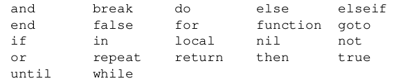
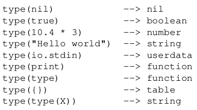

# Lua Programming

```lua
-- defines a factorial function
function fact (n)
    if n == 0 then
        return 1
    else
        return n * fact(n - 1)
    end
end
print("enter a number:")
a = io.read("*n") -- reads a number
print(fact(a))
```

* each piece of code that Lua executes, such as a file or a single line in interactive mode is called _chunk_.

* Lua is used also as a _data-description language_, chunks with several megabytes are not uncommon.

* call the function `os.exit()`, from the Operating System
library to exit interactive mode.

* In older versions (< 5.3), we need to precede expression with an equal sign to print it.

```
a = 15
= a^2  --> 225.0
```

```
lua -i prog
```

* Start interactive session after running a given chunk.

* Another way to run chunks is with the function `dofile`, which immediately executes a file.

```lua
--- lib1.lua
function norm (x, y)
    return math.sqrt(x^2 + y^2)
end

function twice (x)
    return 2.0 * x
end
```

```shell
> dofile("lib1.lua")  --load library
> n = norm(3.4, 1.0)
```



* Comment starts anywhere with two consecutive hyphens (--). Long comments with two hyphens followed by two opening square brackets and run until the first occurance of two consecutive closing square brackets.

--[[multi-line
long comment
]]

* Lua is a dynamically-typed language.



* `userdata` are used to represent new types created by an application program or a library written in C; for instance

* Booleans do not hold a monopoly of condition values: in Lua, any value can represent a condition.

* Lua considers both **zero and the empty string as _true_** in
conditional tests. Only Boolean false and nil are considered as false and anything else as true.

* logical operator `and`, `or` and `not`.

* The result of the `and` operator is its _first operand_ if that operand is _false_; otherwise, the result is its _second operand_. 

* The result of the `or` operator is its _first operand_ if it is _not false_; otherwise, the result is its _second operand_.

* A useful Lua idiom is `x = x or v`, which is equivalent to
`if not x then x = v end`. sets x to a default value v when x is not set (provided that x is not set to false).

* `((a and b) or c)` or simply `(a and b or c)` is equivalent to the C expression `a ? b : c`, provided that b is not false.

* The `not` operator always gives a Boolean value

* The `-e` option allows us to enter code directly into the command line, like here:

`% lua -e "print(math.sin(12))"`

* A script can retrieve its arguments through the predefined global variable `arg`. A script can also retrieve its arguments through a `vararg` expression. In the main body of a script, the
expression `...` (three dots) results in the arguments to the script.
