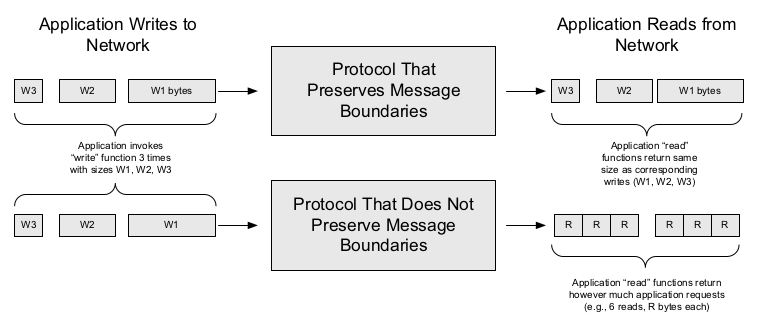
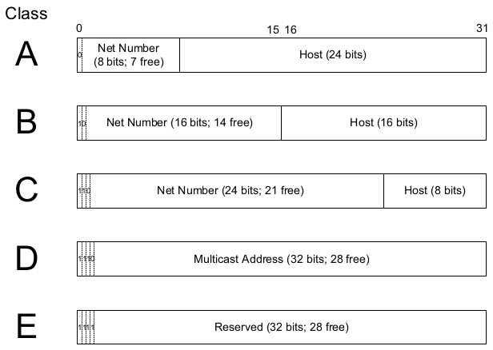
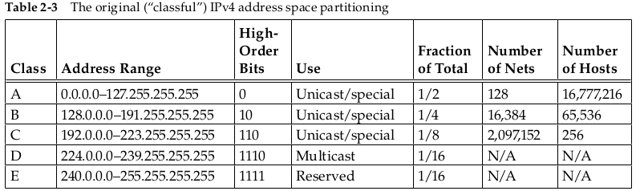
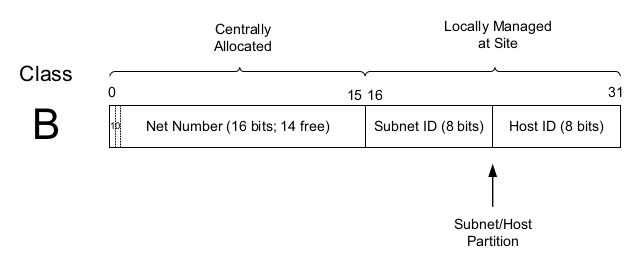

# Computer Networks

* TCP/IP is a protocol suite that implements the Internet architecture and draws its origins from the ARPANET Reference Model (ARM) [RFC0871].

* When an application sends more than one chunk of information into the network, the fact that more than one chunk was written may or may not be preserved by the communication protocol.

* Most datagram protocols preserve message boundaries.

| Services | Ports |
|----------|-------|
| Secure Shell Protocol (SSH) | 22 |
| File Transfer Protocol (FTP) | 20 and 21|
| Telnet remote terminal protocol | 23 |
| e-mail/Simple Mail Transfer Protocol (SMTP) | 25 | 
| Domain Name System (DNS) | 53 | 
| Hypertext Transfer Protocol or Web (HTTP and HTTPS) | 80 and 443 | 
| Interactive Mail Access Protocol (IMAP and IMAPS | 143 and 993 |
| Simple Network Management Protocol (SNMP) |  161 and 162 | 
| Lightweight Directory Access Protocol (LDAP) | 389 |

* In the TCP/IP world, the **DNS** is a distributed database that provides the mapping between host names and IP addresses (and vice versa).

* Every official standard in the Internet community is published as a _Request for Comments_, or **RFC**. [RFC](http://www.rfc-editor.org.)

* The historical de facto standard TCP/IP implementations were from the _Computer Systems Research Group (CSRG)_ at the University of California, Berkeley. They were distributed with the 4.x BSD (Berkeley Software Distribution) system and with the BSD Networking Releases until the mid-1990s.

* malicious users are able to insert whatever IP address they choose into the source IP address field of each IP datagram they send, an activity called _spoofing_.

* _Denial-of-service (DoS)_ attacks usually involve using so much of some important resource that legitimate users are denied service. This is often accomplished by using many sending computers, forming a _distributed DoS (DDoS)_ attack.

* The dotted-quad notation is simply a way of writing the whole IPv4 address; a 32-bit nonnegative integer used throughout the Internet system; using convenient decimal numbers.

* In IPv6, addresses are 128 bits in length, four times larger than IPv4 addresses.

* The conventional notation adopted for IPv6 addresses is a series of four hexadecimal numbers separated by colons. Example `5f05:2000:80ad:5800:0058:0800:2023:1d71`

* The partitioning of the address space involved five _classes_. Each class represented a different trade-off in the number of bits of a 32-bit IPv4 address devoted to the network
number versus the number of bits devoted to the host number.

* The IPv4 address space was originally divided into five classes. Classes A, B, and C were used for assigning addresses to interfaces on the **Internet** (unicast addresses) and for
some other special-case uses. The classes are defined by the first few bits in the address: 0 for class A, 10 for class B, 110 for class C, and so on. Class D addresses are for multicast use, and class E addresses remain reserved.

* Subnet addressing [RFC0950]. Using subnet addressing, a site is allocated a class A, B, or C network number, leaving some number of remaining host bits to be further allocated
and assigned within a site. The site may further divide the host portion of its base address allocation into a _subnetwork (subnet)_ number and a host number.

* The subnetwork structure is known only by hosts and routers where the subneting is taking place.

* The _subnet mask_ is an assignment of bits used by a host or router to determine how the network and subnetwork information is partitioned from the host information in a corresponding IP address.

* Masks are used by routers and hosts to determine where the network/subnetwork portion of an IP address ends and the host part begins.

* A bit set to 1 in the subnet mask means the corresponding bit position in an IP address should be considered _part of a combined network/subnetwork portion_ of an address. Conversely, a bit set to 0 in the subnet mask means the corresponding bit position in an IP address should be considered _part of the host portion_.

* There is a common case where a subnetwork contains _only two hosts_. When **routers** are connected together by a point-to-point link requiring an IP address to be assigned at each end, it is common practice to use a /31 network prefix with IPv4, and it is now also a recommended practice to use a /127 prefix for IPv6 [RFC6164].

* In each IPv4 subnetwork, a special address is reserved to be the _subnet broadcast address_. The subnet broadcast address is formed by setting the network/subnetwork portion of an IPv4 address to the appropriate value and _all the bits in the Host field to 1_.

* A datagram using the broadcast address `128.32.1.255` for the subnet `128.32.1.0/24` as its destination has also been known as a _directed broadcast_. Such a broadcast can,
at least theoretically, be routed through the Internet as a single datagram until reaching the target subnetwork, at which point it becomes a collection of broadcast datagrams that are delivered to all hosts on the subnetwork.

* Directed broadcasts were found to be such a big problem from a security point of view that they are effectively disabled on the Internet today.

* Three particular scaling issues of Internet
    * class B address space would be exhausted by about 1995
    * The 32-bit IPv4 address was thought to be inadequate to handle the size of the Internet anticipated by the early 2000s
    * As more and more class A, B, and C routing entries appeared, routing performance would suffer.

| RFCs   |  Description |
|--------|--------------|
| 0919   | various types of broadcasts for IPv4 |
| 1812   | Support for directed broadcast |
| 2644   | Disable forwarding of directed broadcast | 

