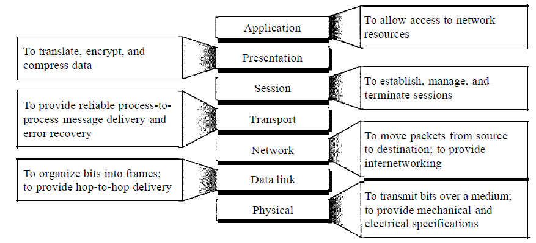

# Computer Networks

* TCP/IP is a protocol suite that implements the Internet architecture and draws its origins from the ARPANET Reference Model (ARM) [RFC0871].


* When an application sends more than one chunk of information into the network, the fact that more than one chunk was written may or may not be preserved by the communication protocol.

* Most datagram protocols preserve message boundaries.

| Services | Ports |
|----------|-------|
| Secure Shell Protocol (SSH) | 22 |
| File Transfer Protocol (FTP) | 20 and 21|
| Telnet remote terminal protocol | 23 |
| e-mail/Simple Mail Transfer Protocol (SMTP) | 25 |
| Domain Name System (DNS) | 53 |
| Hypertext Transfer Protocol or Web (HTTP and HTTPS) | 80 and 443 |
| Interactive Mail Access Protocol (IMAP and IMAPS | 143 and 993 |
| Simple Network Management Protocol (SNMP) |  161 and 162 |
| Lightweight Directory Access Protocol (LDAP) | 389 |

* In the TCP/IP world, the **DNS** is a distributed database that provides the mapping between host names and IP addresses (and vice versa).

* Every official standard in the Internet community is published as a _Request for Comments_, or **RFC**. [RFC](http://www.rfc-editor.org.)

* The historical de facto standard TCP/IP implementations were from the _Computer Systems Research Group (CSRG)_ at the University of California, Berkeley. They were distributed with the 4.x BSD (Berkeley Software Distribution) system and with the BSD Networking Releases until the mid-1990s.

* malicious users are able to insert whatever IP address they choose into the source IP address field of each IP datagram they send, an activity called _spoofing_.

* _Denial-of-service (DoS)_ attacks usually involve using so much of some important resource that legitimate users are denied service. This is often accomplished by using many sending computers, forming a _distributed DoS (DDoS)_ attack.

* The dotted-quad notation is simply a way of writing the whole IPv4 address; a 32-bit nonnegative integer used throughout the Internet system; using convenient decimal numbers.

* In IPv6, addresses are 128 bits in length, four times larger than IPv4 addresses.

* The conventional notation adopted for IPv6 addresses is a series of four hexadecimal numbers separated by colons. Example `5f05:2000:80ad:5800:0058:0800:2023:1d71`

* The partitioning of the address space involved five _classes_. Each class represented a different trade-off in the number of bits of a 32-bit IPv4 address devoted to the network
number versus the number of bits devoted to the host number.


* The IPv4 address space was originally divided into five classes. Classes A, B, and C were used for assigning addresses to interfaces on the **Internet** (unicast addresses) and for
some other special-case uses. The classes are defined by the first few bits in the address: 0 for class A, 10 for class B, 110 for class C, and so on. Class D addresses are for multicast use, and class E addresses remain reserved.


* Subnet addressing [RFC0950]. Using subnet addressing, a site is allocated a class A, B, or C network number, leaving some number of remaining host bits to be further allocated
and assigned within a site. The site may further divide the host portion of its base address allocation into a _subnetwork (subnet)_ number and a host number.


* The subnetwork structure is known only by hosts and routers where the subneting is taking place.

* The _subnet mask_ is an assignment of bits used by a host or router to determine how the network and subnetwork information is partitioned from the host information in a corresponding IP address.

* Masks are used by routers and hosts to determine where the network/subnetwork portion of an IP address ends and the host part begins.

* A bit set to 1 in the subnet mask means the corresponding bit position in an IP address should be considered _part of a combined network/subnetwork portion_ of an address. Conversely, a bit set to 0 in the subnet mask means the corresponding bit position in an IP address should be considered _part of the host portion_.

* There is a common case where a subnetwork contains _only two hosts_. When **routers** are connected together by a point-to-point link requiring an IP address to be assigned at each end, it is common practice to use a /31 network prefix with IPv4, and it is now also a recommended practice to use a /127 prefix for IPv6 [RFC6164].

* In each IPv4 subnetwork, a special address is reserved to be the _subnet broadcast address_. The subnet broadcast address is formed by setting the network/subnetwork portion of an IPv4 address to the appropriate value and _all the bits in the Host field to 1_.

* A datagram using the broadcast address `128.32.1.255` for the subnet `128.32.1.0/24` as its destination has also been known as a _directed broadcast_. Such a broadcast can,
at least theoretically, be routed through the Internet as a single datagram until reaching the target subnetwork, at which point it becomes a collection of broadcast datagrams that are delivered to all hosts on the subnetwork.

* Directed broadcasts were found to be such a big problem from a security point of view that they are effectively disabled on the Internet today.

* Three particular scaling issues of Internet
    * class B address space would be exhausted by about 1995
    * The 32-bit IPv4 address was thought to be inadequate to handle the size of the Internet anticipated by the early 2000s
    * As more and more class A, B, and C routing entries appeared, routing performance would suffer.


* **Open Systems Interconnection (OSI)** model is a reference model developed by ISO (International Organization for Standardization) in 1984, as a conceptual framework of standards for communication in the network across different equipment and applications by different vendors.


* OSI Layers
    * Application Layers (Upper Layers):
    * Network Processes to Applications
    * Data Representation
    * InterHost Communication
    * Transport Layer

        End To End Connections:
        * Handles transportation issues between hosts
        * Ensures data transport reliability
        * Establishes, maintains and terminates virtual circuits
        * Provides reliability through fault detection and recovery
        * Information flow control

    * Internet Layer

        Data Delivery:
        * Provides connectivity and path selection between two host systems
        * Routes data packets
        * Selects best path to deliver data
        * The Network layer prioritizes data known as Quality of Service (QoS)

    * Data Link Layer

        Access to Media:
        * Defines how data is formatted for transmission and how access to the network is controlled

    * Physical Layer

        Binary Transmission:
        * Defines the electrical, mechanical, procedural, and functional specifications for activating, maintaining, and deactivating the physical link


*  In TCP/IP, socket and port are used to describe the path over which applications communicate. Most application level protocols are associated with one or more port number.

* In TCP/IP architecture, there are two Transport Layer protocols. The **Transmission Control Protocol (TCP)** guarantees information transmission. The **User Datagram Protocol (UDP)** transports datagrams without end-to-end reliability checking.

* The **Internet Protocol (IP)** is the primary protocol in the TCP/IP Network Layer.  In addition, there are many supporting protocols in the Network Layer, such as _ICMP_, to facilitate and manage the routing process.

* In the TCP/IP architecture, the Data Link Layer and Physical Layer are normally grouped together to become the Network Access layer. TCP/IP makes use of existing Data Link and Physical Layer standards rather than defining its own. Many RFCs describe how IP utilizes and interfaces with the existing data link protocols such as Ethernet, Token Ring, FDDI, HSSI, and ATM.

* In the context of data communication, a _protocol_ is a formal set of rules, conventions and data structure that governs how computers and other network devices exchange information over a network.

* The IP, the Internet Protocol, is responsible for exchanging information between routers so that the routers can select the proper path for network traffic, while TCP is responsible for ensuring the data packets are transmitted across the network reliably and error free.

* The LAN protocols suite is for the physical and data link layers communications over various LAN media such as Ethernet wires and wireless waves. The WAN protocol suite is for the lowest three layers and defines communication over various wide-area media, such as fiber optic and copper cable.

* many routing protocols use other network protocols to exchange information between routers.

* the Gigabit Ethernet protocol IEEE 802.3z is a LAN (Local Area Network) protocol and it can also be used in MAN (Metropolitan Area Network) communications.

* Most recent protocols are designed by the **IETF (Internet Engineering Task Force)** for Inter-networking communications, and the IEEE for local area networking (LAN) and metropolitan area networking (MAN). The International Telecommunication Union - Telecommunication (ITU-T) contributes mostly to wide area networking (WAN) and telecommunications protocols. ISO has its own suite of protocols for inter-networking communications, which is mainly deployed in European countries.

* The TCP/IP protocols are well documented in the Request For Comments (RFC), which are drafted, discussed, circulated and approved by the IETF committees.

* The TCP/IP suite’s core functions are addressing and routing (IP/IPv6 in the networking layer) and transportation control (TCP, UDP in the transport layer).

* On a LAN, messages are sent between machines by supplying the six bytes unique identifier (the “MAC” address). On top of these local or vendor specific network addresses, IP assigns a unique number to every network device in the world, which is called an IP address.

* This IP address is a four bytes value in IPv4 that, by convention, is expressed by converting each byte into a decimal number (0 to 255) and separating the bytes with a period. In IPv6, the IP address has been increased to 16 bytes.

* TCP provides a reliable stream delivery and virtual connection service to applications through the use of sequenced acknowledgment with re-transmission of packets when necessary.

* TCP provides stream data transfer, transportation reliability, efficient flow control, full-duplex operation, and multiplexing.


* Protocols refer to the rules; a standard is a protocol that has been adopted by vendors and manufacturers.

* **Jitter**: Jitter refers to the variation in the packet arrival time. It is the uneven delay in the delivery of audio or video packets.

* In _half-duplex mode_, each station can both transmit and receive, but not at the same time. When one device is sending, the other can only receive, and vice versa. Walkie-talkies and CB (citizens band) radios are both half-duplex systems.

* In _full-duplex mode_ (also called duplex), both stations can transmit and receive simultaneously. In full-duplex mode, signals going in one direction share the capacity of the link: with signals going in the other direction. This sharing can occur in two ways: Either the link must contain two physically separate transmission paths, one for sending and the other for receiving; or the capacity of the channel is divided between signals traveling in both directions. One common example of full-duplex communication is the telephone network.

* **Physical Topology** refers to the way in which a network is laid out physically. There are four basic topologies possible:
    * mesh,
    * star,
    * bus, and
    * ring.


* Different organizations managing Internet/Portocols:

    * International Organization for Standardization (ISO)
    * International Telecommunication Union-Telecommunication Standards Sector (ITU-T)
    * Consultative Committee for International Telegraphy and Telephony (CCITT)
    * American National Standards Institute (ANSI)
    * Institute of Electrical and Electronics Engineers (IEEE)

* The OSI model is not a protocol; it is a model for understanding and designing a network architecture that is flexible, robust, and inter-operable.

* Each layer defines a family of functions distinct from those of the other layers.
    * Layers 1-Physical,
    * layer 2-data link, and
    * layer 3-network, are the network support layers; they deal with the physical aspects of moving data from one device to another (such as electrical specifications, physical connections, physical addressing, and transport timing and reliability).
    * Layers 5-session,
    * layer 6-presentation, and
    * layer 7-application; can be thought of as the user support layers; they allow inter-operability among unrelated software systems.

* To be transmitted, bits must be encoded into signals - electrical or optical. The physical layer defines the type of encoding (how 0s and 1s are changed to signals).

* The physical layer is also concerned with Data rate, Synchronization of bits, Line configuration, Physical topology and Transmission mode.

* The **data link layer** transforms the physical layer, a raw transmission facility, to a reliable link. It makes the physical layer appear error-free to the upper layer (network layer).

* Responsibilities of the data link layer include Framing, Physical addressing, Flow control, Error control and Access control.

* The network layer is responsible for the source-to-destination delivery of a packet, possibly across multiple networks (links). Whereas the data link layer oversees the delivery of the packet between two systems on the same network (links), the network layer ensures that each packet gets from its point of origin to its final destination.

* If two systems are connected to the same link, there is usually no need for a network layer. However, if the two systems are attached to different networks (links) with connecting devices between the networks (links), there is often a need for the network layer to accomplish source-to-destination delivery.

* Other responsibilities of the network layer include Logical addressing, Routing,

* The transport layer is responsible for process-to-process delivery of the entire message. The network layer gets each packet to the correct computer; the transport layer gets the entire message to the correct process on that computer.

* Other responsibilities of the transport layer include Service-point addressing, Segmentation and reassembly, Connection control, Flow control, Error control.

* The session layer is responsible for dialog control and synchronization.

* The presentation layer is responsible for translation, compression, and encryption. The presentation layer at the sender changes the information from its sender-dependent format into a common format. The presentation layer at the receiving machine changes the common format into its receiver-dependent format.

* The application layer is responsible for providing services to the user.



* TCP/IP protocol suite has four layers: host-to-network, internet, transport, and application. At the transport layer, TCP/IP defines three protocols: Transmission Control Protocol (TCP), User Datagram Protocol (UDP), and Stream Control Transmission Protocol (SCTP). At the network layer, the main protocol defined by TCP/IP is the Internetworking Protocol (IP); there are also some other protocols that support data movement in this layer.

* At the physical and data link layers, TCP/IP does not define any specific protocol. It supports all the standard and proprietary protocols.

* At the network layer (or, more accurately, the internetwork layer), TCP/IP supports the Internetworking Protocol. IP, in turn, uses four supporting protocols: ARP, RARP, ICMP, and IGMP.

* The Internetworking Protocol (IP) is an unreliable and connectionless protocol - a best-effort delivery service.

* The **Address Resolution Protocol (ARP)** is used to associate a logical address with a physical address. The **Reverse Address Resolution Protocol (RARP)** allows a host to discover its Internet address when it knows only its physical address. It is used when a computer is connected to a network for the first time or when a diskless computer is booted.

* The **Internet Control Message Protocol (ICMP)** is a mechanism used by hosts and gateways to send notification of datagram problems back to the sender. ICMP sends query and error reporting messages. The Internet Group Message Protocol (IGMP) is used to facilitate the simultaneous transmission of a message to a group of recipients.

* The **Transmission Control Protocol (TCP)** provides full transport-layer services to applications. TCP is a reliable stream transport protocol.

* At the sending end of each transmission, TCP divides a stream of data into smaller units called _segments_. Each segment includes a sequence number for reordering after receipt, together with an acknowledgment number for the segments received. Segments are carried across the internet inside of IP datagrams. At the receiving end, TCP collects each datagram as it comes in and reorders the transmission based on sequence numbers.

* The size and format of physical addresses vary depending on the network. Ethernet uses a 6-byte (48-bit) physical address that is imprinted on the network interface card (NIC). LocalTalk (Apple), however, has a I-byte dynamic address that changes each time the station comes up.

* A logical address in the Internet is currently a 32-bit address that can uniquely define a host connected to the Internet. The physical addresses will change from hop to hop, but the logical addresses usually remain the same.

* In the TCP/IP architecture, the label assigned to a process is called a port address. A port address in TCP/IP is 16 bits in length.

* One of the major functions of the physical layer is to move data in the form of electromagnetic signals across a transmission medium. Transmission media work by conducting energy along a physical path.

* **Analog data** refers to information that is continuous; **Digital data** refers to information that has discrete states.

* Analog data, such as the sounds made by a human voice, take on continuous values. When someone speaks, an analog wave is created in the air. This can be captured by a microphone and converted to an analog signal or sampled and converted to a digital signal.

* Digital data can be converted to a digital signal or modulated into an analog signal for transmission across a medium.

* Signals can be either analog or digital. An _analog signal_ has infinitely many levels of intensity over a period of time. As the wave moves from value A to value B, it passes through and includes an infinite number of values along its path. A _digital signal_, on the other hand, can have only a limited number of defined values. Although each value can be any number, it is often as simple as 1 and O.

* The sine wave is the most fundamental form of a periodic analog signal. A sine wave can be represented by three parameters: the **peak amplitude**, the **frequency**, and the **phase**.

* The power in your house can be represented by a sine wave with a peak amplitude of 155 to 170 V. However, it is common knowledge that the voltage of the power in U.S. homes is 110 to 120 V. This discrepancy is due to the fact that these are **root mean square (RMS)** values. The signal is squared and then the average amplitude is calculated.

* **Period** refers to the amount of time, in seconds, a signal needs to complete 1 cycle. **Frequency** refers to the number of periods in 1s.

* The term **phase** describes the position of the waveform relative to time O.

* Wavelength binds the period or the frequency of a simple sine wave to the propagation speed of the medium.

* A single frequency sine wave is not useful in data communications; we need to send a composite signal, a signal made of many simple sine waves. French mathematician Jean-Baptiste Fourier showed that any composite signal is actually a combination of simple sine waves with different frequencies, amplitudes, and phases.

* Although the number of frequencies in a human voice is infinite, the range is limited. A normal human being can create a continuous range of frequencies between 0 and 4 kHz.

* In the United States, each AM radio station is assigned a lO-kHz bandwidth. The total bandwidth dedicated to AM radio ranges from 530 to 1700 kHz. Each FM radio station is assigned a 200-kHz bandwidth. The total bandwidth dedicated to FM radio ranges from 88 to 108 MHz.

* A 4-MHz bandwidth has been set aside for each black and white TV channel. An analog color TV channel has a 6-MHz bandwidth.

* Most digital signals are nonperiodic, and thus period and frequency are not appropriate characteristics. Another term - **bit rate** (instead of frequency) - is used to describe digital signals. The bit rate is the number of bits sent in 1s, expressed in bits per second (bps).

* The High Definition TV (HDTV) Screen is normally a ratio of 16:9 (in contrast to 4:3 for regular TV), which means the screen is wider.

* We can transmit a digital signal by using one of two different approaches: **baseband transmission** or **broadband transmission** (using modulation).


* Baseband transmission means sending a digital signal over a channel without changing the digital signal to an analog signal.

* Broadband transmission or _modulation_ means changing the digital signal to an analog signal for transmission. Modulation allows us to use a bandpass channel-a channel with a bandwidth that does not start from zero. This type of channel is more available than a low-pass channel.

* An example of broadband transmission using modulation is the sending of computer data through a telephone subscriber line. These lines, installed many years ago, are designed to carry voice (analog signal) with a limited bandwidth (frequencies between 0 and 4 kHz). Although this channel can be used as a low-pass channel, it is normally considered a bandpass channel.

* Signals travel through transmission media, which are not petfect. The imperfection causes _signal impairment_. Three causes of impairment are attenuation, distortion, and noise.

* **Attenuation** means a loss of energy. When a signal, simple or composite, travels through a medium, it loses some of its energy in overcoming the resistance of the medium. That is why a wire carrying electric signals gets warm, if not hot, after a while. To compensate for this loss, **amplifiers** are used to amplify the signal.

* **Decibel:** To show that a signal has lost or gained strength, engineers use the unit of the decibel. The decibel (dB) measures the relative strengths of two signals or one signal at two different points. Note that the decibel is negative if a signal is attenuated and positive if a signal is amplified. To compute decibel, use powers or voltage of a signal at points 1 and 2.

```
    Formula: 10log10 P2/P1 (P1, P2: power of signal at point 1 & 2)
```

* attenuation (loss of power)  is negative. -3 db

* amplification (gain of power) is positive. 10 db

* Sometimes the decibel is used to measure signal power in milliwatts. In this case, it is referred to as dBm.

* **Distortion** means that the signal changes its form or shape. Distortion can occur in a composite signal made of different frequencies.

* Noise is another cause of impairment. Several types of noise, such as thermal noise, induced noise, crosstalk, and impulse noise, may corrupt the signal.

* **Thermal noise** is the random motion of electrons in a wire which creates an extra signal not originally sent by the transmitter.

* **Induced noise** comes from sources such as motors and appliances. These devices act as a sending antenna, and the transmission medium acts as the receiving antenna.

* **Crosstalk** is the effect of one wire on the other. One wire acts as a sending antenna and the other as the receiving antenna.

* **Impulse noise** is a spike (a signal with high energy in a very short time) that comes from power lines, lightning, and so on.

* **Signal-to-Noise Ratio (SNR)** is the ratio of the signal power to the noise power. A high SNR means the signal is less corrupted by noise; a low SNR means the signal is more corrupted by noise.

* Data rate depends on three factors:

    * The bandwidth available
    * The level of the signals we use
    * The quality of the channel (the level of noise)

* Two theoretical formulas were developed to calculate the data rate: one by **Nyquist for a noiseless channel**. another by **Shannon for a noisy channel**.

* Network performance depends on the following:

    * **Bandwidth**: Bandwidth in hertz is the range of frequencies contained in a composite signal or the range of frequencies a channel can pass. Bandwidth in Bits per Seconds refers to the speed of bit transmission in a channel or link.

    * **Throughput** is a measure of how fast we can _actually_ send data through a network. The bandwidth is a potential measurement of a link; the throughput is an actual measurement of how fast we can send data.

    * **Latency or Delay** defines how long it takes for an entire message to completely arrive at the destination from the time the first bit is sent out from the source.

    In a vacuum, light is propagated with a speed of 3 x 10**8 m/s. It is lower in air; it is much lower in cable.

    * **Jitter**

* The **bandwidth~delay product** defines the number of bits that can fill the link.

* Converting digital data to digital signals involves three techniques:

    * **line coding**,
    * **block coding**, and
    * **scrambling**.

* **Line coding** converts a sequence of bits to a digital signal. At the sender, digital data are encoded into a digital signal; at the receiver, the digital data are recreated by decoding the digital signal.


* In a **unipolar scheme**, all the signal levels are on one side of the time axis, either above or below.

* **NRZ (Non-Return-to-Zero)**: Traditionally, a unipolar scheme was designed as a non-return-to-zero (NRZ) scheme in which the positive voltage defines bit 1 and the zero voltage defines bit O. It is called NRZ because the signal does not return to zero at the middle of the bit.

* In **polar schemes**, the voltages are on the both sides of the time axis. For example, the voltage level for 0 can be positive and the voltage level for 1 can be negative.

* In polar NRZ encoding, two levels of voltage amplitude are used. In NRZ-L (NRZ-Level), the level of the voltage determines the value of the bit. In NRZ-I (NRZ-Invert), the change or lack of change in the level of the voltage determines the value of the bit. If there is no change, the bit is 0; if there is a change, the bit is 1.

* In **Return-to-zero (RZ)** scheme, uses three values: positive, negative, and zero. In RZ, the signal changes not between bits but during the bit.

* The idea of RZ (transition at the middle of the bit) and the idea of NRZ-L are combined into the Manchester scheme. In **Manchester encoding**, the duration of the bit is divided into two halves. The voltage remains at one level during the first half and moves to the other level in the second half. The transition at the middle of the bit provides synchronization. **Differential Manchester**, combines the ideas of RZ and NRZ-I. There is always a transition at the middle of the bit, but the bit values are determined at the beginning of the bit. If the next bit is 0, there is a transition; if the next bit is 1, there is none.

## ANALOG-TO-DIGITAL CONVERSION

* The most common technique to change an analog signal to digital data (digitization) is called **Pulse Code Modulation (PCM)**. A PCM encoder has three processes

    * Sampling
    * Quantizing
    * Encoding

* According to the Nyquist theorem, the sampling rate must be at least 2 times the highest frequency contained in the signal.


| RFCs   |  Description |
|--------|--------------|
| 0919   | various types of broadcasts for IPv4 |
| 1812   | Support for directed broadcast |
| 2644   | Disable forwarding of directed broadcast |
