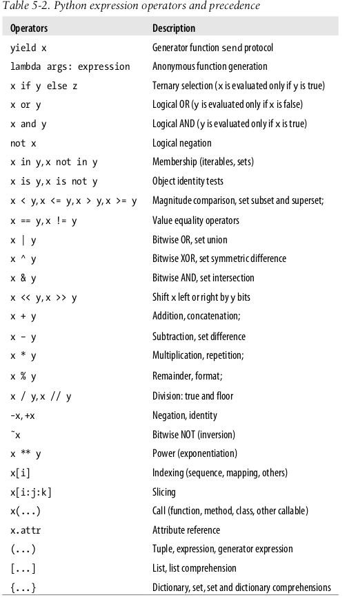
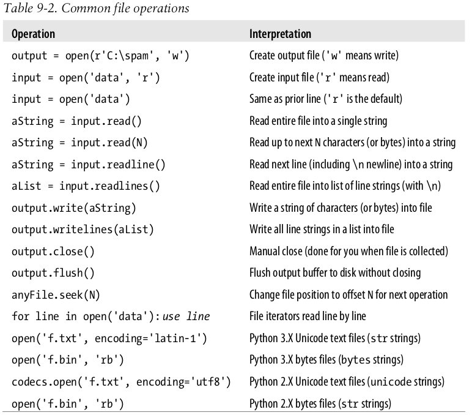
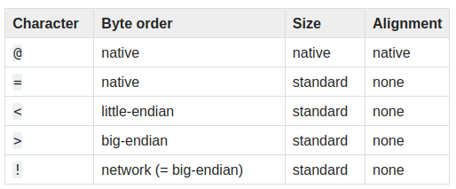
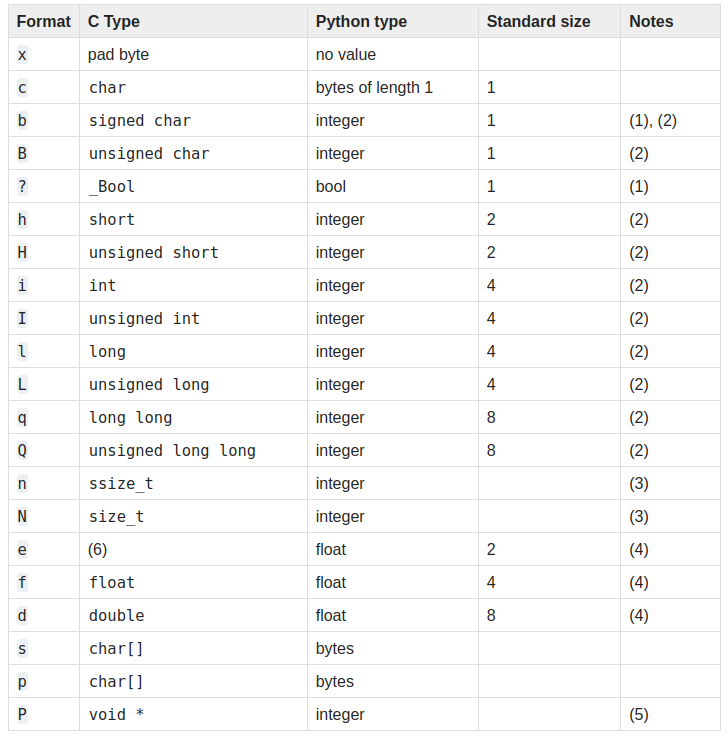

# Python Notes

## Think Python

* The single most important skill for a computer scientist is **problem solving**.

* Two kinds of programs process high-level languages into low-level languages: **interpreters** and **compilers**. An interpreter reads a high-level program and executes it line by line. A compiler reads the program and translates it completely before the program starts run-
ning.

* When you have eliminated the impossible, whatever remains, however im-
probable, must be the truth. - Sherlock Holmes

```python
type(3.2)       # <type 'float'>
type('hello')   # <type 'str'>
type(17)        # <type 'int'>
```

* Python 2 has 31 keywords. In Python 3, `exec` is no longer a keyword, but `nonlocal` is.

* In the context of programming, a function is a named sequence of statements that performs a computation.

* Python provides built-in functions that convert values from one type to another.

```python
int(3.2)
float(32)
str(32)
```

* A **module** is a file that contains a collection of related functions.
Before we can use the module, we have to import it using `import math`.

* `def` is a keyword that indicates that this is a function definition.
```python
def say_hello():
    echo "Hello"
    
def add_numbers(a, b):
    return a+b
```

* The `turtle` module allows you to create images using turtle graphics. On Ubuntu `turtle` required tkinter module.

```shell
$ sudo apt-get install python3-tk
```

* Turtle methods

|  fun  |  Description            |
|-------|-------------------------|
|  `fd` | Forward                 |
|  `bk` | Backward                |
|  `lt` | Left turn (in angle)    |
|  `rt` | Right turn (in angle)   |

# Learning Python

* Jython - Based on Java
  IronPython - Based on .NET-based Python
  Stackless and 
  PyPy

* Python can interact over networks with interfaces like SOAP, XML-RPC, and CORBA.

* Python includes tools such as modules and OOP that naturally promote code reusability

* Python is a general-purpose programming language that blends procedural, functional, and object-oriented paradigms.

* Python’s standard library comes with POSIX bindings and support for all the usual OS tools: 
    * environment variables, 
    * files, 
    * sockets, 
    * pipes, 
    * processes, 
    * multiple threads, 
    * regular expression pattern matching, 
    * command-line arguments, 
    * standard stream interfaces,
    * shell-command launchers, 
    * filename expansion, 
    * zip file utilities, 
    * XML and JSON parsers,
    * CSV file handlers, and more.

* Python comes with a standard object-oriented
interface to the Tk GUI API called tkinter (Tkinter in 2.X)

* Higher-level toolkits such as **Dabo** are built on top of base APIs such as _wxPython_ and
_tkinter_. With the proper library, you can also use GUI support in other toolkits in
Python, such as Qt with PyQt, GTK with PyGTK, MFC with PyWin32, .NET with
IronPython, and Swing with Jython (the Java version of Python, described in Chapter
2) or JPype

* integrating a C library into Python enables Python to
test and launch the library’s components, and embedding Python in a product enables
onsite customizations to be coded without having to recompile the entire product

* The in-process _SQLite_ embedded SQL database engine
is a standard part of Python itself since 2.5, supporting both prototyping and basic
program storage needs.

* Python’s standard _pickle_ module provides a simple object
persistence system—it allows programs to easily save and restore entire Python objects
to files and file-like objects.

* _PyMongo_, an interface to **MongoDB**, a high-performance, non-SQL, open source
JSON-style document database, which stores data in structures very similar to Python’s
own lists and dictionaries, and whose text may be parsed and created with Python’s
own standard library json module.

* Image processing with PIL and its newer Pillow fork

* PEP (Python Enhancement Proposal)

* Main things found in Python's toolbox
    * Dynamic typing
    * Automatic memory management
    * Built-in object types
    * Built-in tools
    * Library utilities
    * Third-party utilities

* Python script is first compiled to **byte code** and then routed to **virtual machine**. Byte code of the program is stored in files that end with a _.pyc_ extension (compiled .py)

* In 3.2 and later, .pyc files are stored in __pycache__ directory.

* byte code is saved in files only for files that are imported, not
for the top-level files of a program that are only run as scripts

* Python Virtual Machine (PVM) is just a big code loop that iterates through
your byte code instructions, one by one, to carry out their operations. The PVM is the
runtime engine of Python;

* there are at least five implementations
of the Python language—CPython, Jython, IronPython, Stackless, and
PyPy. Other potential candidates here include the Cython and Shed Skin systems

* Frozen binaries bundle together the byte code of your program files, along with the
PVM (interpreter) and any Python support files your program needs, into a single
package.

* In Python `*` means multiply for numbers but repeat for strings.

* In Python, using a variable before it has been _assigned a value_ is always an error

* Python files are usually knows as _modules_. Modules are simply text files containing Python statements.

```python
import sys
print(sys.platform)
```

* Scripts usually start with a line that begins with the
characters #! (often called “hash bang” or “shebang”), followed by the path to the
Python interpreter on your machine.

* On some Unix systems, you can avoid hardcoding the path to the Python interpreter
in your script file by writing the special first-line comment like this:
`#!/usr/bin/env python`

* In simple terms, every file of Python source code whose name ends in a .py extension is a module. Other files can access the items a module defines by importing that module — import operations essentially load another file and grant access to that file’s contents

* One of the modules is designated as the main or
top-level file, or “script”—the file launched to start the entire program,

* import operations _run_ the code in a file that is being
loaded as a final step. Because of this, importing a file is yet another way to launch it.

* `import script1` This works, but only once per session by default. After the first import, later imports do nothing, even if you change and save the module’s source file again in another window. This is by design because import is an expensive operation.

* To reload python module without stopping and restarting the session use `reload` function available in `imp` standard library module.

```python
from imp import reload
reload(script1)

DeprecationWarning: the imp module is deprecated in favour of importlib; see the module's documentation for alternative uses
```
* A module is mostly just a package of variable names, known as a
_namespace_, and the names within that package are called _attributes_. An attribute is simply a variable name that is attached to a specific object (like a module).

```python

# myfile.py
title = "The Meaning of Life"

import myfile
myfile.title

from myfile import title
title
```

* The `dir()` function fetches a list of all the names avaialble inside a module.

```python
import sys
dir(sys)

for i, name in enumerate(dir(sys)):
	print("{} => {}".format(i, name))
```

* each module is a self-contained namespace: one module file
cannot see the names defined in another file unless it explicitly imports that other file.

* `from` statement in a sense defeats the namespace partitioning purpose of modules—because the from copies variables from one file to another,

* the `exec(open('module.py').read())` built-in function
call is another way to launch files from the interactive prompt without having to import and later reload.

* Python searches for imported modules in every directory
listed in `sys.path`; a Python list of directory name strings in the sys module, which is initialized from a `PYTHONPATH` environment variable, plus a set of standard directories.

```python
for i, v in enumerate(sys.path):
	print('{} => {}'.format(i, v))

C:\Users\Aamir\AppData\Local\Programs\Python\Python37\lib\site-packages

On Linux: 
/usr/local/lib/python3.8/dist-packages
/usr/lib/python3/dist-packages
```

* _IDLE_ provides a graphical user interface for doing Python development. _IDLE_ is a Python program that uses the standard library’s `tkinter` GUI toolkit (named `Tkinter` in Python 2.X) to build its windows. IDLE is just a Python script.

```shell
python -m idlelib.idle
```

* Alt-P - Scroll backward through command history
* Alt-N - Scroll forward through command history

* Python/C integration

```c
#include <Python.h>

Py_Initialize(); // This is C, not Python
PyRun_SimpleString("x = 'brave ' + 'sir robin'"); // But it runs Python code
```

* Python comes with a source code debugger named `pdb`, available as a module in Python’s standard library. `pdb` also includes a postmortem function (`pdb.pm()`) that you can run after an
exception occurs, to get information from the time of the error.

* `python –i m.py` Python will enter into its interactive interpreter mode.

* The `Winpdb` system is a standalone debugger with advanced debugging support and cross-platform GUI.

* Python's Built-in objects
    * Numbers
    * Strings
    * Lists
    * Dictionaries
    * Tuples
    * Files
    * Sets

* Python is `dynamically typed`, a model that keeps track of types
for you automatically instead of requiring declaration code, but it is also `strongly typed`, a constraint that means you can perform on an object only operations that are valid for its type.

* Python’s core objects set includes: _integers_ that have no
fractional part, _floating-point numbers_ that do, and more exotic types — _complex numbers_ with imaginary parts, _decimals_ with fixed precision, _rationals_ with numerator and denominator, and full-featured sets.

* There are two ways to print every object in Python; an object’s
as-code `repr`, and the second is its user-friendly `str`.

* In older Pythons, the floating-point `repr` sometimes displays more precision than you might expect

```python
import math
math.pi
math.sqrt(85)

import random
random.random()
random.choice([1, 2, 3 4])
```

* In Python, we can also index backward, from the end. Formally, a negative index is simply added to the string's length.

```python
# equivalent
S[-1]
S[len(S)-1]
```

* sequences also support a more general form of indexing known as _slicing_, which is a way to extract an entire section (slice) in a single step.

```python
S[1:]  # everything past first
S[0:3] # 0 to 2
S[:3]  # 0 to 2
S[:-1] # Everything but the last
S[:]   # All of S as a top-level copy
```

* Sequences also supprt _concatenation_ with plus (+) sign and _repetition_ (*).

* Strings are `immutable` in Python — they cannot be changed
in place after they are created.

* `numbers`, `strings`, and `tuples` are immutable; `lists`, `dictionaries`, and `sets` are immutable and can be changed in place.

* `bytearray` type is available in Pythons 2.6, 3.0

```python
n = 'aamir'
L = list(n)
L[0] = 'A'
n = ''.join(L)

# Or use bytearray
B = bytearray(b'spam')
B.extend(b'eggs')
B = B.decode() # convert to normal string
```

* String method

```python
S = 'python'
S.find('py')
S.replace('p', 'P')
split(',')
upper() # convert to uppercase
isalpha() 
isdigit()
rstrip() # remove whitespace on the right side
```

* String formatting

```python
'%s, eggs, and %s' % ('spam', 'SPAM!')
'{0}, eggs, and {1}'.format('spam', 'SPAM!')
'{}, eggs, and {}'.format('spam', 'SPAM!') # 2.7+, 3.1+

'{:,.2f}'.format(296999.2567) # 296,999.26
```

* The built-in `dir` function lists variables assigned in the caller's scope when called with no arguments; it also returns a list of all the attributes available for any object passed to it.

* `help(s.replace)` to display help for strings replace function.

* Special characters can be represneted as backslash escape sequences, which Python displays in `\xNN` hexadecimal escape notation for non-printable character.

```python
ord('\n')  # 10
```

* Python also supports _raw_ string literal that turns off the backslash escape mechanism. `r'C:\text\new'`

* `str` string handles Unicode text.
  `bytes` string type represents raw byte values (including media and encoded text).

  * the notion of bytes
doesn’t apply to Unicode: some encodings include character code points too large for
a byte, and even simple 7-bit ASCII text is not stored one byte per character under some
encodings and memory storage schemes

```python
'spam'.encode('utf8') # Encoded to 4 bytes in UTF-8 in files
'spam'.encode('utf16')  # Encoded to 10 bytes in UTF-16 
```

* `bytearray` string type is essentially a `bytes` string (a `str` in 2.X) that supports most of the list object’s in-place mutable change operations.

* Both Python 3.X and 2.X also support coding non-ASCII characters with \x hexadecimal and short \u and long \U Unicode escapes

```python
'x' + b'y'.decode()  # 'xy'
'x'.encode() + b'y'  # b'xy'
```

* text is _encoded_ to bytes when stored in a file, and _decoded_ into
characters (a.k.a. code points) when read back into memory. Once it is loaded, we usually process text as strings in decoded form only.

* This `re` module has analogous calls for searching, splitting, and replacement, but because we can use patterns to specify substrings, we can be much more.

```python
import re
match = re.match('Hello[ \t]*(.(*)world', 'Hello    Python world'))
match.group(1)
```

* the list `append` method expands the list’s size and inserts an item at the end; the `pop` method (or an equivalent `del` statement) then removes an item at a given offset, causing the list to shrink.

* Python includes a more advanced list operation known as a _list comprehension expression_

* List comprehensions derive from set notation; they are a way to build a new list by running an expression on each item in a sequence, one at a time, from left to right.

```python
# List comprehension
L = [x for x in range(6)]  # [0, 1, 2, 3, 4, 5]
L = [x*x for x in L]       # [0, 1, 4, 9, 16, 25]

L = [x for x in range(10)] # [0, 1, 2, 3, 4, 5, 6, 7, 8, 9]
L = [x*x for x in L if x % 2 == 0] # [0, 4, 16, 36, 64]

L = list(range(10))

[[x**2, x**3] for x in range(4)]
```

* In recent Pythons, comprehension syntax has been generalized for other roles: it’s not just for making lists today. For example, enclosing a comprehension in _parentheses_ can also be used to create _generators_ that produce results on demand.

```python
G = (x for x in range(5))
next(G)  # 0
next(G)  # 1
```

* In Python 2.7 and 3.X, comprehension syntax can also be used to create _sets_ and _dictionaries_.

```python
M = [[1, 2, 3],
     [4, 5, 6],
     [7, 8, 9]]
{sum(row) for row in M} # create a set {24, 6, 15}
{i:sum(M[i]) for i in range(3)} # create dictionary
```

```python
>>> [ord(x) for x in 'spaam'] # List of character ordinals
[115, 112, 97, 97, 109]
>>> {ord(x) for x in 'spaam'} # Sets remove duplicates
{112, 97, 115, 109}
>>> {x: ord(x) for x in 'spaam'} # Dictionary keys are unique
{'p': 112, 'a': 97, 's': 115, 'm': 109}
>>> (ord(x) for x in 'spaam') # Generator of values
<generator object <genexpr> at 0x000000000254DAB0>
```

* When written as literals, _dictionaries_ are coded in curly braces and consist of a series of **“key: value”** pairs.

* indexing a dictionary by key is often the fastest way to code a search in Python.

```python
bob1 = dict(name='Bob', job='dev', age=40)
bob2 = dict(zip(['name', 'job', 'age'], ['Bob', 'dev', 40]))
```

* The dictionary `in` membership expression allows us
to query the existence of a key

```python
# print dictionary in sorted order
keys = list(D.keys())
keys.sort()
for key in keys:
    print(key, '=>', D[key])
```

* The above three step process can be replaced with `sorted` built-in function.

```python
for key in sorted(D):
    print(key, '=>', D[key])
```

* an object is iter_able if it is either a physically stored sequence in memory,
or an object that generates one item at a time in the context of an iteration operation

* dictionaries
are iterable objects, with a **next** that returns successive keys.

* The list comprehension, and related functional programming tools like `map` and
`filter` , will often run _faster_ than a for loop today on some types of code.

* A major rule of thumb in Python is to code for simplicity and readability first and worry
about performance later

* Python includes tools, including the `time` and `timeit` modules for timing the speed of
alternatives, and the `profile` module for isolating bottlenecks.

* Tuples are sequences, like lists, but they are _immutable_, like strings. Syntactically, they are normally coded in _parentheses_ instead of _square_ brackets

* one-item tuples require a trailing comma. `(2,)`. tuples provide a sort of integrity con-
straint.

* File objects are Python code’s main interface to external files on your computer.

* files provide an _iterator_ that automatically reads line by line in for loops and other contexts:

```python
for line in open('data.txt'): 
    print(line)
```

* _text files_ represent content as normal `str` strings and per-
form Unicode encoding and decoding automatically when writing and reading data,
while `binary files` represent content as a special `bytes` string and allow you to access file
content unaltered.

* Python’s `struct` module can both create and unpack packed binary data - raw bytes that record values that are not Python objects — to be written to a file in binary mode.

```python
import struct
packed = struct.pack('>i4sh', 7, b'spam', 8)
packed  # b'\x00\x00\x00\x07spam\x00\x08'

struct.unpack('>i4sh', packed)
```

```python
text.encode('utf-8') # encode convert str to bytes
raw.decode('utf-8')  # decode convert bytes to str

text = open('unidata.txt', encoding='utf-8').read()
```

* `Sets`, are a recent addition to the language that are neither _mappings_ nor _sequences_;
rather, they are _unordered_ collections of unique and immutable objects.

```python
X = set('spam')
Y = {'h', 'e', 'l', 'l', 'o'}

X & Y  # Intersection
X | Y  # Union
X - Y  # Difference
X > Y  # Is superset

set('spam') == set('asmp')   # Order-neutral equality tests (== is False)
True
```

* Python recently grew a few new numeric types: _**decimal**_ numbers, which
are fixed-precision floating-point numbers, and **_fraction_** numbers, which are rational
numbers with both a numerator and a denominator.

```python
import decimal
d = decimal.Decimal('3.141')
d + 1  # Decimal('4.141')

from fractions import Fraction
f = Fraction(2, 3)
f + 1
f + Fraction(1, 2)
```

* The _type_ object, returned by the `type` built-in function, is an object that
gives the type of another object.

```python
type(L)

if type(L) == type([]):
    print('yes')

if type(L) == list:
    print('yes')

if isinstance(L, list):
    print('yes')
```

* Floating-point numbers are implemented as C “doubles” in standard CPython, and therefore get as much precision as the C compiler used to build the Python interpreter gives to doubles.

* Hex 0x or 0X
  Octal 0o or 0O (zero and lower/uppercase letter o)
  Binary 0b or 0B

  * The built-in calls `hex(I)`, `oct(I)` and `bin(I)` convert an integer to its representation string in these three bases and `int(str, base)` converts a runtime string to an integer per a given base.

  

 * `repr` (and the default interactive echo) produces results that look as though they were _code_; str (and the print operation) converts to a typically more user-friendly format if available. 

 ```python
 import math
 math.floor(2.5)  # closest number below value
 math.trunc(2.5)  # Truncate fractional part
 ```

 * The oct function converts decimal to octal, hex to hexadecimal, and bin to binary. To
go the other way, the built-in int function converts a string of digits to an integer, and
an optional second argument lets you specify the numeric base

* The `eval` function, treats strings as though they were Python code.

```python
'{0:o}, {1:x}, {2:b}'.format(64, 64, 64)
'100, 40, 1000000' 
'%o, %x, %x, %X' % (64, 64, 255, 255)

X = 99
X.bit_length() # 7

import math
math.pi
math.e
math.sin(2 * math.pi / 180)
math.sqrt(144)
pow(2, 4)
abs(-42.0)
sum((1, 2, 3, 4))
min(3, 1, 2, 4)
max(3, 1, 2, 4)
```

* 3 ways to produce square root of number

```python
import math
math.sqrt(144)  # module
144 ** .5       # expression
pow(144, .5)    # built-in
```

* Standard library module called `builtins`, implied namespace that Python automatically searches to find names used in a program.

```python
import random
random.random()
random.randint(1, 10)
random.choice([1, 2, 3, 4, 5])
random.shuffle([2, 4, 6, 8, 10])
```

```python
import decimal
decimal.getcontext().prec = 4
```

* `with` context manager statement

* `{}` is still a dictionary in all Pythons. Empty sets must be created with the
set built-in, and print the same way.

* `sets` can only contain `immutable` (a.k.a. “hashable”) object types. Hence, _lists_ and _dictionaries_ cannot be embedded in sets, but _tuples_ can if you need to store compound values.

* if you need to store a set inside another set, the `frozenset` built-in call works just like set but creates an _immutable_ set that cannot change and thus can be embedded in other sets.

* sets can be used to _filter duplicates_ out of other collections.

* Sets can be used to _isolate differences_ in lists, strings, and other iterable objects.

* Sets can also be used to keep track of where you’ve already been when traversing a
graph or other cyclic structure.

* Each object also has two standard header fields: a _type designator_ used to
mark the type of the object, and a reference counter.

* a variable in Python is that it references a particular object at a particular point in time.

* types are associated with objects in Python, not with variables.

* standard library `copy` module has a call for copying any object type generically, as well as a call for copying nested object structures

```python
import copy
X = copy.copy(Y)      # Make shallow copy
X = copy.deepcopy(Y)  # Make deep copy

L = [1, 2, 3]
M = L
L == M    # check if same values
L is M    # same objects
```

* `is` operator tests for ojbect _identity_, it return `True` only if both names point to the exact same object.

* There are three string types: `str` is used for Unicode text (including
ASCII), `bytes` is used for binary data (including encoded text), and `bytearray` is a mutable variant of `bytes`.

* encoding => translation

* Unlike in C, in Python, strings come with a powerful set of processing
tools. Also unlike languages such as C, Python has no distinct type for individual characters; instead, you just use one-character strings.

* In fact, Python 3.X defines `str` strings formally as sequences of Unicode code points, not `bytes`, to make this clear.

* In Python, a zero (null) character does not terminate a string the way a “null byte” typically does in C. Instead, Python keeps both the string’s length and text in memory.

```python
S = 'hello'
S[::-1]  # Reversing item, 'olleh'

ord('s')  # 115
chr(115)  # 's'
```

* unlike strings, lists may be changed in place by assignment to offsets and slices, list method calls, deletion statements, and more—they are mutable objects.

```python
['OK'] * 4
['OK', 'OK', 'OK', 'OK']
```

* `map` built-in function applies a function to items in a sequence and collects all the results in a new list:

```python
list(map(abs, [−1, −2, 0, 1, 2]))
[1, 2, 0, 1, 2]

L.sort()
L.sort(key=str.lower)
L.sort(key=str.lower, reverse=True)
```

* sorting is also available in recent Pythons as a built-
in function, which sorts any collection (not just lists) and returns a new list for the result
(instead of in-place changes):

```python
sorted(L, key=str.lower, reverse=True)
sorted([x.lower() for x in L], reverse=True)
```

```python
D = {'eggs': 3, 'spam': 2, 'ham': 1}
D2 = {'toast': 4, 'muffin': 5}
D.update(D2)
print(D.items())
{'eggs': 3, 'muffin': 5, 'toast': 4, 'spam': 2, 'ham': 1}

D.pop('muffin')  # pop a dictionary by key, delete and return from a key

list(D.items())
[title for (title, year) in table.items() if year == '1975']
```

* There are at least three ways to avoid errors for nonexistent key in a dictonary.

```python
# Method-1: Check key using in
if 'eggs' in D:
    print(D['eggs'])
else:
    print("Key doesn't exist')

# Method-2: Use try/except
try:
    print(D['eggs'])
else:
    print("Key doesn't exist')

# Method-3: Use get
D.get('test', 0)

dict(zip(keylist, valuelist))
```

```python
L = list(zip(['a', 'b', 'c'], [1, 2, 3]))
D = dict(zip(['a', 'b', 'c'], [1, 2, 3]))

D = {k: v for(k, v) in zip(['a', 'b', 'c'], [1, 2, 3])}
```

* In 3.X the dictionary keys , values , and items methods all return view objects, whereas in 2.X they return actual result lists.

* **View objects** are _iterables_, which simply means objects that generate result items _one at a time_, instead of producing the result list all at once in memory.

```python
keys = D.keys()
K
dict_keys(['b', 'c', 'a'])   # view object, not a list
```

* dictionary views in 3.X are _dynamically reflect future changes_ made to the dictionary after the view object has been created

* Tuples are
    * Ordered collections of arbitarary objects
    * Accessed by offset
    * Of the category "immutable sequence"
    * Fixed-length, heterogeneous and arbitararily nestable
    * Arrays of object references

* The **namedtuple** utility, available in the standard library’s _collections_ module implements an extension type that adds logic to tuples that allows components to be accessed by both _position_ and _attribute_ name, and can be converted to dictionary-like form for access by key if desired.

* `namedtuple` are a tuple/class/dictionary _hybrid_.
```python
from collections import namedtuple
Rec = namedtuple('Rec', ['name', 'age', 'jobs'])
bob = Rect('Bob', 40.5, ['dev', 'mgr'])
D = bob._asdict()
```

* The built-in `open` function creates a Python _file object_, which serves as a link to a file residing on your machine. After calling `open` , you can transfer strings of data to and from the associated external file by calling the returned file object’s methods.



* In _binary mode_ end-of-line translations and 3.X Unicode encodings are turned off.

* The `pickle` module is a more advanced tool that allows us to store almost any Python object in a file directly, with no to- or from-string conversion requirement on our part.

```python
D = {'a': 1, 'b': 2}
F = open('datafile.pkl', 'wb')
import pickle
pickle.dump(D, F)
F.close()

F = open('datafile.pkl', 'rb')
E = pickle.load(F)
E   # {'a': 1, 'b': 2}
```

* The `pickle` module performs what is known as object _serialization_ convert-
ing objects to and from strings of bytes.

* `shelve` is a tool that uses `pickle` to store Python objects in an access-by-key filesystem.

* `JSON` is a newer and emerging data interchange format, which is both
programming-language-neutral and supported by a variety of systems. `MongoDB`, for instance, stores data in a JSON document database (using a binary JSON format).

* JSON is so close to Python dictionaries and lists in syntax, the translation to and from Python objects is trivial, and is automated by the `json` standard library module.

```python
name = dict(first='Bob', last='Smith')
rec = dict(name=name, job=['dev', 'mgr'], age=40.5)

import json
json.dump(rec)
S = json.dump(rec)
O = json.loads(S)

json.dump(rec, fp=open('testjson.txt', 'w'), indent=4)
P = json.load(open('testjson.txt'))
```

* The `struct` module knows how to both compose and parse packed binary data.

```python
import struct
data = struct.pack('>i4sh', 7, b'spam', 8)
```

* The first character of the format string can be used to indicate the byte order, size and alignment of the packed data. Use `sys.byteorder` to check the endianness of your system.



