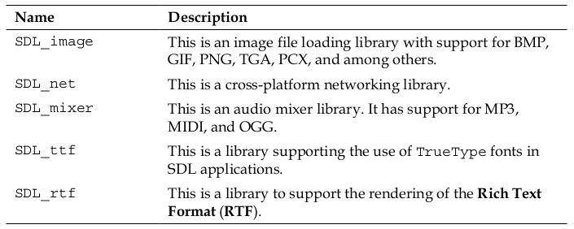
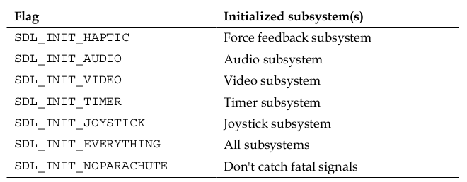
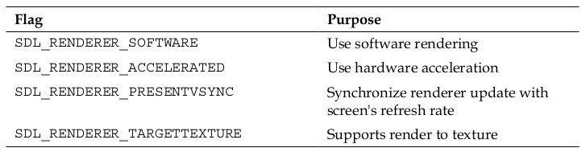
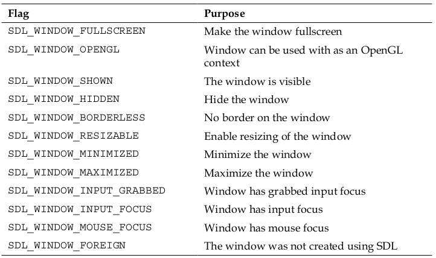

# Simple DirectMedia Layer (SDL)

* **Simple DirectMedia Layer (SDL)** is a cross-platform multimedia library created by
Sam Oscar Latinga. It provides low-level access to input (via mouse, keyboard, and
gamepads/joysticks), 3D hardware, and the 2D video frame buffer. SDL is written
in the C programming language, yet has native support for C++. The library also
has bindings for several other languages such as Pascal, Objective-C, Python, Ruby,
and Java; a full list of supported languages is available at 

* http://www.libsdl.org/languages.php

* Each platform has its own way of creating and displaying windows and graphics,
handling user input, and accessing any low-level hardware; each one with its own
intricacies and syntax. SDL provides a uniform way of accessing these platform-
specific features.

* SDL has separate extensions that can be used to add new capabilities to the library.
The reason these extensions are not included in the first place is to keep SDL as
lightweight as possible, with the extensions serving to add functionality only when
necessary.



* Building SDL 2.0 on Windows also requires the latest DirectX SDK,

* **TortoiseHg**, a free and user-friendly mercurial application; it is available at tortoisehg.bitbucket.org.

```c
// initializes all of SDL's subsystems
SDL_Init(SDL_INIT_EVERYTHING)
```

* `SDL_CreateWindow` returns a pointer to a window matching the
passed parameters. The parameters are the window title, x position of the
window, y position of the window, width, height, and any required SDL_
flags.

* Event handling, file I/O, and threading subsystems are all initialized by default in
SDL. Other subsystems can be initialized using the following flags








* SDL can use two structures to draw to the screen. One is the `SDL_Surface` structure, which contains a collection of pixels and is rendered
using _software rendering processes (not the GPU)_. The other is `SDL_Texture`; this can be used for _hardware-accelerated rendering_.

* https://www.widgetworx.com/spritelib/

* `SpriteLib` is a collection of static and animated graphic objects available for free.