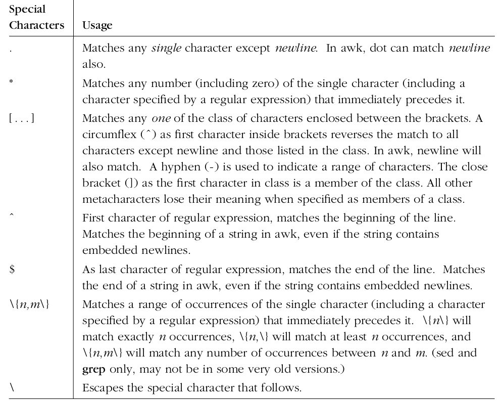
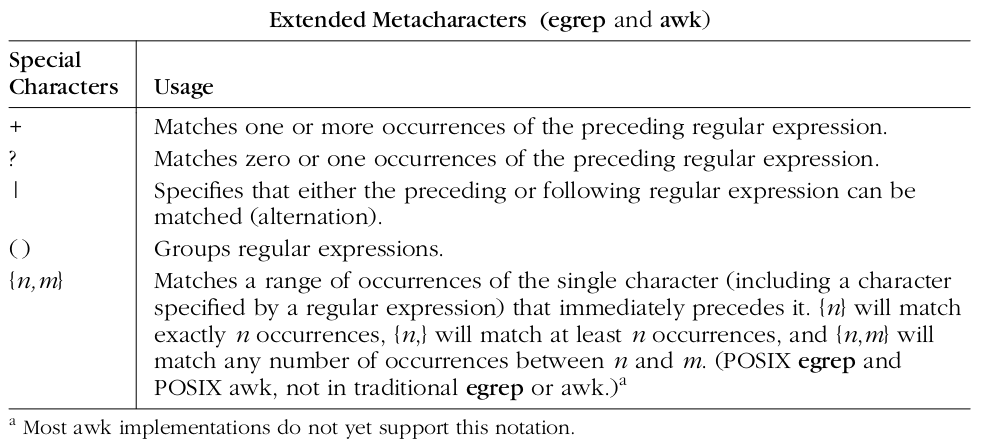
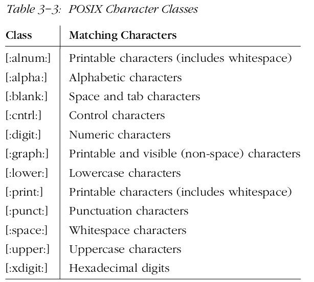

# Sed and Awk Tools

* Sed **Stream Editor** is very powerful tool to manipulate, filter and transform text.

* Basic Syntax
```
sed [options] {sed-commands} {input-file}

sed [options] -f {sed-cmd-in-a-file} {input-file}
# print all lines
$ sed -n 'p' /etc/passed
```

* One of the major differences between `sed` and `ed` is that `sed` looks at every line in the file automatically. Additionally,
`sed` will print out every line in the file regardless of whether it was changed, unless we tell it no t to with the `-n` flag.

* sed reads one line at a time from input-file and executes the command on that particular line.

* sed substitute command: s. The substitute command changes all occurrences of regular expression into a new value.

```
echo "day" | sed 's/day/night/'
sed 's/day/night' <old >new
```

* The character after substitute command `s` is the delimiter. It can be anything.

```
sed 's:day:night:' <old >new
sed 's|day|night|' file
```

* The special character `&` corresponds to the pattern found

```
sed 's/[a-z]*/(&)/'

echo "abc 123" | sed 's/[a-z]*/(&)/'
output: (abc) 123

echo "abc 123" | sed 's/[0-9][0-9]*/(&)/'
output: abc (123)

```

* `+` is a meta-character when using "extended regular expressions". To enable extended regular expression, use `-r` command line argument.

```
echo "123 abc" | sed -r 's/[0-9]+/(&)/'
```

* The escaped parentheses (that is, parentheses with backslashes before them) remember a substring of the characters matched by the regular expression. You can use this to exclude part of the characters matched by the regular expression. The "\1" is the first remembered pattern, and the "\2" is the second remembered pattern. Sed has up to nine remembered patterns.

* **Comment out a range of lines**
```shell
$ sed '4,15s/./\/\/&/' -i match.cpp

# from within vi editor
# comment line 4 to 15
:!sed -i '4,15s-.-//-' match.cpp

# uncomment line 4 to 15
:!sed -i '4,15s-//--' match.cpp
```

```
echo "hello world" | sed 's/\([a-z]*\).*/\1/'
output: hello

# switch words around, to use \1, \2 you should use escaped parentheses \(...\)
sed 's/\([a-z]*\) \([a-z]*\)/\2 \1/'
```

* With extended regular expressions '(' and ')' no longer need to have a backslash.
```
echo "hello world" | sed -r 's/([a-z]+) ([a-z]+)/\2 \1/'
output: world hello
```

* `'1` can be used in search pattern as well.
```
# remove duplicate words
sed -r 's/([a-z]+) \1/\1/'

echo "hello hello world world" | sed -r 's/([a-z]+) \1/\1/g'
output: hello world
```

* sed -n, -quiet, --silent : suppress automatic printing of pattern space

## sed pattern flags
```
sed s/pattern/str/flags
```

| Command | Description |
|---------|-------------|
| `p`  | Print lines |
| `d`  | Delete lines |
| `w`  | Write to file |
| `a`  | Append line after |
| `i`  | Insert line before |
| `c`  | Change line |
| `l`  | Print hidden characters |
| `=`  | Print line numbers |
| `y`  | Change Case |
| `q`  | Quid |

* [^]*: matches everything except a space.

* The `s` command will not scan the newly created output.

* use "\(" and "\)" to mark each pattern, and use "\1" "\2" for matched patterns.

* Add a number after the substitution command to indicate you only want to match that particular pattern.

```
# delete second word /2
echo "one two three four" | sed -r 's/([a-z])* //2'
output: one three four

echo "one two three four" | sed -r 's/([a-z])* //2g'
output: one four
```

* The number flag can be any number from 1 to 512.

```
#Add a colon after 80th character in each line.
sed 's/./&:/80' <file >new
```
* Sed scripting follows Read, Execute, Print, Repeat (REPR) acronum.

* Usually when p is used you will use the -n option to suppress the the default printing that happens as part of the standard sed flow.

```
$ sed -n '2 p' /etc/passwd
$ sed -n '1, 4 p' /etc/passwd
$ sed -n '4, $ p' /etc/passwd
```

* `n,m` indicatates n through m lines
* `n,+m` means m lines starting with n
* `n~m` indicates that sed should start at nth line and pick up every mth line from there.

```
# print only odd numbered lines
$ sed -n '1~2 p' /etc/passwd

# print lines matching pattern "star"
$ sed -n '/star/ p' notes.txt

# print line matching "star" and 2 lines immediately
$ sed -n '/star/,+2 p' notes.txt

# delete only 2nd line
$ sed '2 d' news.txt

# delete 1 through 4
$ sed '1, 4 d' news.txt

# delete all empty lines from a file
$ sed '/^$/ d' test.txt

# delete all comment lines
$ sed '/^#/ d' test.txt
```

* sed's most powerful command is substitute command `s`.

```
# replace Manager with Director only on lines that contain 'Sales'
$ sed '/Sales/s/Manager/Director/' employee.txt

$ echo "aamir" | sed 's/a/A/'
output: Aamir
$ echo "aamir" | sed 's/a/A/g'
output: AAmir
```

| Substitute Flag | Desciption |
|-----------------|------------|
| `/g` | Global replacement |
| `/1, /2, /3` | Number Flags |
| `/p` | print flag |
| `/w` | write flag |
| `/i` | ignore case  (only GNU) |
| `/e` | execute command (only GNU) |

* Use number flag to specify occurence of original string. Only the n-th instance of original string will trigger the substitution. /11 will replace only the 11th occurrence of original string in a line.

```
echo "aamir" | sed 's/a/A/2'
output: aAmir
```

```
# print only line that was changed by substitute cmd
$ sed -n 's/aamir/Aamir/p' /etc/passwd
```

* `&` replaces it with whatever text matched the original-string or regular-expression.

## Regular Expression

| Meta-Character | Description |
|----------------|-------------|
| `^`            | Matches at the start of a line |
| `$`            | Matches the end of line |
| `.`            | Matches any character except the end of line char |
| '*`            | Zero or more occurrences of previous char |
| `\+`           | Matches one or more occurrence of previous char |
| `\?`           | Zero or one occurrences of previous char |
| `\`            | Search for special chac (ex: *, .) |
| [0-9]          | character class, Match only one out of several char |
| `\|`            | Match either of two whole subexpressions |


```
$ sed -n '/101\|102/ p' test.txt
```

* A regular expression followed by `{m}` matches exactly m occurrences of preceding expression.

* A regular expression followed by `{m,n}` indicates that the preceding
item must match at least m times, but not more than n times.

### Additional Sed Commands
#### Append line after (a command)

```
$ sed '[address] a line-to-append' input-file

$ echo -e "123\n789\n" | sed '1 a 456'
output:
123
456
789

# append at the end
$ echo -e "123\n456\n789" | sed '$ a 10'

# search and append after
$ echo -e "123\n456\n789" | sed '/123/a abc\
def\
ghi'
```

#### Insert line before (i command)

```
$ echo -e "123\n789\n" | sed '1 i ABC'
output:
ABC
123
789
```

#### Change line (c command)
* Change command (c) let us replace an existing line with new text.

```
echo -e "123\n456\n789" | sed '1 c ABC'
output:
ABC
456
789

# a, i and c together
# a - Append 'Jack Johnson' after 'Jason'
# i - Insert 'Mark Smith' before 'Jason'
# c - Change 'Jason' to 'Joe Mason'
$ sed '/Jason/ {
    a\
    204,Jack Johnson,Engineer
    i\
    202,Mark Smith,Sales Engineer
    c\
    203,Joe Mason,Sysadmin
}' employee.txt
```

* The sed `l` command prints hidden characters, like `\t` for tab and $ for end of line.

* The sed `=` command prints line numbers followed by line content. Line number and line content can be printed on same line by combining = command with N command.

```
# get the line number of line having pattern
$ sed -n '/Raj/ =' test.txt

# get total number of lines in a file
$ sed -n '$ =' test.txt
```

#### Change case (y command)
```
# print after executing first line
$ sed 'q' test.txt

# print first 5 lines
$ sed '5 q' test.txt

# print all lines until first containing keyword
$ sed '/Manager/q' test.txt
```

# Awk

* Awk is a powerful language to manipulate and process text files. Useful when lines in text files are in record format.

* AWK - original AWK
NAWK - New AWK
GAWK - GNU AWK

  ```
  awk -Fs '/pattern/ {action}' input-file
  awk -Fs '{action}' input-file

  -F: filed separator (default is empty space)
  ```

  ```
  $ awk -F: '/mail/ {print $1}' /etc/passwd
  ```

  * A typical awk program has three blocks: `BEGIN, body, END`.

  ```
  $ awk 'BEGIN {FS=":"; print "----header----"} \
        /mail/ {print $1} \
        END {print "----footer----"}' /etc/passwd
  ```

  * awk print command (without any argument) prints the full record.

```
$ awk -F: 'BEGIN {print "username\n----------\n"; C=1} \
{ print C, $1; C++ } \
END { print "--------"}' /etc/passwd
```

| Built-In Variables | Description |
|--------------------|-------------|
| `FS`               | Field separator |
| `OFS`              | Output field separator |
| `RS`               | Record separator |
| `ORS`              | Output record separator |
| `NR`               | Number of records |
| `FILENAME`         | Current File Name |
| `FNR`              | File number of record, reset NR between multiple files |
| `NF`               | Number of field |


```
# multple filed separator
BEGIN { FS="[,:%]"}
```
* `FILENAME` inside the BEGIN block will return empty value "", as the BEGIN block is for the whole awk program, and not for any specific file.

```
# print number of shell users
$ awk -F ':' '$NF ~ /\/bin\/bash/ { print; n++ }; END { print n }' /etc/passwd

# print even lines
$ awk 'NR % 2 == 0 {print NR, $0}' /etc/passwd
```
#### Regular expression operators
| Operator | Description |
|----------|-------------|
| `~`      | Match operator |
| `!~`     | No match operator |

* `==` looks for full match, `~` looks for partial match

```
# single action
if (conditional-expression)
    action

# Multiple actions
if (conditional-expression)
{
    action1;
    action2;
}

# while
while(condition)
    actions

$ awk 'BEGIN {while(count++<50) s=s "x"; print s}'

do
    action
while(condition)
```
zsh example to list all C++ files in current directory and all it's subdirectories.

```
% ls **/*.cpp | awk -F/ BEGIN'{ n=0; } { n+=1; print n, " => ", $NF} END {printf "Total Files: %s\n", n; }'
```

# Sed 101 Hacks

```bash
# print all lines twice
$ sed 'p' employee.txt

# same as cat
$ sed -n 'p' employee.txt

# print only 2nd line
$ sed -n '2 p' employee.txt

# print 1-4 lines
$ sed -n '1,4 p' employee.txt

#
$ sed -n '2,$ p' employee.txt
```

* You can modify address range using comma, plus, and tilde.

`n,m`: indicates n through m.
`n,+m`: means the m lines starting with n.
`n~m`: indicates that sed should start at the nth line and pick up every mth line from there.

```bash
# first match to 4th line
$ sed -n '/Jason/,4 p' employee.txt
```

`^`: The Caret Symbol ^ matches at the start of a line.

`$`: The dollar symbol $ matches the  end of a line.

`.`: The special meta-character "." (dot) matches any character except the end of the line character.

`*`: The special character "*" (star) matches zero or more occurrences of the previous character.

`+`: The special character "\+" matches one or more occurrence of the previous character.

`?`: The special character "?" matches zero or one occurrences of the previous character.

`Character Class ([0-9])`: The character class is nothing but a list of characters mentioned
within a square bracket; this is used to match only one out of several characters.

`|`: The pipe character (|) is used to specify that either of two whole subexpressions could occur in a position.

`Exactly M Occurrences ({m})`: A Regular expression followed by `{m}` matches exactly `m` occurrences of the preceding expression.

`M to N Occurrences ({m,n})`: A regular expression followed by {m,n} indicates that the preceding
item must match at least m times, but not more than n times. The
values of m and n must be non-negative and smaller than 255.

`Word Boundary (\b)`: `\b` is used to match a word boundary.

`Back References (\n)`: Back references let you group expressions for further use.

use the sed command line option `-i`, which lets sed directly modify the input file.

```bash
$ sed -i 's/John/Johnny/' employee.txt
```

# Sed and Awk

## Sed

* The familiar UNIX utility `grep` is derived from the following global command in ed:
`g/re/p` which stands for “global regular expression print.”

* `Sed` differs from `ed` primarily in that it is _stream-oriented_. By default, all of the input to `sed` passes through and
goes to standard output. The input file itself is not changed. `ed` is not stream-oriented and changes are made to the file itself.

* One of the most distinctive features of `awk` is that it parses, or breaks up each input line and makes individual words available for processing with a script.

* `nawk` to offer more support for writing larger programs and tackling general-purpose programming problems. This new version, with minor improvements, is now codified by the POSIX standard.

* The enclosing single quotes prevent the
shell from interpreting special characters or spaces found in the editing instruction.

* There are three ways to specify multiple instructions on the command line:
    * Separate instructions with a semicolon.
    * Precede each instruction by -e.
    * Use the multiline entry capability of the Bourne shell.

```shell
    sed ’s/ MA/, Massachusetts/; s/ PA/, Pennsylvania/’ list
    sed -e ’s/ MA/, Massachusetts/’ -e ’s/ PA/, Pennsylvania/’ list
    sed ’
    > s/ MA/, Massachusetts/
    > s/ PA/, Pennsylvania/
    > s/ CA/, California/’ list
```

* The `-n` option suppresses the automatic output. When specifying this option, each instruction intended to produce output must contain a print command, `p`.

```shell
$ sed -n -e ’s/MA/Massachusetts/p’ list
```

* `egrep` offered an extended set of regular expression metacharacters. Awk uses essentially the same set of metacharacters as egrep.

| meta character | meaning |
|----------------|---------|
| `.` | match any single character |
| `*` | match zero or more occurrences of _preceding_ regular expression |

* The regular expression `.*` matches any number of characters, whereas in the shell,
`*` has that meaning.





* Inside square brackets, the standard metacharacters lose
their meaning.

* each character class matches a single character. If
you specify multiple classes, you are describing multiple consecutive characters



* GNU awk and GNU sed
support the character class notation, but not the other two bracket notations.

```shell
# match any text inside quotes ("")
$ grep "\".*\"" file
$ grep '".*"' file
```

* The span matched by “.*” is always the longest possible.

* The ability to match “zero or more” of something is known by the technical term __“closure.”__

* Don’t confuse the ? in a regular expression with the ? wildcard
in the shell. The shell’s ? represents a single character, equivalent to . in a regular
expression.

* In sed (and grep), “ˆ” and “$” are only special when they occur at the beginning
or end of a regular expression, respectively.

* \{ and \} are available in grep and sed. POSIX egrep and POSIX awk use { and }.

* In `\{n,m\}`, `n` and `m` are integers between 0 and 255.

  | pair of metacharacter | Description |
  |----|-------------|
  | `\{n\}` | exactly `n` occurrences of the preceding character or regular expression will be matched |
  | `\{n,\}` | at least `n` occurrences will be matched |
  | `\{n,m\}` | any number of occurrences between n and m will be matched |
  | `“?”` | is equivalent to `"\{0,1\}"` |
  | `"*"` | is equivalent to `"\{0,\}"` |
  | `"+"` | is equivalent to `"\{1,\}"` |
  | `"\{1\}"` | no modifier is equivalent to this |


## awk

* $0 represents the entire input line. $1, $2, . . . refer to the individual fields on the input line.

```shell
$ awk ’/MA/ { print $1 }’ list

# use , as field seperator
$ awk -F, ’/MA/ { print $1 }’ list
```

