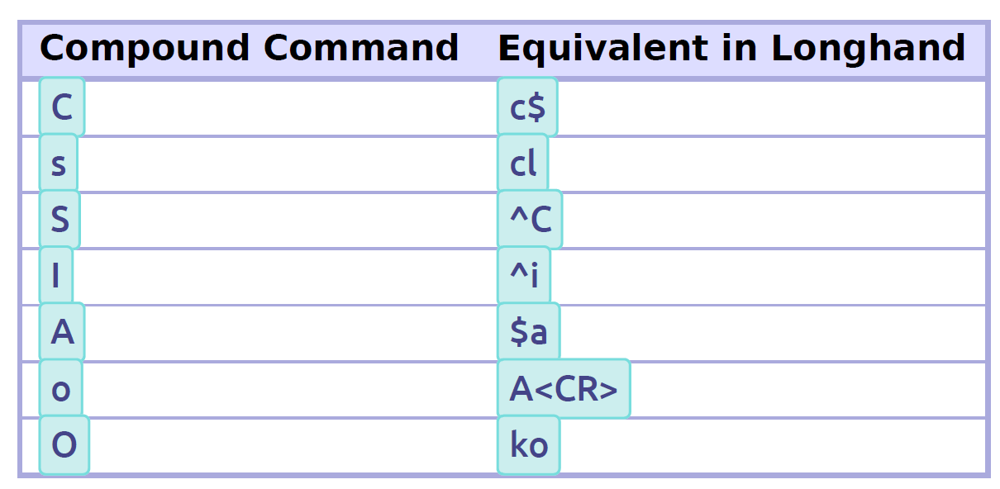
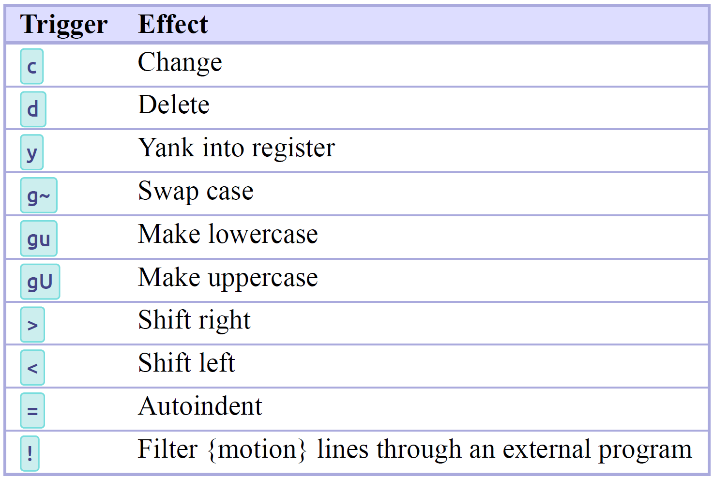
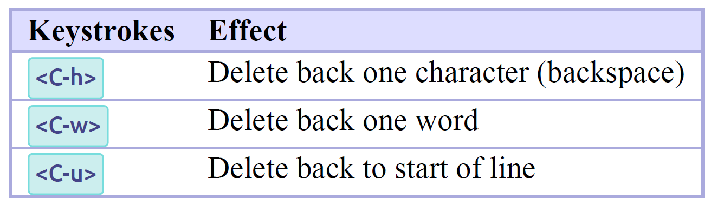
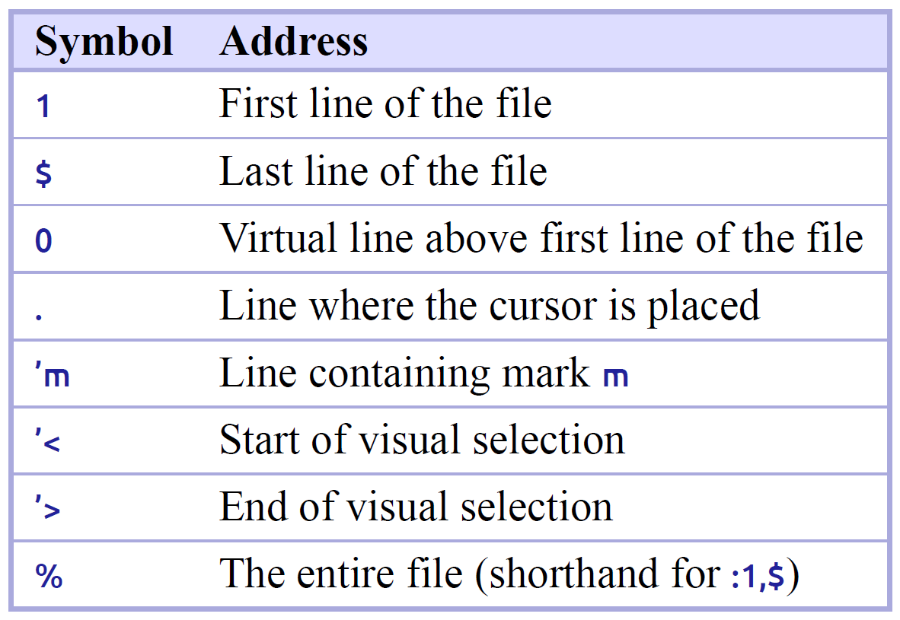
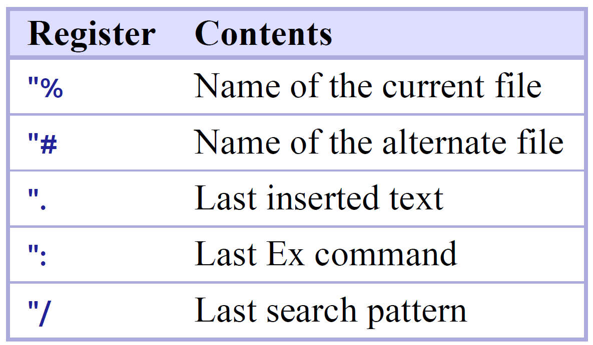

# Vim Editor

Ctrl-C |> Normal Mode (Ctrl-C/Ctrl-V/Ctrl-f will not work for copy/paste)

i/a/I/A/o/O |> Insert Mode

| Command | Description |
|---------|-------------|
| `ESC` or `Ctrl-c` | Go back to `Normal Mode` |
| `i` | Go to `Insert Mode` |
| `h`, `gh` | Move left,  |
| `j`, `gj` | Move down one line, Move down of visual line |
| `k`, `gk` | Move up one line, Move up of visual line |
| `g0` | Move to the end of visual line |
| `g$` | Move to the begining of the visual line |
| `gq` | Make visual line as actual lines |
| `gu{txt object}, gu$` | uncapitalize till end of line |
| `gU{txt object}` | capitalize |
| `gf` | open the file under cursor |
| `gv` | reselect the previous selected text |
| `gJ` | join selected lines without adding extra spece btn lines |
| `g&` | run previous substitution command on the entire document |
| `l`, `gl` | Move right |
| `w` | jump from word to work (forward) |
| `b` | jump from word to work (backward) |
| `e` | jump to the end of the word |
| `ge` | jump to the end of word (backword) |
| `W`, `B`, `E`, `GE` | Include special character with w, b, e, ge |
| `f{char}` | find the next occurance of {char} |
| `t{char}` | (until) move curser just before the occurance of {char}, After using f{char} | 
| `;` | to go to next occurance after f{}, t{} search |
| `,` | go to previous occurance after f{}, t{} search |
| `;` | repeat the last search which f{char} performed |
| `0` | Move to first character in a line |
| `^` | Move to first non-blank character of a line |
| `$` | Move to end of line |
| `g_` | Move to non-blank character at the end of line |
| `}` | jump entire paragrahp downward |
| `{` | jump entire paragraph upward |
| `Ctrl-D` | move down half page |
| `Ctrl-U` | move up half page |
| `/{pattern}` | search forward, `n` to jump to next match, `N` to jump to previous |
| `?{backward}` | search backward |
| `/<Enter>` | run last search forward |
| `?<Enter>` | run last search backward |
| `*` | search for the word under cursor |
| `{count}motion` | multiply a motion count times |
| `2w` | move cursor 2 word forward |
| `gd` | jump to definition of whatever is under the cursor |
| `gf` | jump to a file in import |
| `gg` | jump to the top of the file |
| `{line}gg` | jump to a specific line |
| `G` | go to end of file |
| `%` | jump to matching ({[]}) |
| `{operator}{count}{motion}` | |
| `d5j` or `d5` | delete 5 lines down |
| `df'` | deletes everything in the current line until the first occurrence of the ' including ' |
| `dt'` | deletes everything in the current line until the first occurrence of the ' excluding ' |
| `d/hello` | delete everything until the first occurance of hello |
| `dd` | delete whole line |
| `cc` | change a whole line |
| `D` | delete from cursor till end of line |
| `C` | change from cursor till end of line |
| `.` |
| `i` | insert mode before cursor |
| `a` | append, insert mode after cursor |
| `I` | insert mode at the beginning of current line |
| `A` | insert mode at the end of current line |
| `o` | Insert new line below |
| `O` | Insert new line above |
| `gi` | puts u into insert mode at the last place you left insert mode |
| `Ctrl-h` | delete last character you typed |
| `Ctrl-w` | delete last word you typed |
| `Ctrl-u` | delete last line you type |
| `v` | visual mode character-wise |
| `V` | visual mode line-wise |
| `Ctrl-V` | visual mode block-wise |
| `:sp {name-of-file}` | horizontal split |
| `:vsp {name-of-file}` | vertical split |
| `<Ctrl-W> + hjkl` | move between split windows |
| `:tabnew {file}` | open a file in new tab |
| `:tabn` | go to next tab |
| `:tabp` | go to previous tab |
| `yiw` | yank in current word |
| `yaw` | yank all word (includes a trailing space) |
| `yy` | yank the current line |
| `3yy` | yank three lines starting at the current one |
| `yap` | yank all paragraph (includes trailing newline) |
| `~`    | Changes the case of current character |
| `guu`  | Change current line from upper to lower |
| `gUU`  | Change current LINE from lower to upper |
| `guw`  | Change to end of current WORD from upper to lower |
| `guaw` | Change all of current WORD to lower |
| `gUw`  | Change to end of current WORD from lower to upper |
| `gUaw` | Change all of current WORD to upper |
| `g~~`  | Invert case to entire line |
| `g~w`  | Invert case to current WORD |
| `guG`  | Change to lowercase until the end of document |
| `gU)`  | Change until end of sentence to upper case |
| `gu}`  | Change to end of paragraph to lower case |
| `gU5j` | Change 5 lines below to upper case |
| `gu3k` | Change 3 lines above to lower case |
| `yw`   | Yank word              |
| `yaw`  | Yank entire word irrespecitive of where the cursor is located    |
| `yiw`  | Yank entire word            |
| `:tabnew` | open new tab |
| `gt`   | Move to next tab            |
| `gT`   | Move to previous tab              |
| `_nnn_ gt`     | Move to numbered tab              |

In visual mode you select the text first and then you type operator

| vim | commands |
|-----|----------|
| `d`  | delete |
| `c`  | change |
| `y`  | yank |
| `p`  | paste |
| `g~` | toggle caps |
| `.`  | repeat the last change you made |

| CMD   | Description |
|-------|-------------|
| `d2w` | Delete two words |
| `cis` | Change inside sentence (delete curr one and enter insert mode) |
| `yip` | Yank inside parapgraph (copy curr paragraph) |
| `ct<` | Change to open bracket (change till open bracket) |
| `*`   | search for other instance of the word under cursor |
| `C`   | change current line from where you're at |
| `s`   | delete the char under cursor and enter into Insert mode |
| `S`   | substitute the entire current line |
| `dt.` | delete from where you are to the period |
| `D`   | delete to the end of line |
| `J`   | Join current line with next one |
| `dw` - `5.` | delete a word - delete five more words |
| `ddp` | switching lines of text |
| `v`   | character-based visual mode |
| `V`   | line-based visual mode |
| `Ctrl-v` | paragraph-based visual mode |

# ProVim

| CMD | Description |
|-----|--------------|
| `:sp` | Split current buffer |
| `:history` | static list |
| `q:` | dynamic list |
| `:read f2.txt` | read content of f2.txt into current file |
| `:8read f2.txt` | insert in f2.txt at line 8 |

### Moving between files

| CMD | Description |
|-----|-------------|
| `:bn` | Move to next buffer |
| `:b5` | Move to 5th buffer |
| `:bp` | Move to previous buffer |
| `:ls` | list all buffers |
| `:b#` | move to alternative buffer |
| `:bf` | Move to first buffer |
| `:bl` | Move to last buffer |
| `:bm` | Move to next modified buffer |
| `:5,9wq` | Save changes from line 5-9 only |
| `:new` | Create new empty buffer within horizontal split window |
| `:enew` | Create new empty buffer within current window/viewport |
| `:vnew` | Create new empty buffer within vertical split window |
| `:tabnew` | Create new tabbed windown |

### G command

| CMD | Description |
|-----|-------------|
| `:ga` | Get ASCII value of current character under cursor |
| `:gq` | Within a paragraph, make the line more readable |
| `:gf` | Open the file under string if it is a path |
| `ctrl+6` | To go back to original file |
| `g+` | Navigate undo branches |
| `g-` | Navigate undo branches |
| `g&` | To apply previous search/replace to entire document |
| `gi` | |
| `gv` | Go back to previous visual mode selection |

**Double an operator to make it operate on a whole line**: dd deletes a whole like, cc changes a whole line, etc.
Capitalize an operator to make it operate from the cursor to the end of a line: D deletes from the cursor to the end of the line, C changes to the end of a line, etc.

this is a WORD: Iam_A_WORD(WORD)
this function call sum(2,3) is also a WORD
this array [1,2,3,4,5] is a WORD as well

const fireball = function(target){

:set nowrapscan; this prevents Vim from wrapping to top when it hits the bottom.

%s/old/new/gc => interactive replace, [c] confirm each substitution

### vim.plug

vim plug is a neovim package manager.
:PlugInstall -- Install the plugin
:PlugClean -- Remove unused plugins.
:PlugStatus -- 
:PlugDiff --

## Practical vim

| Command |  Description |
|---------|--------------|
| `daw`   | delete a word using aw text object |
| `count<C-a>` | Add [count] to the number _at or after the cursor_ |
| `count<C-x>` | Perform subtraction |
| `5<C-a>` | add 5 to current number |
| `10<C-x>` | subtract 10 from current number |

### Two for the price of one

### Operator commands

### Insert Mode Deletion

### Ex Commands

### Operators

`d{motion}` -
`c{motion}` -
`y{motion}` -

### Ex Command Line

| Command | Description |
|---------|-------------|
| `:[range]delete [x]` | Delete specified lines [into register x] |
| `:[range]yank [x]` | Yank specified lines [into register x] |
| `:[range]put [x]` | Put text from register x after specified line |
| `:[range]copy {address}`| Copy the specified lines to below the line specified by {address} |
| `:[range]move {address}` | Move the specified lines to below the line specified by {address}|
| `:[range]join` | Join the specified lines |
| `:[range]normal {commands}` | Execute Normal mode {commands} on each specified line |
| `:[range]substitude/{pattern}/{string}/[flags]` | Replace occurrences of {pattern} with {string} on each specified line |
| `:[range]global/{pattern}/cmd` | Execute the Ex command [cmd] on all specified lines where the {pattern} matches |

| Command | Description |
|---------|-------------|
| `:[range]delete [x]` | Delete specified lines [into register x] |
| `w` | jump to the beginning of the word |
| `b` | jump to the beginning of a word backwards |
| `e` | jump to the end of the word |
| `ge` | jump to the end of a word backwards |
| `W` | jump to the beginning of the WORD |
| `B` | jump to the beginning of a WORD backwards |
| `E` | jump to the end of the WORD |
| `gE` | jump to the end of a WORD backwards |
| `f{char}` | _find_  Move to next occurrence of a character in a line |
| `F{char}` | _find_  Move to previous occurrence of a character |
| `t{char}` | _until_ Move the cursor just before the next occurrence of a character  |
| `T{char}` |  Move the cursor just before the previous occurrence of a character |
| `;` | Go to next occurrence of `f{char}` |
| `,` | Go to previous occurance of `f{char}` |
| `0` | Move to the first character of a line |
| `^` | Move to the first non-blank character of a line |
| `$` | Moves to the end of a line |
| `g_` | Moves to the non-blank character at the end of a line |
| `}` | jumps entire paragraphs downwards |
| `{` | jumps entire paragraphs upwards |
| `Ctrl-D` | move down half a page by scrolling the page |
| `Ctrl-U` | move up half a page by scrolling the page |
| `T/{pattern}` | search forward inside a file |
| `?{pattern}` | search backwards inside a file |
| `n` | jump to the next match |
| `N` | jump to the previous match |
| `/Enter` | run the last search forward |
| `?Enter` | run the last search backwards |
| `\*` | search for word under the cursor |
| `#`  | search for word under the cursor backwards |
| `3;` | go to the next third occurrence of a character |
| `2/search` | sends you to the second occurrence of `search` |
| `gd` | jump to the definition under the cursor |
| `Tgf` | jump to a file in an import |
| `gg` | go to the top of the file |
| `{line}gg` | go to a specific line |
| `G` | go to the end of file |
| `%` | jump to matching `({[]})` |

`{operator}{count}{motion}`
`{count}{operator}{motion}`

`operator` - deleting, changing, yanking, formatting

### Vim Operators

| Command | Description |
|---------|-------------|
| `c` |  change |
| `d` |  delete |
| `p` |  paste |
| `y` |  yank |
| `=` |  format |
| `g~` | toggle case |
| `>` | Adds indentation |
| `<` |  Removes indentation |

Examples:

| Command | Description |
|---------|-------------|
| `c/hello` | changes everything until the first occurrence of hello |
| `ggyG`| copies whole document |
| `gUw` | capitalizes a word |
| `dd` | deletes a whole line |
| `cc` | changes a whole line |
| `D` | deletes from the cursor to the end of line |
| `C` | changes to the end of a line |
| `Y` | like `yy` copies a complete line |
| `P` | pastes something before the cursor |

### text objects

`a`  a text object plus whitespace
`i`  inner object without whitespace

`{i|a}{TEXT-OBJECT-ID}`
`{operator}{a|i}{text-object}`

build-in text-objects are
| Text Object | Description |
|-------------|-------------|
| `w` | Word |
| `s` | Sentence |
| `p` | Paragraph |
| `b(` | Block surrounded by () |
| `B{` | Block surrounded by {} |
| `" ' ` | Quoted text |
| `< >` | Block surrounded by <> |
| `[ ]` | Block surrounded by [] |
| `t` | for tag |

Examples

| Command | Explanation |
|---------|--------------|
| `daw` | delete a word and trailing whitespaces |
| `ciw` | change inner word |
| `das` | delete a sentence  |
| `dis` | delete inner sentence |
| `da"` | delete something in double quotes including quotes |
| `di"` | delete only the content inside the quotes  |
| `ci"` | change something inside double quotes |
| `dap` | delete a paragraph |
| `dab` | `da(` `da)` delete a block surrounded by `(` |
| `daB` | `da{` `da}` delete a block surrounded by `{` |
| `dat` | delete an HTML tag |
| `cit` | change the contents of HTML tag |

The `.` command becomes even more useful if you get in the habit of using Text-objects. Text-objects are more reliable than other motions because you don't need to care as much where the cursor is positioned. 

### Single character command
| `x` `dl` | deletes character under the cursor |
| `X` `dh` | deletes the character before the cursor |
| `s` `ch` | deletes character under the cursor and puts into insert mode |
| `~` | switch case for single character |

`u` undo last change
`<Ctrl>-R` redo it

### Insert Mode

| Command | Explanation |
|---------|--------------|
| `i` |  Go to insert mode before the cursor |
| `a` |  append, Go to insert mode after the cursor |
| `o` |  Insert a new line below the current line and go to insert mode |
| `I` |  Go to insert mode at the beginning of the current line |
| `A` |  Go to insert mode at the end of current line |
| `O` |  Insert a new line above the current line and go to insert mode |
| `gi` | puts you into insert mode at the last place you made a change |
| `ctrl-h` | delete the last character you typed |
| `ctrl-w` | delete the last word you typed |
| `ctrl-u` | delete the last line you typed |
| `<esc>` `ctrl-[` `ctrl-c` | Exit insert mode |

### Visual Mode
`v`  Visual mode - character
`V`  Visual mode - Linewise
`ctrl-v`  Visual block (rectangular selection)

`{trigger visual mode}{motion}{operator}`
`gn`  Select match in Visual mode, combines `n` and `.`

### Copy Paste
`y{motion}` yank
`yy` `Y` yank line
`p`  paste after cursor
`P`  paste before cursor
`gp` same as `p` but puts the cursor after the pastted selection
`gP` same as `P` and puts the cursor after the pasted selection

`yl`  yanks a letter
`yaw`  yanks a word
`yas`  yanks a sentence
`yi(`  yanks everything within `(`

The behaviour of `p` and `P` depends on whether you have yanked characters or line. If you've yanked _characters_ then pasting will put those characters after or before the cursor. If you've yanked lines, however, pasting will put
those lines after or before the line where the cursor is resting on.

`yyp` duplicate a line below
`yyP` duplicate a line above
`ddp` `ddP` swap lines
`yy{count}p` n-plicate a line
`dlp` `xp` swap characters

### Vim Registers

Registers in Vim are like a special clipboard where you can save multiple things at once.

| Register Name | Register | Description |
|---------|-------------|--------------|
| **unnamed register** | `""` | the default register, where you copy and cut stuff to when no explicit register is specified |
| **named registers** | `"a-"z` | registers you can use explicitly to copy and cut text |
| **yank register** | `"0` | stores last thing yanked (copied) |
| **cut registers** | `"1-"9` | store the last 9 things cut by using either delete or the change command |
| **black hole register** | `"_` | `"_d{motion}` |
| **system clipboard** | `"+`  | When we want to copy some text from inside of Vim and paste into external program |
| **selection register** | `"*` | X11 primary, used with middle mouse button. No primary clipboard in Windows and Mac OS X  |
| **named registers** | | let us save bits of texts for later pasting. |
| **expression register** | `"=` | execute vim script expression |

| `"+p` | Paste text from system clipboard to vim |
| `<C-r>+` | From INSERT mode |

`"{name of register}y{motion}`
`"{name of register}d{motion}`
`"{name of register}c{motion}`

#### Readonly register

`"ayas` - yank a sentence and store it in register `a`.
`"ap` - Paste the content of register `a` somewhere.
`A` - append whatever you copy or cut into that register
`:reg {register}` - to see what is in the `register`

The **yank register** lets you have access to what you copied last via the `y` command. This is helpful because deletes and changes don't overwrite this register like they do the unnamed register.

The `x`, `s`, `d{motion}`, `c{motion}` and `y{motion}` commands (and their uppercase equivalents) all set the contents of the unnamed register.

When we address a named register with a lowercase letter, it _overwrites_ the specified register, whereas when we use an uppercase letter, it _appends_ to the specified register.

To paste the content of a register in **INSERT MODE**, use the following:
`ctrl-R "`  pastes the contents of unnamed register
`ctrl-R a`  pastes the contents of register `a`
`ctrl-R 0`  pastes the contents of yank register
`ctrl-R +`  pastes the contents copied by external application 

VSCodeVim has support for only a very limited number of Ex commands but they can be greatly enhanced by integrating VSCodeVim with Neovim. 

### Ex Commands
`:edit` `:e` - Edit a file - VSCode uses relative paths in relation to currently opened file.
`:write` `:w` - save a file
`:quit` `:q` - close a file
`:write!` `:w!` - force save a file
`:quit!` `q!` - force close a file without saving
`:wall` `:wa` - save all files
`:qall` `:qa` - close all files
`:wqall` `:wqa` - save and close all files
`:qall!` `:qa!` - close all files without saving

`:[range]d [register]`

Other useful Ex command alternatives to _Normal mode_ commands are (Not supported by VSCodeVim)
`:yank`
`:put`
`:copy`
`:move`
`:substitude`

`:[range]s/{pattern}/{substitue}/flags`

Flags can be
`g` - change all occurrences in the current line
`i` - case insensitive searches
`c` - confirm each and every substitution

To repeat normal mode commands use `@:`, type `@@` to repeat it again.

### Split and Tab
`:sp {relative-path-to-file}` - open a file in horizontal split
`:vsp{relative-path-to-file}` - open a file i na vertical split
`<ctrl-W> S` - open horizontal split (Window and Split)
`<ctrl-W> V` - open a vertical split 
`<ctrl-W> + hjkl` - Move between split windows

`:tabnew {file}` open a file in a new tab
`:tabn` `:tabnext` go to the next tab
`:tabp` `:tabprevious`  go to the previous tab
`:tabo` `:tabonly` close all other tabs

### Surround operator (s/S)
Using the surround operator we can operate on the surroundings (quotes, parenthesis, braces, tags etc..)

`ds` delete the surroundings
`cs` change the surroundings
`ys` add surroundings
`S{char}` surround the visually selected text with `char`

### Vim Easy Motion

| Command | Move to |
|---------|---------|
| `<leader><leader>w` | start of words |
| `<leader><leader>b` | start of words backwards|
| `<leader><leader>bdw` | start of words everywhere. `bd` bidirectional |
| `<leader><leader>e` | end of words |
| `<leader><leader>ge` | end of words backwards |
| `<leader><leader>bdw` | end of words everwhere |
| `<leader><leader>j` | beginning of lines |
| `<leader><leader>k` | beginning of lines backwards |
| `<leader><leader>f{char}` | find character |
| `<leader><leader>F{char}` | find character backwards |
| `<leader><leader>t{char}` | until character |
| `<leader><leader>T` | until character backwards |
| `<leader><leader>s{char}` | search character everywhere |

### Multi Cursor
* Move the cursor on top of a word
* `<ctrl-D>` or `gb` to add cursor
* Type `gb` to continue adding cursors until you're done
* Perform an action (delete, change etc)

### Vim Macro
* Type `q{register}` to start recording a macro (e.g. `qq` will start recording a macro to register `q`)
* Perform the different actions you want to include in the macro
* When you're done, type `q` to end the recording
* Type `@{register}` (e.g. `@q`) to execute the macro that lives in a given `register`

| Command | Move to |
|---------|---------|
| `~`    | Changes the case of current character. |
| `guu`  | Change current line from upper to lower. |
| `gUU`  | Change current LINE from lower to upper. |
| `guw`  | Change to end of current WORD from upper to lower. |
| `guaw` | Change all of current WORD to lower. |
| `gUw`  | Change to end of current WORD from lower to upper. |
| `gUaw` | Change all of current WORD to upper. |
| `g~~`  | Invert case to entire line. |
| `g~w`  | Invert case to current WORD. |
| `guG`  | Change to lowercase until the end of document. |
| `gU)`  | Change until end of sentence to upper case. |
| `gu}`  | Change to end of paragraph to lower case. |
| `gU5j` | Change 5 lines below to upper case. |
| `gu3k` | Change 3 lines above to lower case. |

`xp` Transpose the next two characters
`ddp` Transpose the order of this line and its successor

The `:normal @a` command tells Vim to execute the macro once for each line in the selection.

`dG`  delete till end of document
`dgg` delete till the beginning of document
`S`   go to insert mode with proper indentation
LMH: Low, Mid, High

`L`
`M`
`H`
`ctrl-u` - up half screen
`ctrl-d` - down half screen

Deleteing in Insert Mode
`<ctrl>-w`  delete the previous word from the current position
`<ctrl>-h`  delete previous character (like backspace)
`<ctrl>-u`  delete from cursor position till end of line
`<ctrl>-o`  allow executing normal mode command, enter normal mode command and get back to insert mode again
`<ctrl>-p`  Auto complete
`<ctrl>-n`  Auto complete

`:set spell` to turn on spell check
`:set no spell` turn off spell check
`:set spell&` turn off spell check
`:help j` get help for j key

