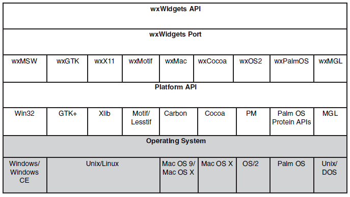

# WxWidget

* `wxWidgets` has bindings for a variety of other languages such as **Python**, **Perl**, a **BASIC** variant, **Lua**, **Eiffel**, **JavaScript**, **Java**, **Ruby**, **Haskell**, and **C#**. Some of these bindings are more advanced than others. 

* http://www.wxwidgets.org

* We need the GTK development libraries which wxWidgets depend on.

```shell
$ sudo apt-get install libgtk-3-dev build-essential checkinstall
```

* The utility called `checkinstall` would allow us to create an installation package for wxwidgets, so that later on it can un-installed easily using package managers.

* **DialogBlocks** is a sizer-based resource editor that quickly gets you creating professional-looking dialogs, wizards and frames for deployment on Windows, Linux, Mac or any other supported wxWidgets platform.

* wxWidgets is a programmer's toolkit for writing desktop or mobile applications
with graphical user interfaces (GUIs). It's a _framework_, in the sense that
it does a lot of the housekeeping work and provides default application behavior.

* wxWidgets provides classes for files and streams, multiple threads, application
settings, interprocess communication, online help, database access, and
much more.

* wxWidgets provides a native look and feel. wxWidgets uses the native widgets wherever possible (and its own widget set in other cases) so that not only does the application look native on the major platforms, but it actually is native.

* Initially, wxWidgets targeted XView and MFC 1.0; Borland C++ users complained about the requirement for MFC, so it was rewritten to use pure Win32. Because XView was giving way to Motif, a Motif port quickly followed.

* Wolfram Gloger suggested that wxWidgets should be ported to GTK+, the up-and-coming widget set being adopted for the GNOME desktop environment.

* Robert Roebling became the lead developer for wxGTK, which is now the main Unix/Linux port of wxWidgets.

* wxUniversal, wxWidgets's own set of widgets for use on platforms that have no widget set of their own. wxUniversal was first used in SciTech's port to MGL, their low-level graphics layer.

* In 2002, Julian Smart and Robert Roebling added the wxX11 port using the wxUniversal widgets. Requiring only Unix and X11, wxX11 is suitable for any Unix environment and can be used in fairly low-spec systems.

* The object-oriented language Smalltalk designed by Alan Kay and others in the 1970s was an important milestone in GUI history, making innovations in user interface technology as well as language design, and although wxWidgets uses a different language and API, the principles employed are broadly the same.



* Every wxWidgets application defines an application class deriving from `wxApp`.

```cpp
// Declare the application class
class MyApp : public wxApp
{
public:
    // Called on application startup
    virtual bool OnInit();
};
```

* The implementation of OnInit usually creates at least one window, interprets any command-line arguments, sets up data for the application, and performs any other initialization tasks required for the application.

* `wxT()` macro converts string and character literals to the appropriate type to allow the
application to be compiled in Unicode mode.

```cpp
// Give wxWidgets the means to create a MyApp object
IMPLEMENT_APP(MyApp)
```

* When wxWidgets creates a `MyApp` object, it assigns the result to the global variable `wxTheApp`. You can use this in your application, but it would be more convenient if you didn't have to cast the `wxApp` pointer to `MyApp`.

```cpp
// Implements MyApp& wxGetApp()
DECLARE_APP(MyApp)
```

* A frame is a top-level window that contains other windows, and usually has a title bar and menu bar.

```cpp
// Declare our main frame class
class MyFrame : public wxFrame
{
public:
    // Constructor
    MyFrame(const wxString& title);
    // Event handlers
    void OnQuit(wxCommandEvent& event);
    void OnAbout(wxCommandEvent& event);
private:
    // This class handles events
    DECLARE_EVENT_TABLE()
};
```

* Small bitmaps and icons can be implemented using the `XPM` format on all platforms. XPM files have valid C++ syntax and so can be included as `SetIcon(wxIcon(modrian_xpm));`

* Most GUI applications are not multithreaded so each task is being done in turn.

* wxWidgets uses _event tables_ to expose event handling to the application.

* Every class that derives from `wxEvtHandler`, including `frames`, `buttons`, `menus`, and even `documents`, can contain an event table to tell wxWidgets how events are routed to handler functions.

* All window classes (derived from `wxWindow`), and the application class, are derived from `wxEvtHandler`.

* All event handler functions have the same form—their return type is void, they are not virtual, and they take a single event object argument.

* A list of system events that will not get sent to the parent’s event handler:
    * `wxActivateEvent`, 
    * `wxCloseEvent`, 
    * `wxEraseEvent`, 
    * `wxFocusEvent`, 
    * `wxKeyEvent`, 
    * `wxIdleEvent`,
    * `wxInitDialogEvent`, 
    * `wxJoystickEvent`, 
    * `wxMenuEvent`, 
    * `wxMouseEvent`, 
    * `wxMoveEvent`,
    * `wxPaintEvent`, 
    * `wxQueryLayoutInfoEvent`, 
    * `wxSizeEvent`, 
    * `wxScrollWinEvent`, and
    * `wxSysColourChangedEvent`

* Call `wxEvent::Skip` to indicate that the search for the event handler should continue. Pass the events to the original event handler using `wxEvent::Skip`.

